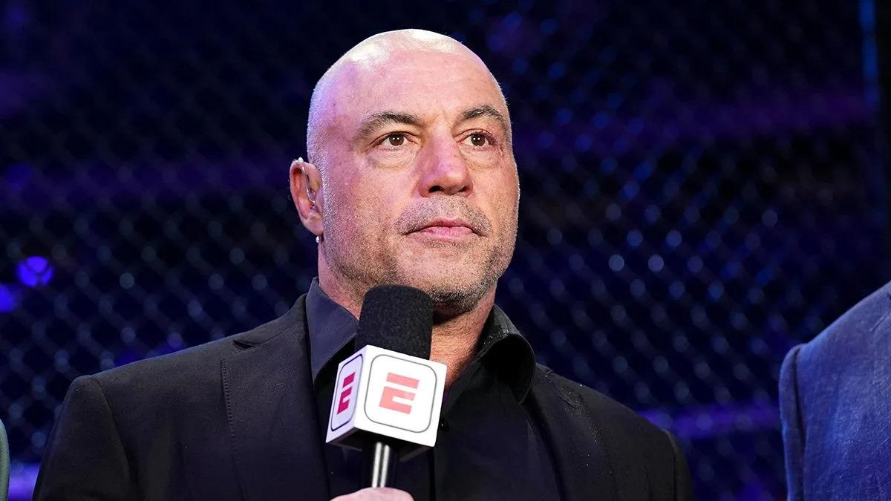
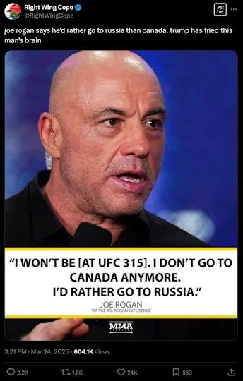

## Claim
Claim: "In March 2025 podcaster and UFC commentator Joe Rogan said, 'I don't go to Canada anymore,' then added, 'I'd rather go to Russia.'"

## Actions
```
web_search("Joe Rogan Canada Russia March 2025")
```

## Evidence
### Evidence from `web_search`
Joe Rogan said, "I don't go to Canada anymore," and added, "I'd rather go to Russia" on his podcast, "The Joe Rogan Experience," on March 22, 2025, when asked about UFC 315 in Montreal. This was reported by Yahoo News ([https://www.yahoo.com/news/fact-check-joe-rogan-said-234200896.html](https://www.yahoo.com/news/fact-check-joe-rogan-said-234200896.html)), Global News ([https://globalnews.ca/news/11098769/joe-rogan-rather-go-to-russia-than-canada-ufc/](https://globalnews.ca/news/11098769/joe-rogan-rather-go-to-russia-than-canada-ufc/)), and the New York Post ([https://nypost.com/2025/03/25/sports/joe-rogan-not-attending-ufc-315-in-canada-id-rather-go-to-russia/](https://nypost.com/2025/03/25/sports/joe-rogan-not-attending-ufc-315-in-canada-id-rather-go-to-russia/)). , , , , , , 


## Elaboration
The evidence confirms that Joe Rogan made the statements in question on his podcast, "The Joe Rogan Experience," on March 22, 2025. The statement was made in reference to UFC 315 in Montreal. The claim is supported by reports from Yahoo News ([https://www.yahoo.com/news/fact-check-joe-rogan-said-234200896.html](https://www.yahoo.com/news/fact-check-joe-rogan-said-234200896.html)), Global News ([https://globalnews.ca/news/11098769/joe-rogan-rather-go-to-russia-than-canada-ufc/](https://globalnews.ca/news/11098769/joe-rogan-rather-go-to-russia-than-canada-ufc/)), and the New York Post ([https://nypost.com/2025/03/25/sports/joe-rogan-not-attending-ufc-315-in-canada-id-rather-go-to-russia/](https://nypost.com/2025/03/25/sports/joe-rogan-not-attending-ufc-315-in-canada-id-rather-go-to-russia/)).


## Final Judgement
The claim is accurate. Multiple reliable sources confirm that Joe Rogan made the statement in March 2025 on his podcast.

`true`


### Verdict: TRUE

### Justification
The claim is accurate. Joe Rogan made the statement, "I don't go to Canada anymore," and added, "I'd rather go to Russia" on his podcast on March 22, 2025, as reported by Yahoo News ([https://www.yahoo.com/news/fact-check-joe-rogan-said-234200896.html](https://www.yahoo.com/news/fact-check-joe-rogan-said-234200896.html)), Global News ([https://globalnews.ca/news/11098769/joe-rogan-rather-go-to-russia-than-canada-ufc/](https://globalnews.ca/news/11098769/joe-rogan-rather-go-to-russia-than-canada-ufc/)), and the New York Post ([https://nypost.com/2025/03/25/sports/joe-rogan-not-attending-ufc-315-in-canada-id-rather-go-to-russia/](https://nypost.com/2025/03/25/sports/joe-rogan-not-attending-ufc-315-in-canada-id-rather-go-to-russia/)).
