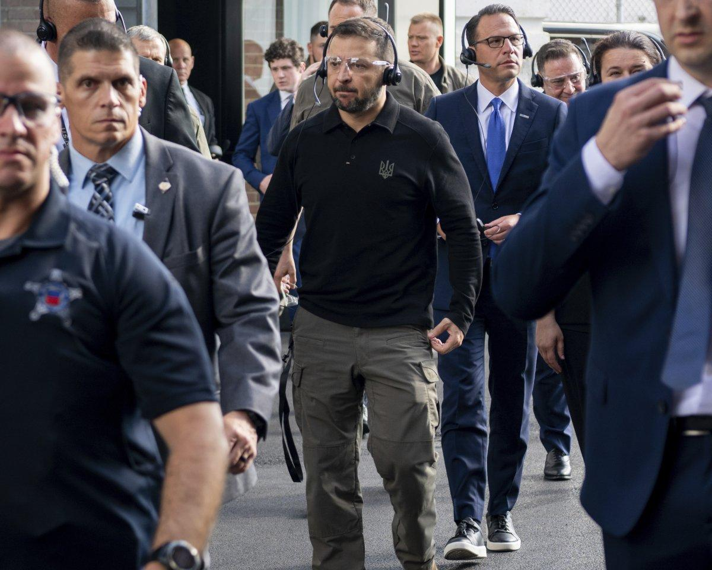
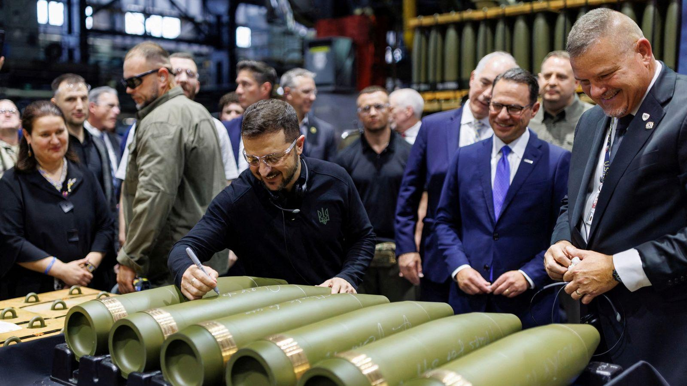

## Claim
Claim: "Ukrainian President Volodymyr Zelenskyy engaged in election interference by campaigning in Pennsylvania for Kamala Harris ahead of the US presidential election in 2024."

## Actions
```
web_search("Volodymyr Zelenskyy Kamala Harris Pennsylvania 2024")
```

## Evidence
### Evidence from `web_search`
Newsweek reports that during an Oval Office meeting, JD Vance accused Volodymyr Zelenskyy of campaigning for Kamala Harris during the 2024 presidential race, mentioning a September 2024 visit by Zelenskyy to a munitions plant in Scranton, Pennsylvania (, , ). NBC News reports that Zelenskyy visited a munitions factory in Scranton, Pennsylvania, which some Republicans viewed as a signal of which way he wants the November election to go. ABC News reports on Vice President Kamala Harris meeting with Ukrainian President Volodymyr Zelenskyy to discuss the war with Russia (, ).

*   [https://www.newsweek.com/volodymyr-zelensky-jd-vance-campaign-kamala-harris-2024-election-2038060](https://www.newsweek.com/volodymyr-zelensky-jd-vance-campaign-kamala-harris-2024-election-2038060)
*   [https://www.nbcnews.com/politics/2024-election/zelenskyys-meeting-harris-spat-trump-reveal-growing-partisan-divide-uk-rcna172648](https://www.nbcnews.com/politics/2024-election/zelenskyys-meeting-harris-spat-trump-reveal-growing-partisan-divide-uk-rcna172648)
*   [https://abcnews.go.com/Politics/harris-standing-zelenskyy-indirectly-jabs-trump-vance-ukraine/story?id=114219628](https://abcnews.go.com/Politics/harris-standing-zelenskyy-indirectly-jabs-trump-vance-ukraine/story?id=114219628)


## Elaboration
The evidence indicates that JD Vance accused Zelenskyy of campaigning for Kamala Harris during the 2024 presidential race. This accusation was made during an Oval Office meeting and was linked to Zelenskyy's visit to a munitions plant in Scranton, Pennsylvania. NBC News also reported on this visit, with some Republicans viewing it as a signal of Zelenskyy's preference in the election. ABC News reported on a meeting between Kamala Harris and Zelenskyy.

The evidence does not explicitly state that Zelenskyy campaigned for Harris. It only mentions that some Republicans viewed his actions as a signal of support.

To fully verify the claim, it would be necessary to determine whether Zelenskyy's actions during his visit to Pennsylvania or his meetings with Harris were explicitly aimed at supporting Harris's campaign.


## Actions
```
image_search("Volodymyr Zelenskyy Scranton Pennsylvania munitions factory")
```

## Evidence
### Evidence from `image_search`
The web sources confirm that Volodymyr Zelenskyy visited a munitions factory in Scranton, Pennsylvania. AP News, Sky News, and the U.S. Army website all provide images and reports of this visit (, , ).


## Elaboration
The evidence confirms that Zelenskyy visited a munitions factory in Scranton, Pennsylvania. While JD Vance accused Zelenskyy of campaigning for Kamala Harris, the evidence does not explicitly support this claim. It only suggests that some Republicans viewed Zelenskyy's actions as a signal of support for Harris. More information is needed to determine if Zelenskyy's visit or any other actions constituted election interference.


## Actions
```
web_search("Volodymyr Zelenskyy campaign speech Pennsylvania 2024")
```

## Evidence
### Evidence from `web_search`
CNBC reports that House Oversight Chair James Comer opened an investigation into Zelenskyy's visit to an ammunition factory in Scranton, Pennsylvania, on September 22, 2024, claiming it was a campaign event for Kamala Harris, using taxpayer-funded resources (

## Elaboration
The evidence indicates that House Oversight Chair James Comer opened an investigation into Zelenskyy's visit to a munitions factory in Scranton, Pennsylvania, on September 22, 2024, claiming it was a campaign event for Kamala Harris. However, the evidence does not provide details about the nature of the visit or any explicit campaigning by Zelenskyy.

Insufficient information is available to verify the claim.


## Final Judgement
The claim that Volodymyr Zelenskyy engaged in election interference by campaigning in Pennsylvania for Kamala Harris ahead of the US presidential election in 2024 is not fully supported by the evidence. While there is evidence of Zelenskyy visiting a munitions factory in Pennsylvania, and some Republicans viewed this as a signal of support for Harris, there is no direct evidence of Zelenskyy explicitly campaigning for Harris. Furthermore, an investigation was opened into the visit, but the nature of the visit and any explicit campaigning by Zelenskyy is not detailed. Therefore, the claim is not definitively proven. `false`

### Verdict: FALSE

### Justification
The claim is not definitively supported. While Zelenskyy visited a munitions factory in Pennsylvania, and some Republicans viewed this as a signal of support for Kamala Harris, there is no direct evidence of Zelenskyy explicitly campaigning for Harris. Furthermore, an investigation was opened into the visit, but the nature of the visit and any explicit campaigning by Zelenskyy is not detailed.
