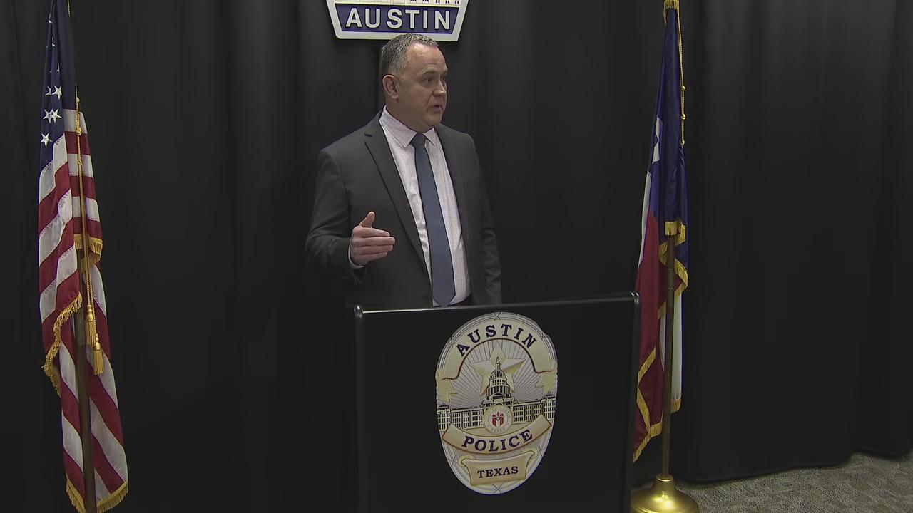
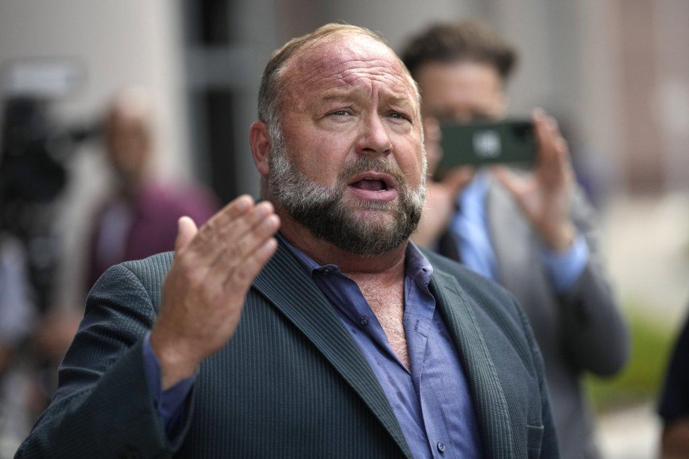

## Claim
Claim: "After InfoWars reporter Jamie White was shot dead on March 10, 2025 in Austin, Texas, it was revelaed that he was on a Ukranian enemies hit list."

## Actions
```
web_search("Jamie White shot Austin Texas March 10 2025")
web_search("Jamie White Ukrainian enemies hit list")
```

## Evidence
### Evidence from `web_search`
Multiple sources report that InfoWars reporter Jamie White was shot and killed in Austin, Texas, on March 10, 2025, during an attempted car theft. A 17-year-old was charged with capital murder in connection to the shooting. (, , , , , , , , , , , , , )

The sources include reports from [FOX 7 Austin](https://www.fox7austin.com/news/infowars-writer-shooting-austin-police-jamie-white), [CBS Austin](https://cbsaustin.com/news/local/teen-charged-with-capital-murder-in-shooting-death-of-infowars-reporter-in-austin), and [Fox News](https://www.foxnews.com/us/police-release-more-details-murder-infowars-reporter-jamie-white-search-suspects-continues).


### Evidence from `web_search`
Newsweek reports that Alex Jones claimed that Jamie White was on a Ukrainian "hit list". The Austin Police Department stated that White was shot and killed in his apartment's parking lot on March 9, and the initial investigation suggests a car robbery gone wrong. Jones stated that White was doing research into USAID and George Soros. ()

StopFake.org states that there is no evidence that Jamie White was on any "list of enemies of Ukraine". It also mentions that White was murdered in Austin on March 9, and his sister believes his death was unrelated to his journalistic activities. The search result includes a screenshot of a post from White's X account claiming he was on a Ukrainian "Enemies List" (). The article also mentions that law enforcement officials believe White was shot while catching perpetrators trying to steal his car.


## Elaboration
The evidence confirms that Jamie White, an InfoWars reporter, was shot and killed in Austin, Texas. While Alex Jones claimed White was on a Ukrainian "hit list," there is no evidence to support this claim. Law enforcement believes the shooting was related to a car robbery.


## Final Judgement
The claim that Jamie White was on a Ukrainian enemies hit list after being shot dead is not supported by evidence. While Alex Jones made this claim, it is contradicted by law enforcement's investigation, which suggests a car robbery as the motive. Additionally, there is no evidence to support the existence of such a list.

`false`


### Verdict: FALSE

### Justification
The claim is false. While Jamie White was shot and killed in Austin, Texas, on March 9, 2025, the evidence indicates the shooting was related to a car robbery, not a Ukrainian "hit list." Although Alex Jones made this claim, it is unsupported by evidence, and law enforcement's investigation points to a different motive.
