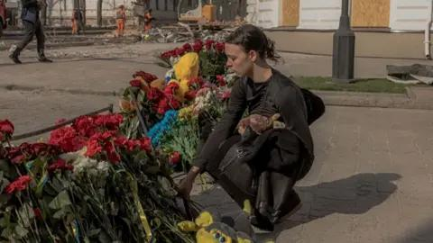

## Claim
Claim: "Ukrainian President Volodymyr Zelenskyy started the 2022 war in Ukraine with Russia."

## Actions
```
web_search("Volodymyr Zelenskyy started 2022 war")
```

## Evidence
### Evidence from `web_search`
On February 24, 2022, Russia initiated a "special military operation" in the Donbas, as stated in the Wikipedia article ([https://en.wikipedia.org/wiki/Volodymyr_Zelenskyy](https://en.wikipedia.org/wiki/Volodymyr_Zelenskyy)) <image:k>. The article also mentions that Zelenskyy called for direct talks with Putin. Al Jazeera published a fact-check ([https://www.aljazeera.com/news/2025/2/20/fact-check-did-ukraine-start-its-war-with-russia-as-trump-claims](https://www.aljazeera.com/news/2025/2/20/fact-check-did-ukraine-start-its-war-with-russia-as-trump-claims)) stating that Russian forces launched an invasion of Ukraine on February 24, 2022 .

The BBC News article ([https://www.bbc.com/news/articles/cg5q0mev07lo](https://www.bbc.com/news/articles/cg5q0mev07lo)) reports that Donald Trump blamed Volodymyr Zelenskyy for starting the war with Russia , . Trump stated that Zelenskyy shared the blame with Vladimir Putin for the casualties in the conflict.


## Elaboration
The evidence indicates that Russia initiated a "special military operation" on February 24, 2022, which is when the war began ([https://en.wikipedia.org/wiki/Volodymyr_Zelenskyy](https://en.wikipedia.org/wiki/Volodymyr_Zelenskyy)). Al Jazeera's fact-check confirms that Russian forces launched an invasion on that date ([https://www.aljazeera.com/news/2025/2/20/fact-check-did-ukraine-start-its-war-with-russia-as-trump-claims](https://www.aljazeera.com/news/2025/2/20/fact-check-did-ukraine-start-its-war-with-russia-as-trump-claims)).

Donald Trump has blamed Zelenskyy for starting the war, stating that he shares blame with Putin ([https://www.bbc.com/news/articles/cg5q0mev07lo](https://www.bbc.com/news/articles/cg5q0mev07lo)). However, the evidence does not provide any information to support the claim that Zelenskyy started the war.

The evidence suggests that Russia initiated the war. Therefore, the claim is not supported by the evidence.


## Final Judgement
The evidence indicates that Russia initiated the war in Ukraine on February 24, 2022. While some sources mention that Zelenskyy called for talks with Putin, there is no evidence to support the claim that he started the war.

`false`

### Verdict: FALSE

### Justification
The claim that Volodymyr Zelenskyy started the 2022 war in Ukraine is not supported by the evidence. Multiple sources, including a Wikipedia article ([https://en.wikipedia.org/wiki/Volodymyr_Zelenskyy](https://en.wikipedia.org/wiki/Volodymyr_Zelenskyy)) and an Al Jazeera fact-check ([https://www.aljazeera.com/news/2025/2/20/fact-check-did-ukraine-start-its-war-with-russia-as-trump-claims](https://www.aljazeera.com/news/2025/2/20/fact-check-did-ukraine-start-its-war-with-russia-as-trump-claims)), indicate that Russia initiated the war on February 24, 2022.
