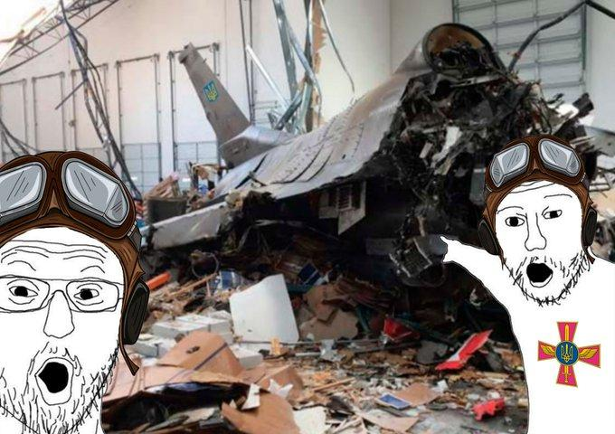

## Claim
Claim: " This image shows a Ukrainian F-16 fighter jet which was shot down by Russia as part of the large-scale Russian invasion in Ukraine."

## Actions
```
reverse_search()
web_search("Ukrainian F-16 shot down Russia")
```

## Evidence
### Evidence from `reverse_search`
The image in the claim () is of an F-16 that crashed near March Air Reserve Base in May 2019. The crash was due to hydraulic failure caused by improperly installed parts. The pilot ejected and survived. The image is found in articles from The Press-Enterprise ([https://www.pressenterprise.com/2020/05/01/heres-why-the-missiles-on-the-crashed-f-16-near-march-air-reserve-base-did-not-explode/](https://www.pressenterprise.com/2020/05/01/heres-why-the-missiles-on-the-crashed-f-16-near-march-air-reserve-base-did-not-explode/)), Air & Space Forces Magazine ([https://www.airandspaceforces.com/improperly-installed-parts-caused-f-16-to-crash-into-warehouse-in-may-2019/](https://www.airandspaceforces.com/improperly-installed-parts-caused-f-16-to-crash-into-warehouse-in-may-2019/)), and The Sun ([https://www.sbsun.com/2020/04/23/hydraulic-failure-caused-f-16-to-crash-near-march-base-last-year-air-force-says/](https://www.sbsun.com/2020/04/23/hydraulic-failure-caused-f-16-to-crash-near-march-base-last-year-air-force-says/)). The image in the claim matches the image of the crashed F-16 in the warehouse.


### Evidence from `web_search`
Reuters reports that a Ukrainian F-16 fighter pilot died in a crash while repelling a Russian air attack. Ukraine has lost three F-16s since it began operating the jets last year. Newsweek reports that Ukraine has lost three F-16 fighter pilots. One F-16 pilot, Lieutenant Colonel Maksym Ustimenko, was killed after his aircraft was damaged while intercepting Russian air targets. A second F-16 was shot down in April, killing its pilot, and a third pilot ejected from his aircraft after losing communication. CNN reports that a Ukrainian F-16 pilot was killed after Russia launched a large aerial assault. This was the fourth F-16 lost by Ukraine since they began flying the jets.

Sources: [Reuters](https://www.reuters.com/business/aerospace-defense/least-six-wounded-large-scale-russian-air-attack-ukraine-ukrainian-authorities-2025-06-29/), [Newsweek](https://www.newsweek.com/ukraine-f16-pilot-killed-russia-2092478), [CNN](https://www.cnn.com/2025/06/29/europe/ukraine-f-16-pilot-killed-russia).


## Elaboration
The image in the claim depicts an F-16 that crashed near March Air Reserve Base in May 2019 due to hydraulic failure, not a Russian attack. The image has been altered with meme characters. The claim is therefore false.

The web search results confirm that Ukraine has lost F-16s in the conflict with Russia. However, the image in the claim does not depict a Ukrainian F-16 shot down by Russia.


## Final Judgement
The image in the claim shows an F-16 that crashed in 2019 due to mechanical failure, not a Russian attack. The image has been altered with meme characters. The claim is therefore false. `false`

### Verdict: FALSE

### Justification
The image in the claim depicts an F-16 that crashed in 2019 due to mechanical failure, as reported by The Press-Enterprise ([https://www.pressenterprise.com/2020/05/01/heres-why-the-missiles-on-the-crashed-f-16-near-march-air-reserve-base-did-not-explode/](https://www.pressenterprise.com/2020/05/01/heres-why-the-missiles-on-the-crashed-f-16-near-march-air-reserve-base-did-not-explode/)), not a Russian attack. While Ukraine has lost F-16s in the conflict with Russia, the image is unrelated to the current conflict.
