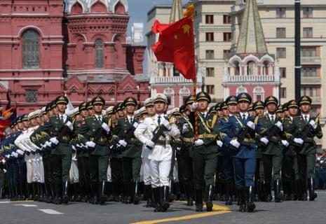

## Claim
Claim: " This image shows the Chinese Communist Party's Red Cross troops in Russia who have changed into winter clothes and set off for the Russian-Ukrainian front to aid Russia in rescuing its occupied territories."

## Actions
```
reverse_search()
web_search("Chinese Red Cross troops Russia Ukraine")
```

## Evidence
### Evidence from `reverse_search`
The image in the claim appears on the Wikipedia article "Airliner" ([https://en.wikipedia.org/wiki/Airliner](https://en.wikipedia.org/wiki/Airliner)), the Smithsonian National Air and Space Museum ([https://airandspace.si.edu/explore/stories/evolution-commercial-airliner](https://airandspace.si.edu/explore/stories/evolution-commercial-airliner)), and Merriam-Webster ([https://www.merriam-webster.com/dictionary/airliner](https://www.merriam-webster.com/dictionary/airliner)). The image is of an airliner .


### Evidence from `web_search`
CNN reported on April 16, 2025, about the capture of Chinese nationals fighting for Russia in Ukraine, with a photo of a Ukrainian security officer adjusting handcuffs on a Chinese national. The Guardian reported on May 9, 2025, that Chinese troops marched with Russian forces in Moscow's Victory Day parade. The International Federation of Red Cross and Red Crescent Societies and the International Committee of the Red Cross published a report on the Russia-Ukraine conflict, mentioning the involvement of the Russian Red Cross Society and the Red Cross Society of China.

The sources are: [https://www.cnn.com/2025/04/16/europe/ukraine-russia-chinese-nationals-intl-latam](https://www.cnn.com/2025/04/16/europe/ukraine-russia-chinese-nationals-intl-latam), [https://www.theguardian.com/weather/2025/may/09/chinese-troops-march-with-russian-forces-as-xi-joins-putin-for-victory-day-parade](https://www.theguardian.com/weather/2025/may/09/chinese-troops-march-with-russian-forces-as-xi-joins-putin-for-victory-day-parade), and [https://www.icrc.org/sites/default/files/document_new/file_list/red_cross_movement_activities_overview_ukraine_2022_3.pdf](https://www.icrc.org/sites/default/files/document_new/file_list/red_cross_movement_activities_overview_ukraine_2022_3.pdf).

, , , , <image:k>


## Elaboration
The image in the claim is of an airliner. The provided evidence does not contain any information about the Chinese Red Cross troops setting off for the Russian-Ukrainian front. However, the evidence does mention the involvement of the Red Cross Society of China in the Russia-Ukraine conflict. Also, the evidence mentions that Chinese troops marched with Russian forces in Moscow's Victory Day parade.

The claim cannot be verified based on the provided evidence. More information is needed to confirm the claim.


## Final Judgement
The image in the claim is of an airliner, and the provided evidence does not support the claim that it depicts Chinese Red Cross troops. The evidence does mention the involvement of the Red Cross Society of China in the Russia-Ukraine conflict and the presence of Chinese troops in a Moscow parade. However, there is no evidence to support the claim that the image shows Chinese Red Cross troops setting off for the Russian-Ukrainian front.

`false`

### Verdict: FALSE

### Justification
The image in the claim is of an airliner, not Chinese Red Cross troops. While there is evidence of Chinese involvement in the Russia-Ukraine conflict, including the Red Cross Society of China and Chinese troops marching in a Moscow parade ([https://www.theguardian.com/weather/2025/may/09/chinese-troops-march-with-russian-forces-as-xi-joins-putin-for-victory-day-parade](https://www.theguardian.com/weather/2025/may/09/chinese-troops-march-with-russian-forces-as-xi-joins-putin-for-victory-day-parade)), the provided evidence does not support the claim that the image depicts the troops setting off for the front.
