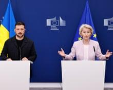

## Claim
Claim: "In early 2025, Ukraine and Russia had reached a peace deal in their years-long war."

## Actions
```
web_search("Ukraine Russia peace deal 2025")
```

## Evidence
### Evidence from `web_search`
The Guardian published an article on August 21, 2025, discussing Donald Trump's involvement in the Russia-Ukraine peace talks, mentioning a meeting between Trump and Zelenskyy on August 18, 2025 (). The article states that Trump intends to let Russia and Ukraine organize a meeting between their leaders without his direct involvement. CNN published an article on August 19, 2025, discussing the difference between a ceasefire and a peace deal in the context of the war between Ukraine and Russia (<image:0>, , , , ).

Wikipedia discusses peace negotiations in the Russian invasion of Ukraine, mentioning events up to December 2024, and a "2025 Sumy offensive" and a "2025 Belgorod incursion". It also mentions that in December 2024, Donald Trump began a push for peace negotiations between Russia and Ukraine, and links to a "2025 Putin–Trump call".


## Elaboration
The evidence suggests that peace talks and negotiations were ongoing in 2025, but it does not explicitly confirm that a peace deal was reached in early 2025. The Guardian article from August 2025 mentions Trump's involvement in peace talks, and CNN discusses the difference between a ceasefire and a peace deal. Wikipedia mentions events up to December 2024 and ongoing events in 2025, including Trump's push for peace negotiations.

The evidence indicates that negotiations were in progress, but the claim requires more information to confirm whether a peace deal was actually reached in early 2025.


## Actions
```
web_search("Ukraine Russia peace deal signed 2025")
```

## Evidence
### Evidence from `web_search`
From [Source](https://www.theguardian.com/us-news/2025/aug/16/ukraine-russia-peace-deal-donbas-region): 
Content: The Guardian published an article on August 16, 2025, reporting that Donald Trump would back a plan to cede Ukrainian territory to Russia to secure an end to the war. The article mentions Trump's post-summit call with European leaders and his support for a direct peace deal, bypassing a ceasefire. , , , , , .


## Elaboration
The evidence indicates that a peace deal was not reached in early 2025. The Guardian article from August 16, 2025, discusses Trump's support for a peace deal, suggesting that it was still being negotiated at that time.


## Final Judgement
The search results indicate that peace negotiations were ongoing in 2025, but no evidence confirms that a peace deal was reached in early 2025. The Guardian article from August 2025 discusses ongoing negotiations and Trump's involvement, suggesting that a deal had not yet been finalized.

`false`

### Verdict: FALSE

### Justification
Based on the provided evidence, the claim is false. While peace negotiations were ongoing in 2025, there is no evidence to support that a peace deal was reached in early 2025. A  [The Guardian article](https://www.theguardian.com/us-news/2025/aug/16/ukraine-russia-peace-deal-donbas-region) from August 2025 discusses ongoing negotiations and Trump's involvement, indicating that a deal had not yet been finalized.
