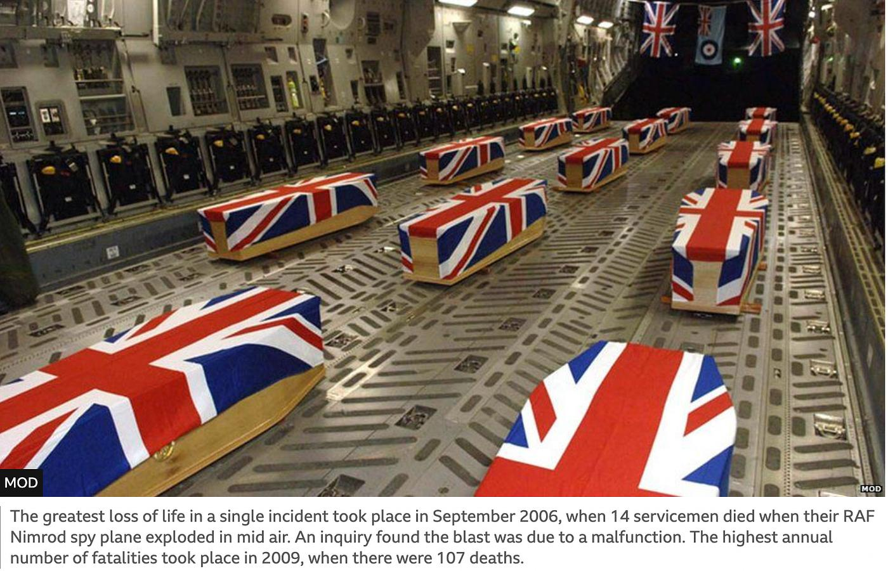
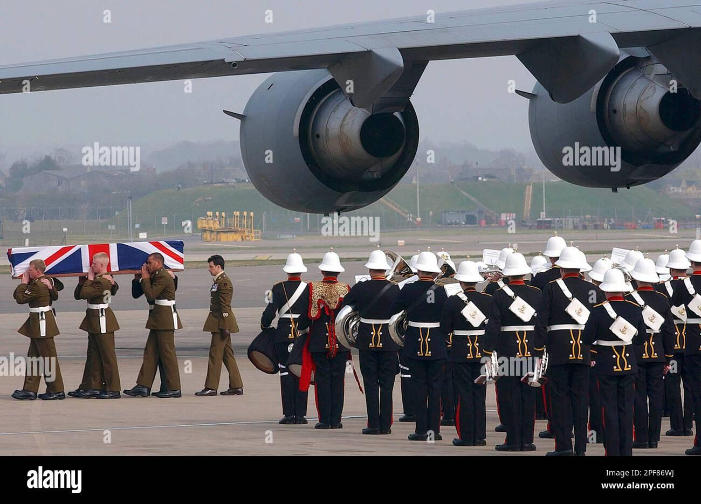
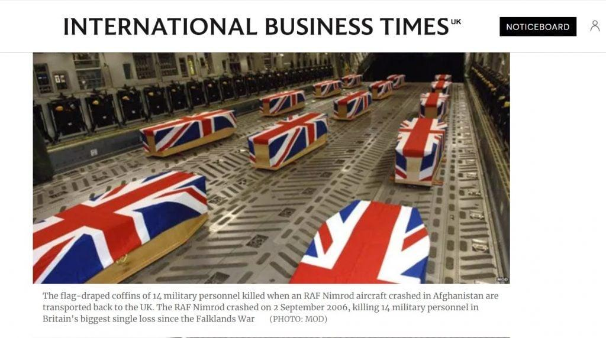

## Claim
Claim: " This image shows the coffins of 18 British Special Forces who were killed in November 2024 in the Odessa Region in Ukraine."

## Actions
```
web_search("British Special Forces killed Odessa Ukraine")
image_search("coffins British flag military plane")
```

## Evidence
### Evidence from `web_search`
The search results discuss claims related to British Special Forces in Ukraine. One source, from [UA Wire](https://www.uawire.org/false-allegations-of-british-sas-casualties-in-odesa-dutch-journalist-s-controversial-claims-debunked-by-ukrainian-military), debunks a claim by Dutch journalist Sonja van den Ende that 18 British special forces soldiers were killed in Odesa, with the Southern Defense Forces spokesperson stating there was no evidence.  Another source, from [Detector Media](https://disinfo.detector.media/en/post/russian-aircraft-allegedly-destroyed-a-british-special-forces-group-in-odesa), denies a claim that Russian aircraft destroyed a group of British SAS special forces in Odesa.

A third source, from [EADaily](https://eadaily.com/en/news/2025/08/04/these-are-not-tourists-two-british-colonels-were-captured-by-russian-special-forces), reports that Russian special forces captured two British officers in Ukraine.


### Evidence from `image_search`
The image shows coffins draped in the British flag inside a military plane (). The image is not related to the claim. One source states that the image is related to the coffins of 14 servicemen who died when their RAF Nimrod spy plane exploded in mid-air in September 2006. Another source shows a British flag-draped coffin being carried away from a military cargo plane on March 29, 2003, at Brize Norton Royal Air Force Base, England (). The coffins were the first of Britain's combat victims to return home from service in Operation Iraqi Freedom.

The International Business Times UK published an article about the flag-draped coffins of 14 military personnel killed when an RAF Nimrod aircraft crashed in Afghanistan (). The RAF Nimrod crashed on 2 September 2006.


## Elaboration
The claim that the image shows the coffins of 18 British Special Forces killed in November 2024 in the Odessa Region in Ukraine is not supported by the evidence. The image search results indicate that the image depicts coffins draped in the British flag, but they are associated with different events. One source states that the image is related to the coffins of 14 servicemen who died when their RAF Nimrod spy plane exploded in mid-air in September 2006.

Furthermore, the web search results debunk claims of British Special Forces casualties in Odesa. One source specifically debunks a claim by a Dutch journalist about 18 British special forces soldiers killed in Odesa, with the Southern Defense Forces spokesperson stating there was no evidence.

Therefore, based on the evidence, the claim is false.


## Final Judgement
The image is not related to the claim. The image search results indicate that the image depicts coffins draped in the British flag, but they are associated with different events. The web search results debunk claims of British Special Forces casualties in Odesa.

`false`

### Verdict: FALSE

### Justification
The claim is false. The image depicts coffins draped in the British flag, but they are associated with events unrelated to the claim, such as the 2006 RAF Nimrod crash, as indicated by the image search results. Furthermore, web search results, such as the one from [UA Wire](https://www.uawire.org/false-allegations-of-british-sas-casualties-in-odesa-dutch-journalist-s-controversial-claims-debunked-by-ukrainian-military), debunk claims of British Special Forces casualties in Odesa.
