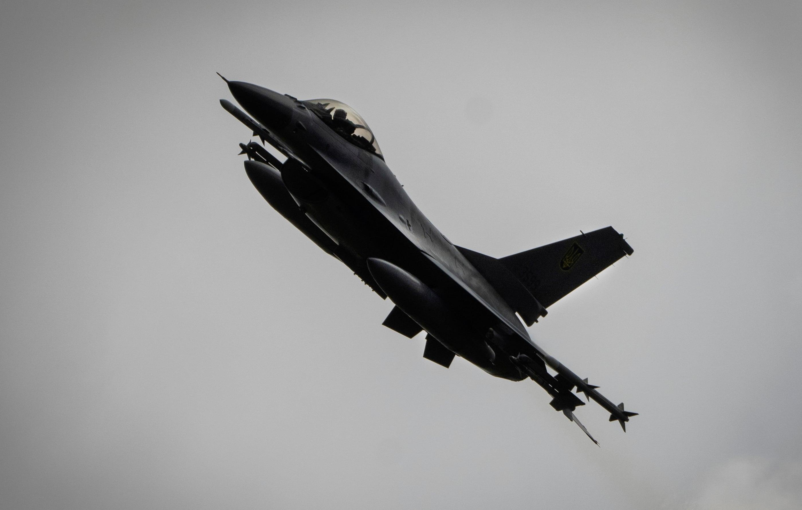
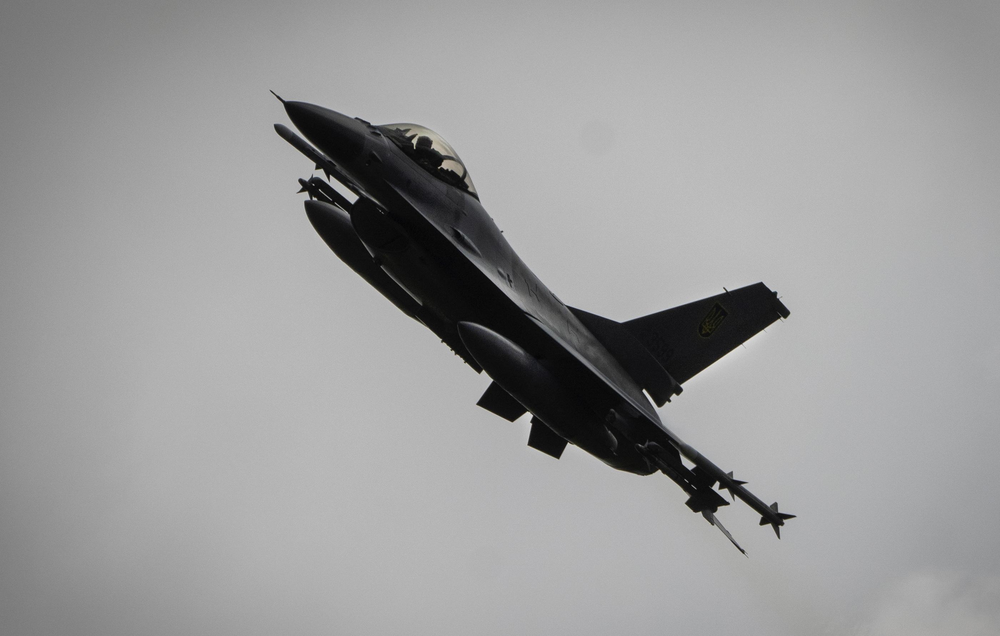
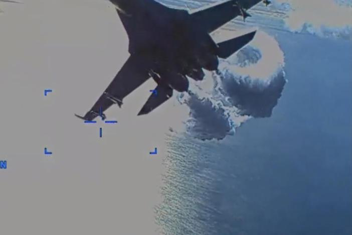
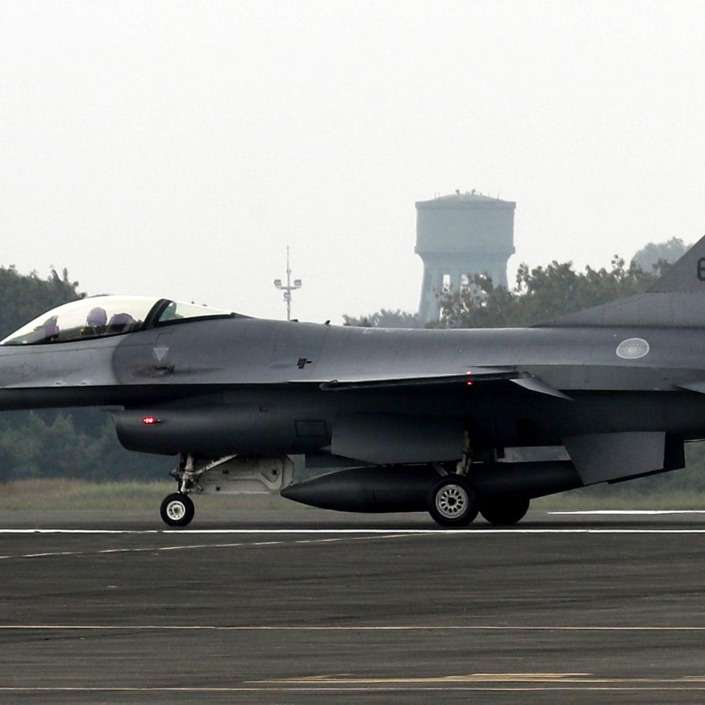

## Claim
Claim: " This image shows a US F-16 fighter jet which was shot down in August 2024 in airspace over the Black Sea after refusing to obey Russian orders."

## Actions
```
web_search("F-16 shot down Black Sea August 2024")
image_search("F-16 fighter jet crash Black Sea")
```

## Evidence
### Evidence from `web_search`
Defense News reported on August 29, 2024, that a Ukrainian F-16 jet crashed during a Russian attack, killing the pilot. The War Zone discusses claims about a Ukrainian F-16 shooting down a Russian Su-35S Flanker, mentioning the death of F-16 pilot Oleksiy Mes in August 2024. The Guardian published an article on August 28, 2024, discussing the Ukraine war, where Volodymyr Zelenskiy said F-16s were used to shoot down Russian missiles. , , , , 

The articles can be found here: [Source](https://www.defensenews.com/global/europe/2024/08/29/ukraine-f-16-jet-crashes-during-russian-attack-killing-pilot/), [Source](https://www.twz.com/air/claims-swirl-around-russian-su-35s-flanker-shootdown), and [Source](https://www.theguardian.com/world/article/2024/aug/28/ukraine-war-briefing-zelenskiy-says-f16s-shooting-down-russian-missiles).


### Evidence from `image_search`
NPR reports on a Ukrainian F-16 warplane crash. () The US military released footage of a drone crash in the Black Sea. () The Guardian reports on a Taiwan F-16 jet crash. ()

The sources are: [https://www.npr.org/2024/08/30/g-s1-20234/ukraine-f16-warplane-crash](https://www.npr.org/2024/08/30/g-s1-20234/ukraine-f16-warplane-crash), [https://www.gpb.org/news/2023/03/16/the-us-military-releases-footage-of-black-sea-drone-crash-russian-jet](https://www.gpb.org/news/2023/03/16/the-us-military-releases-footage-of-black-sea-drone-crash-russian-jet), and [https://www.theguardian.com/world/2022/jan/11/taiwan-f-16-jet-crashes-sea-fleet-suspended](https://www.theguardian.com/world/2022/jan/11/taiwan-f-16-jet-crashes-sea-fleet-suspended).


## Elaboration
The evidence indicates that Ukrainian F-16s have been involved in the war, with at least one crashing in August 2024. The evidence does not mention a US F-16 being shot down in the Black Sea after refusing Russian orders. The image provided does not have enough context to verify the claim.

The claim is not supported by the evidence. More information is needed to verify the claim.


## Final Judgement
The evidence confirms that F-16s have been involved in the war in Ukraine, with at least one crashing in August 2024. However, the evidence does not support the claim that a US F-16 was shot down in the Black Sea after refusing Russian orders. The image provided does not have enough context to verify the claim.

The claim is not factually accurate because it is not supported by the evidence. The evidence does not mention a US F-16 being shot down in the Black Sea after refusing Russian orders. `false`

### Verdict: FALSE

### Justification
The claim is not supported by the evidence. While there are reports of Ukrainian F-16s crashing in August 2024, there is no evidence to support the claim that a US F-16 was shot down in the Black Sea after refusing Russian orders. The provided image lacks sufficient context to verify the claim.
