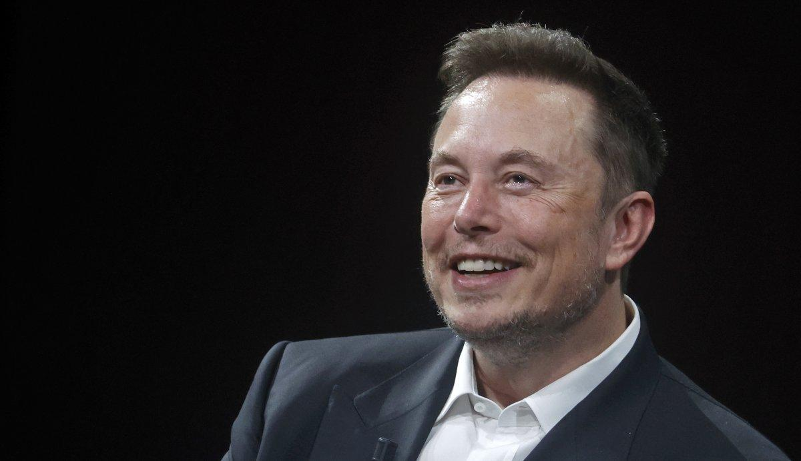

## Claim
Claim: " This image shows a screenshot of an authentic X post from Elon Musk on November 6, 2025 saying 'The last dollar for Zelenskiy'."

## Actions
```
web_search("Elon Musk X post Zelenskiy last dollar")
```

## Evidence
### Evidence from `web_search`
The AOL article ([https://www.aol.com/fact-check-elon-musk-didn-164103080.html](https://www.aol.com/fact-check-elon-musk-didn-164103080.html)) fact-checks the claim that Elon Musk posted "The last dollar for Zelenskiy" and states that the claim is false, with no evidence of Musk posting it. The image of the tweet is fake.

Politico.eu ([https://www.politico.eu/article/billionaire-elon-musk-mocks-ukraine-president-zelenskyy-asking-aid-with-meme/](https://www.politico.eu/article/billionaire-elon-musk-mocks-ukraine-president-zelenskyy-asking-aid-with-meme/)) discusses Elon Musk's meme mocking Ukrainian President Volodymyr Zelenskyy's calls for Western aid. Newsweek ([https://www.newsweek.com/ukraine-hits-back-elon-musk-over-meme-taunting-zelensky-1831547](https://www.newsweek.com/ukraine-hits-back-elon-musk-over-meme-taunting-zelensky-1831547)) discusses a meme posted by Elon Musk on X that mocked Ukrainian President Volodymyr Zelensky.  


## Elaboration
The AOL article ([https://www.aol.com/fact-check-elon-musk-didn-164103080.html](https://www.aol.com/fact-check-elon-musk-didn-164103080.html)) explicitly states that the claim is false, and the image is fake. The evidence also includes articles from Politico.eu ([https://www.politico.eu/article/billionaire-elon-musk-mocks-ukraine-president-zelenskyy-asking-aid-with-meme/](https://www.politico.eu/article/billionaire-elon-musk-mocks-ukraine-president-zelenskyy-asking-aid-with-meme/)) and Newsweek ([https://www.newsweek.com/ukraine-hits-back-elon-musk-over-meme-taunting-zelensky-1831547](https://www.newsweek.com/ukraine-hits-back-elon-musk-over-meme-taunting-zelensky-1831547)) that discuss memes posted by Elon Musk mocking Zelenskyy, but not the specific one mentioned in the claim.

Therefore, the claim is false.


## Final Judgement
The fact-check reveals that the image of the X post is fake, and the claim that Elon Musk posted "The last dollar for Zelenskiy" is false. While Elon Musk has posted memes mocking Zelenskyy, the specific post in the image is not authentic.

`false`


### Verdict: FALSE

### Justification
The claim is false. According to the AOL fact-check ([https://www.aol.com/fact-check-elon-musk-didn-164103080.html](https://www.aol.com/fact-check-elon-musk-didn-164103080.html)), the image of the X post is fake, and there is no evidence that Elon Musk posted "The last dollar for Zelenskiy."
