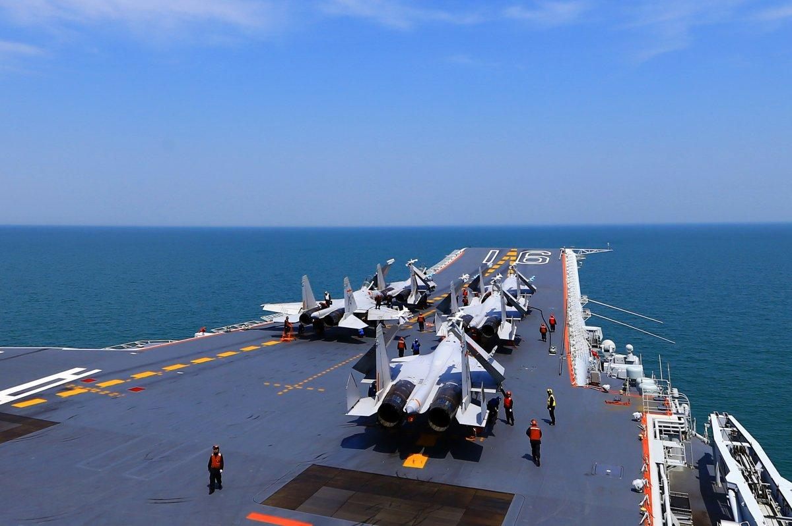

## Claim
Claim: "China and Japan plan to invade the Russian Federation."

## Actions
```
web_search("China Japan Russia invasion plans")
web_search("China Russia military cooperation")
web_search("Japan Russia military cooperation")
```

## Evidence
### Evidence from `web_search`
Newsweek reports on joint military drills between China and Russia in the Sea of Japan, with Japan's Ministry of Defense expressing security concerns regarding China's military cooperation with Russia. The drills are part of the "Maritime Interaction-2025" exercise. (, ) [Source](https://www.newsweek.com/china-russia-drills-trump-2108410)

CEPA discusses the growing military cooperation between Russia and China, particularly after 2014, including joint military exercises and China's acquisition of advanced Russian military hardware. () [Source](https://cepa.org/comprehensive-reports/partnership-short-of-alliance-military-cooperation-between-russia-and-china/)


### Evidence from `web_search`
The Wikipedia article on Japan-Russia relations discusses military cooperation and sanctions imposed by Japan on Russia following the annexation of Crimea. It also mentions leaked Russian documents outlining plans for a potential attack on Japan in the event of a wider conflict (<image:i>). Al Jazeera reported that China and Russia began joint naval drills in the Sea of Japan on August 3, 2025, which included various operations such as submarine rescue and anti-missile operations. Japan's Ministry of Defence has expressed security concerns regarding China's growing military cooperation with Russia (, ).

The Ministry of Foreign Affairs of Japan's document on Japan's policy towards the Russian Federation outlines objectives such as resolving the Northern Territories issue, normalizing relations, and providing assistance for Russia's reforms. The document also mentions political dialogues, security and defense agreements, and Japan's contributions to enhancing safety in the Russian nuclear power industry.


## Elaboration
The evidence indicates that China and Russia are increasing military cooperation, including joint drills. Japan has expressed security concerns about this cooperation. There is also mention of leaked Russian documents outlining potential attack plans on Japan. However, the evidence does not support the claim that China and Japan plan to invade Russia.

The evidence shows that Japan has imposed sanctions on Russia and has expressed security concerns about China's military cooperation with Russia.

The claim is not supported by the evidence. The evidence suggests military cooperation between China and Russia and strained relations between Japan and Russia.


## Final Judgement
The evidence reveals military cooperation between China and Russia, and Japan's concerns about this. However, there is no evidence to support the claim that China and Japan plan to invade Russia.

The claim is demonstrably false because the provided evidence does not support the claim. Instead, the evidence suggests military cooperation between China and Russia and strained relations between Japan and Russia. `false`


### Verdict: FALSE

### Justification
The evidence indicates increasing military cooperation between China and Russia, with Japan expressing security concerns, as reported by [Newsweek](https://www.newsweek.com/china-russia-drills-trump-2108410) and CEPA. While there are mentions of strained relations between Japan and Russia, including leaked documents about potential attacks, there is no evidence to support the claim that China and Japan plan to invade Russia.
