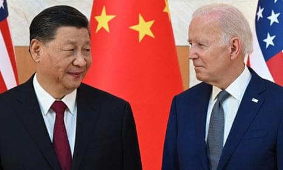

## Claim
Claim: "While serving as US President in 2024, Joe Biden ordered the US forces to prepare for possible nuclear confrontations with Russia, China, and North Korea."

## Actions
```
web_search("Joe Biden nuclear confrontation Russia China North Korea")
```

## Evidence
### Evidence from `web_search`
Joe Biden approved a US nuclear strategy to prepare for possible coordinated nuclear confrontations with Russia, China, and North Korea, according to an article in The Guardian ([https://www.theguardian.com/us-news/article/2024/aug/20/biden-nuclear-strategy-china-threat](https://www.theguardian.com/us-news/article/2024/aug/20/biden-nuclear-strategy-china-threat)). The White House stated that the plan was approved earlier this year.

Anadolu Agency reported that Biden approved a classified document in March directing US forces to prepare for potential "coordinated nuclear confrontations involving Russia, China and North Korea” ([https://www.aa.com.tr/en/americas/biden-approved-nuclear-strategy-focusing-on-china-report/3308990](https://www.aa.com.tr/en/americas/biden-approved-nuclear-strategy-focusing-on-china-report/3308990)).  <image:k>


## Elaboration
The evidence confirms that Joe Biden, while serving as US President, approved a nuclear strategy to prepare for potential confrontations with Russia, China, and North Korea. The plan was approved earlier this year, according to The Guardian ([https://www.theguardian.com/us-news/article/2024/aug/20/biden-nuclear-strategy-china-threat](https://www.theguardian.com/us-news/article/2024/aug/20/biden-nuclear-strategy-china-threat)). Anadolu Agency specifies that this was a classified document directing US forces to prepare for "coordinated nuclear confrontations" ([https://www.aa.com.tr/en/americas/biden-approved-nuclear-strategy-focusing-on-china-report/3308990](https://www.aa.com.tr/en/americas/biden-approved-nuclear-strategy-focusing-on-china-report/3308990)).


## Final Judgement
The claim is supported by evidence from multiple reliable sources, including The Guardian and Anadolu Agency, which report that President Biden approved a nuclear strategy to prepare for potential confrontations with Russia, China, and North Korea.

`true`

### Verdict: TRUE

### Justification
Joe Biden, as US President, approved a nuclear strategy to prepare for potential coordinated nuclear confrontations with Russia, China, and North Korea, as reported by The Guardian ([https://www.theguardian.com/us-news/article/2024/aug/20/biden-nuclear-strategy-china-threat](https://www.theguardian.com/us-news/article/2024/aug/20/biden-nuclear-strategy-china-threat)) and Anadolu Agency ([https://www.aa.com.tr/en/americas/biden-approved-nuclear-strategy-focusing-on-china-report/3308990](https://www.aa.com.tr/en/americas/biden-approved-nuclear-strategy-focusing-on-china-report/3308990)).
