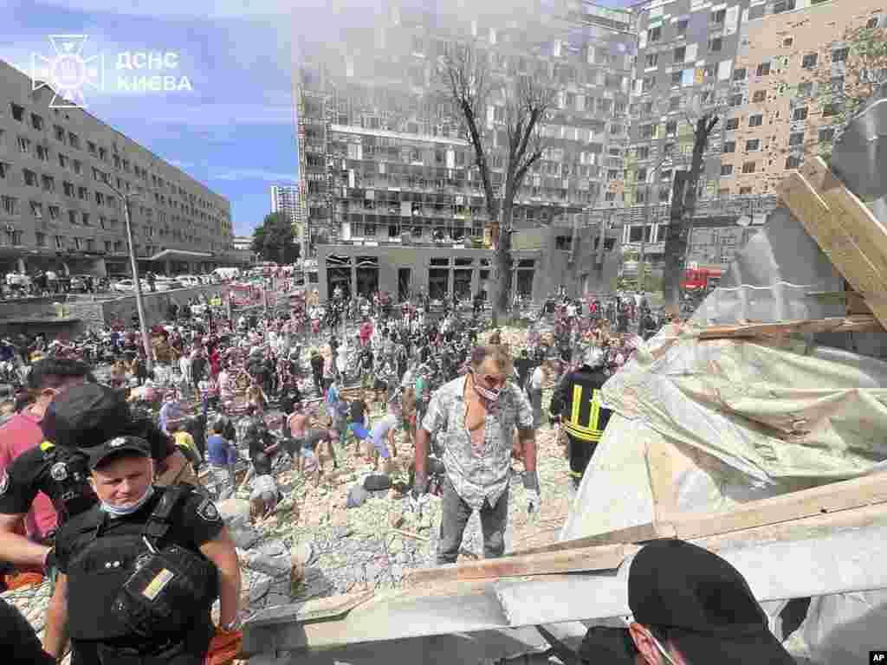
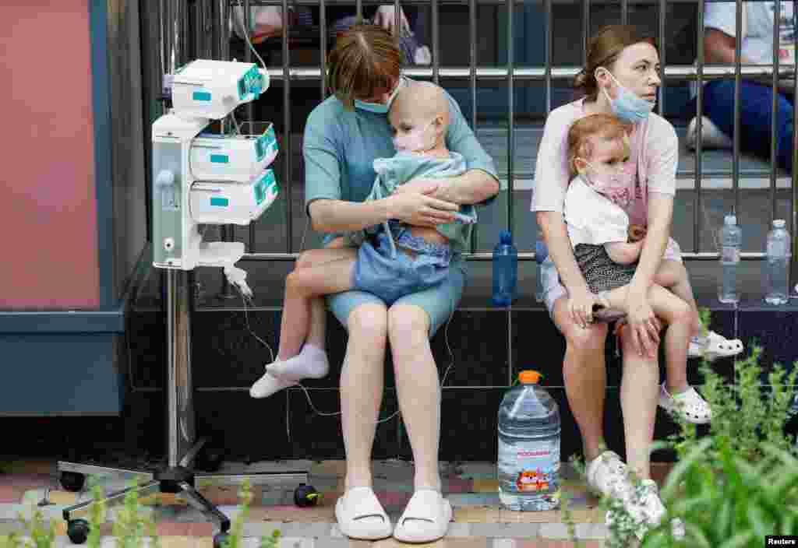
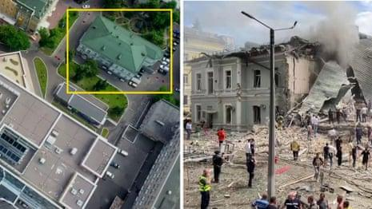

## Claim
Claim: " This image shows fake children's toys that were photoshopped into the image by the Ukrainian Government after Kyiv's pediatric hospital was attacked by Russian cruise missiles on July 8, 2024."

## Actions
```
reverse_search()
```

## Evidence
### Evidence from `reverse_search`
The image () appears in articles discussing a Russian strike on Kyiv on July 8, 2024. The Kyiv Independent published an article on July 9, 2024, reporting that the body of a boy was found under the rubble of a building hit by a Russian strike in Kyiv's Schevchenkyvskyi district on July 8, 2024. The article states that the attack brought the death toll to 27, including four children. News Ukraine published an article on August 6, 2024, discussing a Russian missile attack on Kyiv on July 8, 2024, which hit the Okhmatdyt Children's Hospital, and that 27 people, including 4 children, were killed.

The articles can be found at [https://kyivindependent.com/boys-body-found-under-rubble-in-kyiv/](https://kyivindependent.com/boys-body-found-under-rubble-in-kyiv/) and [https://newsukraine.rbc.ua/news/russian-strike-on-kyiv-number-of-killed-and-1720503127.html](https://newsukraine.rbc.ua/news/russian-strike-on-kyiv-number-of-killed-and-1720503127.html).


## Elaboration
The evidence indicates that the image is related to a Russian strike on Kyiv on July 8, 2024, which resulted in casualties, including children. The Kyiv Independent and News Ukraine reported on the event, mentioning the discovery of a child's body and the attack on the Okhmatdyt Children's Hospital.

The evidence does not provide information about the image being photoshopped or the toys being fake.

To verify the claim, additional information is needed to confirm whether the toys in the image were photoshopped.


## Actions
```
web_search("Kyiv pediatric hospital attack July 8 2024 photoshop")
image_search("Kyiv pediatric hospital attack July 8 2024 toys")
```

## Evidence
### Evidence from `web_search`
The web sources discuss the Russian attack on a children's hospital in Kyiv on July 8, 2024. Human Rights Watch reported that the attack killed at least 42 civilians, including five children, and injured at least 190. VOA News and The Guardian also covered the attack, including images of the aftermath and the damage to the hospital (, , , , ).


### Evidence from `image_search`
Reuters published an article about the Russian missile attack on a children's hospital in Kyiv on July 8, 2024, which includes an image of children and adults (

## Elaboration
The evidence confirms the Russian attack on a children's hospital in Kyiv on July 8, 2024. However, the search results do not provide any information about the image being photoshopped or the toys being fake. The provided images show the aftermath of the attack and the injured people.

The claim cannot be verified with the available information. More evidence is needed to determine if the toys were photoshopped.


## Actions
```
web_search("image of toys in rubble Kyiv hospital attack")
```

## Evidence
### Evidence from `web_search`
Al Jazeera and The Guardian reported on the Russian missile strikes on Kyiv, including the Okhmatdyt children's hospital on July 8, 2024. The articles mention casualties and show images of the aftermath of the attack, but do not mention anything about photoshopped images or fake toys. The Guardian article states that the strikes killed 38 people, including four children. The Al Jazeera article mentions a strike on Okhmatdyt National Children’s Specialised Hospital, with dozens killed and wounded. (

## Elaboration
The evidence does not support the claim that the image shows photoshopped toys. While the evidence confirms the Russian attack on the Okhmatdyt children's hospital in Kyiv on July 8, 2024, and the presence of casualties, it does not mention anything about the image being manipulated or the toys being fake. Therefore, the claim cannot be verified.


## Final Judgement
The image is related to the Russian attack on Kyiv on July 8, 2024, which hit the Okhmatdyt Children's Hospital. However, there is no evidence to support the claim that the toys in the image were photoshopped. Therefore, the claim is not factually accurate. `false`

### Verdict: FALSE

### Justification
The claim that the image depicts photoshopped toys after a Russian attack on a Kyiv hospital on July 8, 2024, is not supported by the evidence. While the attack did occur, as reported by sources like the [Kyiv Independent](https://kyivindependent.com/boys-body-found-under-rubble-in-kyiv/) and [News Ukraine](https://newsukraine.rbc.ua/news/russian-strike-on-kyiv-number-of-killed-and-1720503127.html), there is no information to suggest the image was manipulated or that the toys were fake.
