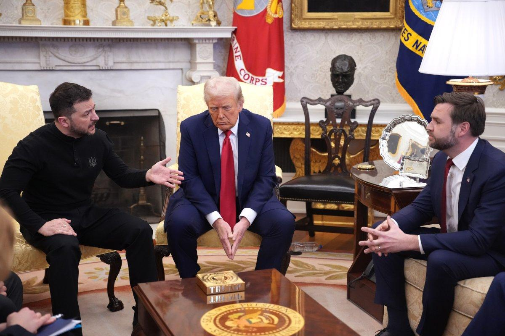
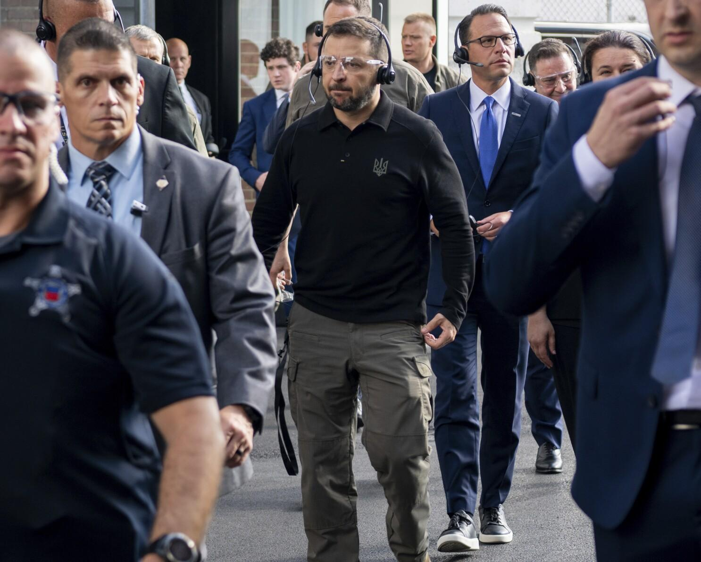

## Claim
Claim: "Ukrainian President Volodymyr Zelenskyy engaged in election interference by campaigning in Pennsylvania for Kamala Harris ahead of the US presidential election in 2024."

## Actions
```
web_search("Volodymyr Zelenskyy Kamala Harris Pennsylvania 2024")
web_search("Volodymyr Zelenskyy US election interference")
```

## Evidence
### Evidence from `web_search`
Newsweek reports that during an Oval Office meeting, JD Vance accused Volodymyr Zelenskyy of campaigning for Kamala Harris in the 2024 presidential race, mentioning a September 2024 visit to a munitions plant in Scranton, Pennsylvania (, , ). The article also mentions that Representative James Comer is investigating the matter. NBC News reports on the growing partisan divide regarding Ukraine, mentioning a meeting between Zelenskyy and Harris, and that Republicans viewed Zelenskyy's visit to a munitions factory in Scranton, Pennsylvania, as a signal of his preference in the upcoming election (<image:i>).

ABC News reports on a meeting between Kamala Harris and Volodymyr Zelenskyy to discuss the war with Russia, mentioning Zelenskyy's visit to Washington and his meetings with lawmakers (, <image:k>).

*   [https://www.newsweek.com/volodymyr-zelensky-jd-vance-campaign-kamala-harris-2024-election-2038060](https://www.newsweek.com/volodymyr-zelensky-jd-vance-campaign-kamala-harris-2024-election-2038060)
*   [https://www.nbcnews.com/politics/2024-election/zelenskyys-meeting-harris-spat-trump-reveal-growing-partisan-divide-uk-rcna172648](https://www.nbcnews.com/politics/2024-election/zelenskyys-meeting-harris-spat-trump-reveal-growing-partisan-divide-uk-rcna172648)
*   [https://abcnews.go.com/Politics/harris-standing-zelenskyy-indirectly-jabs-trump-vance-ukraine/story?id=114219628](https://abcnews.go.com/Politics/harris-standing-zelenskyy-indirectly-jabs-trump-vance-ukraine/story?id=114219628)


### Evidence from `web_search`
The search results discuss the relationship between Volodymyr Zelenskyy and US politics. One source discusses the 2019 Trump–Ukraine scandal, including a phone call where Trump asked Zelenskyy to investigate Joe Biden, and a 2022 visit by Zelenskyy to the United States (<image:k>). Another source mentions a 2019 call where Trump pushed Zelenskyy to investigate Joe Biden ahead of the 2020 election (<image:k>).

A September 25, 2024, article in The Guardian discusses a visit by Zelenskyy to a munitions factory in Scranton, Pennsylvania, where he thanked workers. Mike Johnson claimed this event was a "partisan campaign event designed to help Democrats" and "clearly election interference." The Pennsylvania governor, Josh Shapiro, attended the event ().
*   [https://en.wikipedia.org/wiki/2019\_Trump%E2%80%93Ukraine\_scandal](https://en.wikipedia.org/wiki/2019_Trump%E2%80%93Ukraine_scandal)
*   [https://www.pbs.org/newshour/politics/how-trumps-history-with-putin-and-zelenskyy-set-the-stage-for-an-oval-office-blowup](https://www.pbs.org/newshour/politics/how-trumps-history-with-putin-and-zelenskyy-set-the-stage-for-an-oval-office-blowup)
*   [https://www.theguardian.com/us-news/2024/sep/25/trump-zelenskyy-ukraine-feud-republicans-election-interference](https://www.theguardian.com/us-news/2024/sep/25/trump-zelenskyy-ukraine-feud-republicans-election-interference)


## Elaboration
The evidence indicates that there is a dispute over whether Zelenskyy engaged in election interference. Some Republicans, including JD Vance and Mike Johnson, have accused Zelenskyy of campaigning for Kamala Harris, citing his visit to a munitions factory in Scranton, Pennsylvania, as a partisan event. However, the evidence does not provide definitive proof that Zelenskyy was explicitly campaigning for Harris. The claim is based on interpretations of Zelenskyy's actions and statements.

The evidence shows that Zelenskyy met with Harris and other lawmakers, and his visit to Pennsylvania was attended by the state's governor. These events have been interpreted by some as a sign of preference in the upcoming election.

The available information is insufficient to definitively verify the claim. More information is needed to determine Zelenskyy's intentions and whether his actions constituted election interference.


## Actions
```
image_search("Volodymyr Zelenskyy Scranton Pennsylvania munitions factory")
```

## Evidence
### Evidence from `image_search`
The search results confirm Volodymyr Zelenskyy's visit to a munitions factory in Scranton, Pennsylvania. AP News, Sky News, and kget.com all provide images of the visit (, , ).


## Elaboration
The evidence confirms Zelenskyy's visit to a munitions factory in Scranton, Pennsylvania. This visit, along with his meetings with US officials, has been interpreted by some as a sign of support for Kamala Harris. However, the evidence does not explicitly state that Zelenskyy was campaigning for Harris. The claim relies on interpretations of his actions.


## Actions
```
web_search("Zelenskyy Pennsylvania speech 2024 election")
```

## Evidence
### Evidence from `web_search`
CNBC and AP News report that House Republicans, including James Comer and Mike Johnson, are investigating Volodymyr Zelenskyy's visit to a Pennsylvania ammunition factory, claiming it was a campaign event for Kamala Harris and constituted election interference. (<image:k>) Johnson called for the removal of Ukraine's ambassador to the U.S. and stated the visit was a "partisan campaign event." The Pentagon stated that the flight was funded by the Defense Department for official business.
*   [https://www.cnbc.com/2024/09/25/zelenskyy-insulted-him-house-gop-to-probe-ukraine-leaders-pa-trip-.html](https://www.cnbc.com/2024/09/25/zelenskyy-insulted-him-house-gop-to-probe-ukraine-leaders-pa-trip-.html)
*   [https://apnews.com/article/zelenskyy-johnson-ambassador-ukraine-biden-harris-trump-d81b0a055d99cfd4804b3f2c00915d09](https://apnews.com/article/zelenskyy-johnson-ambassador-ukraine-biden-harris-trump-d81b0a055d99cfd4804b3f2c00915d09)


## Elaboration
The evidence indicates that House Republicans are investigating Zelenskyy's visit to a Pennsylvania ammunition factory, viewing it as a campaign event for Kamala Harris and potential election interference. Mike Johnson called the visit a "partisan campaign event." However, the Pentagon stated that the visit was funded by the Defense Department for official business. The claim is based on interpretations of Zelenskyy's actions, and the evidence does not provide definitive proof that Zelenskyy was explicitly campaigning for Harris.


## Final Judgement
The claim that Volodymyr Zelenskyy engaged in election interference by campaigning in Pennsylvania for Kamala Harris is based on interpretations of his actions, specifically his visit to a munitions factory in Scranton, Pennsylvania. While some Republicans have accused him of such interference, there is no definitive proof that Zelenskyy was explicitly campaigning for Harris. The visit was funded by the Defense Department for official business.

`false`

### Verdict: FALSE

### Justification
The claim is based on interpretations of Volodymyr Zelenskyy's visit to a munitions factory in Scranton, Pennsylvania, which some Republicans, including Mike Johnson, viewed as a campaign event for Kamala Harris and potential election interference. However, the evidence, including reports from sources like [CNBC](https://www.cnbc.com/2024/09/25/zelenskyy-insulted-him-house-gop-to-probe-ukraine-leaders-pa-trip-.html) and [AP News](https://apnews.com/article/zelenskyy-johnson-ambassador-ukraine-biden-harris-trump-d81b0a055d99cfd4804b3f2c00915d09), does not provide definitive proof that Zelenskyy was explicitly campaigning for Harris, and the Pentagon stated the visit was for official business.
