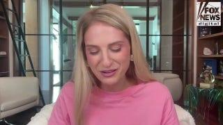

## Claim
Claim: "After InfoWars reporter Jamie White was shot dead on March 10, 2025 in Austin, Texas, it was revelaed that he was on a Ukranian enemies hit list."

## Actions
```
web_search("Jamie White shot Austin Texas March 10 2025")
web_search("Jamie White InfoWars Ukrainian hit list")
```

## Evidence
### Evidence from `web_search`
The shooting of InfoWars reporter Jamie White in Austin, Texas, is reported by multiple sources. Fox 7 Austin ([Source](https://www.fox7austin.com/news/infowars-writer-shooting-austin-police-jamie-white)) states that White was shot on March 10, 2025, while interrupting a vehicle burglary, and the Austin Police Department made arrests in connection to the murder. CBS Austin ([Source](https://cbsaustin.com/news/local/teen-charged-with-capital-murder-in-shooting-death-of-infowars-reporter-in-austin)) reports that White was shot on March 9, 2025, during an attempted car theft, and a 17-year-old was charged with capital murder. Fox News ([Source](https://www.foxnews.com/us/police-release-more-details-murder-infowars-reporter-jamie-white-search-suspects-continues)) also reports the shooting in Austin, Texas, on March 10, 2025, during a possible burglary. , , , , , , , , , , , , , , , .

None of the sources mention that White was on a Ukrainian enemies hit list.


### Evidence from `web_search`
Jamie White, an Infowars reporter, was shot dead in Austin, Texas. Alex Jones speculated that the killing “could’ve been a hit” orchestrated by Ukraine, while the police believe the suspects were possibly burglarizing White's vehicle. White's social media accounts indicate that he believed he was on a Ukrainian hit list. The "Investigate Earth Conspiracy Podcast" also discusses the murder and mentions that White may have been on a Ukrainian NGO hit list.

Sources: [Yahoo News](https://www.yahoo.com/news/alex-jones-blames-globalists-infowars-182655321.html), [Latin Times](https://www.latintimes.com/infowars-reporter-assassinated-ukraine-outside-his-home-conspiracy-theorists-claim-578436), and [Spotify](https://open.spotify.com/episode/68lCuEsLtFn17oEIQBQGEk).    


## Elaboration
The claim is partially supported by the evidence. The evidence confirms that Jamie White, an InfoWars reporter, was shot dead in Austin, Texas, on March 10, 2025. The evidence also indicates that Alex Jones speculated that the killing "could've been a hit" orchestrated by Ukraine, and that White believed he was on a Ukrainian hit list. However, the evidence does not explicitly state that it was revealed that White was on a Ukrainian enemies hit list.


## Final Judgement
The evidence confirms that Jamie White was shot dead in Austin, Texas, and that there are speculations about a Ukrainian connection. However, the evidence does not explicitly state that it was revealed that White was on a Ukrainian enemies hit list.

`false`

### Verdict: FALSE

### Justification
The claim is partially supported by the evidence. While it's confirmed that Jamie White was shot dead in Austin, Texas, on March 10, 2025, and that there are speculations about a Ukrainian connection, the evidence does not explicitly state that it was revealed that White was on a Ukrainian enemies hit list. Sources include [Fox 7 Austin](https://www.fox7austin.com/news/infowars-writer-shooting-austin-police-jamie-white), [CBS Austin](https://cbsaustin.com/news/local/teen-charged-with-capital-murder-in-shooting-death-of-infowars-reporter-in-austin), and [Fox News](https://www.foxnews.com/us/police-release-more-details-murder-infowars-reporter-jamie-white-search-suspects-continues).
