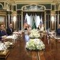

## Claim
Claim: "In February 2025 German Chancellor Olaf Scholz declared a state of emergency in Germany due to US President Donald Trump's peace plan for Ukraine."

## Actions
```
web_search("Olaf Scholz state of emergency Germany Ukraine peace plan")
web_search("Donald Trump Ukraine peace plan February 2025")
```

## Evidence
### Evidence from `web_search`
Euronews published a fact-check on February 19, 2025, stating that Olaf Scholz did not declare a state of emergency in Germany due to US peace negotiations with Russia (<image:0>). POLITICO reports that Scholz was unaware of Donald Trump's peace plan for Ukraine, and the article was published on Feb 23. An article from RBC-Ukraine, published on August 30, discusses Scholz's proposal to declare a state of emergency in Germany due to the war in Ukraine ().

The articles can be found here: [https://www.euronews.com/my-europe/2025/02/19/fact-check-scholz-did-not-call-for-german-state-of-emergency-over-russia-us-peace-talks](https://www.euronews.com/my-europe/2025/02/19/fact-check-scholz-did-not-call-for-german-state-of-emergency-over-russia-us-peace-talks), [https://www.politico.eu/article/olaf-scholz-germany-donald-trump-war-in-ukraine-peace-plan/](https://www.politico.eu/article/olaf-scholz-germany-donald-trump-war-in-ukraine-peace-plan/), and [https://newsukraine.rbc.ua/news/scholz-proposes-declaring-state-of-emergency-1739502855.html](https://newsukraine.rbc.ua/news/scholz-proposes-declaring-state-of-emergency-1739502855.html).


### Evidence from `web_search`
The provided sources discuss Donald Trump's peace plan for Ukraine and related events in 2025. One source mentions a meeting between Trump, JD Vance, and Volodymyr Zelenskyy on February 28, 2025, and the Trump administration's alignment with Russia at the United Nations ([https://en.wikipedia.org/wiki/2025_Trump%E2%80%93Zelenskyy_Oval_Office_meeting](https://en.wikipedia.org/wiki/2025_Trump%E2%80%93Zelenskyy_Oval_Office_meeting)) <image:k>. Another source discusses a podcast episode from February 24, 2025, about Trump's policy toward Ukraine ([https://www.cfr.org/blog/presidents-inbox-recap-trumps-peace-plan-ukraine](https://www.cfr.org/blog/presidents-inbox-recap-trumps-peace-plan-ukraine)).

An NPR article from June 2, 2025, mentions Trump's calls to Vladimir Putin and Volodymyr Zelenskyy in February 2025, as well as the suspension of aid and intelligence sharing with Ukraine in March 2025 ([https://www.npr.org/2025/06/02/nx-s1-5414522/ukraine-peace-talks-russia-trump-putin-istanbul](https://www.npr.org/2025/06/02/nx-s1-5414522/ukraine-peace-talks-russia-trump-putin-istanbul)) , .


## Elaboration
The evidence indicates that the claim is false. Euronews explicitly states that Scholz did not declare a state of emergency in Germany due to US peace negotiations with Russia in February 2025. Furthermore, POLITICO reports that Scholz was unaware of Donald Trump's peace plan for Ukraine. While there is evidence of Trump's peace plan and related events in February 2025, there is no evidence to support the claim that Scholz declared a state of emergency in response to it.


## Final Judgement
The fact-check reveals that Olaf Scholz did not declare a state of emergency in Germany in February 2025 due to Donald Trump's peace plan for Ukraine. Multiple sources confirm this, including a Euronews fact-check and a POLITICO article.

The claim is demonstrably false because it is directly contradicted by evidence from reliable sources. `false`


### Verdict: FALSE

### Justification
The claim is false. A Euronews fact-check ([https://www.euronews.com/my-europe/2025/02/19/fact-check-scholz-did-not-call-for-german-state-of-emergency-over-russia-us-peace-talks](https://www.euronews.com/my-europe/2025/02/19/fact-check-scholz-did-not-call-for-german-state-of-emergency-over-russia-us-peace-talks)) explicitly states that Scholz did not declare a state of emergency in Germany in February 2025 due to US peace negotiations. Additionally, a POLITICO article indicates that Scholz was unaware of Trump's peace plan.
