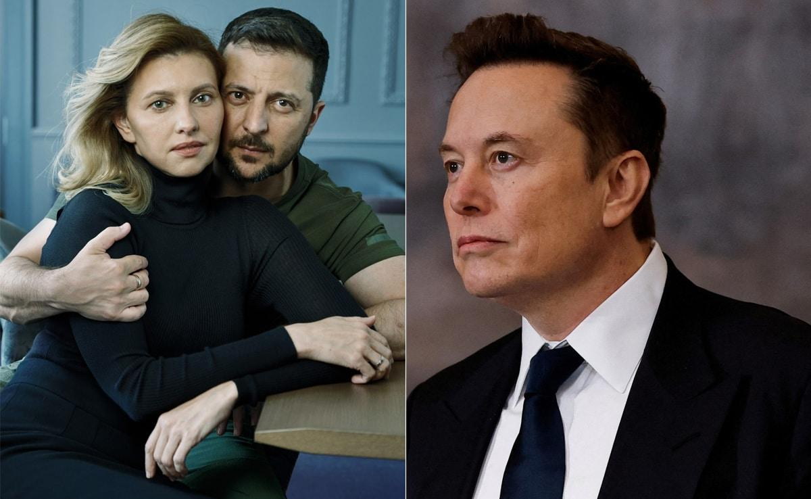

## Claim
Claim: " This image shows a screenshot of an authentic X post from Elon Musk on November 6, 2025 saying 'The last dollar for Zelenskiy'."

## Actions
```
web_search("Elon Musk X post Zelenskiy last dollar")
image_search("Elon Musk X post dollar Zelenskiy")
```

## Evidence
### Evidence from `web_search`
The AOL article ([https://www.aol.com/fact-check-elon-musk-didn-164103080.html](https://www.aol.com/fact-check-elon-musk-didn-164103080.html)) fact-checks the claim that Elon Musk posted "The last dollar for Zelenskiy" and states that the claim is false, with no evidence of the post. The image of the tweet is fake, and a search of Musk's X account did not yield any results.

Politico.eu ([https://www.politico.eu/article/billionaire-elon-musk-mocks-ukraine-president-zelenskyy-asking-aid-with-meme/](https://www.politico.eu/article/billionaire-elon-musk-mocks-ukraine-president-zelenskyy-asking-aid-with-meme/)) discusses Elon Musk's meme mocking Ukrainian President Volodymyr Zelenskyy's calls for Western aid. Newsweek ([https://www.newsweek.com/ukraine-hits-back-elon-musk-over-meme-taunting-zelensky-1831547](https://www.newsweek.com/ukraine-hits-back-elon-musk-over-meme-taunting-zelensky-1831547)) reports that Musk posted a meme mocking Zelensky on October 1, 2023. , , and .


### Evidence from `image_search`
Reuters published an article about a meme mocking Zelenskyy (). NDTV published an article about Elon Musk criticizing Volodymyr Zelenskyy (). Bloomberg reports that Zelensky invited Musk to visit Ukraine ().

The provided sources are: [Reuters](https://www.reuters.com/world/europe/ukraines-parliament-taunts-elon-musk-after-meme-mocking-zelenskiy-2023-10-02/), [NDTV](https://www.ndtv.com/world-news/elon-musk-shreds-ukraines-volodymyr-zelensky-over-old-vogue-shoot-while-kids-were-dying-7756209), and [Bloomberg](https://www.bloomberg.com/news/articles/2022-11-30/zelenskiy-invites-musk-to-visit-ukraine-in-response-to-his-talk-of-peace-deal).


## Elaboration
The claim that the image shows an authentic X post from Elon Musk saying "The last dollar for Zelenskiy" is false. The AOL article ([https://www.aol.com/fact-check-elon-musk-didn-164103080.html](https://www.aol.com/fact-check-elon-musk-didn-164103080.html)) explicitly states that the claim is false, and a search of Musk's X account did not yield any results.


## Final Judgement
The claim is demonstrably false. The provided evidence, including a fact-check from AOL, confirms that the image is fake and that Elon Musk did not post the content in the image.

`false`

### Verdict: FALSE

### Justification
The claim is false. A fact-check from AOL ([https://www.aol.com/fact-check-elon-musk-didn-164103080.html](https://www.aol.com/fact-check-elon-musk-didn-164103080.html)) confirms that the image is fake and that Elon Musk did not post the content.
