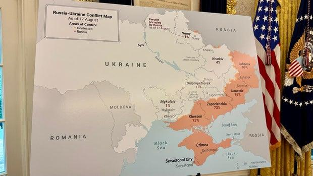

## Claim
Claim: "Russia offered assistance for the California wildfires from January 2025."

## Actions
```
web_search("Russia California wildfires assistance 2025")
```

## Evidence
### Evidence from `web_search`
Tasnim News Agency published an article on January 12, 2025, discussing Russia's comments on the California wildfires, including comments from Maria Zakharova. The article mentions that wildfires began to spread across Los Angeles County on January 7. ([https://www.tasnimnews.com/en/news/2025/01/12/3236714/russia-notes-us-hypocrisy-in-california-fire-case](https://www.tasnimnews.com/en/news/2025/01/12/3236714/russia-notes-us-hypocrisy-in-california-fire-case)) , 

The Dispatch published an article on January 15, 2025, discussing claims that Russia offered sanctuary to California fire victims. Vladimir Saldo offered to accept Americans who lost their homes in the California fires, but only those who haven't supported Ukraine since February 2022. ([https://thedispatch.com/article/assessing-claims-that-russia-offered-sanctuary-to-california-fire-victims/](https://thedispatch.com/article/assessing-claims-that-russia-offered-sanctuary-to-california-fire-victims/)) 

An NPR article, published on January 16, 2025, discusses how pro-Kremlin social media accounts spread a narrative about the Los Angeles wildfires. The article states that Russian news sites are spreading false or unverified narratives about the California fires. ([https://www.npr.org/2025/01/16/nx-s1-5259842/los-angeles-california-fires-russia-ukraine](https://www.npr.org/2025/01/16/nx-s1-5259842/los-angeles-california-fires-russia-ukraine)) , 


## Elaboration
The evidence indicates that Russia commented on the California wildfires and that Vladimir Saldo offered sanctuary to fire victims. However, the evidence does not explicitly state that Russia offered assistance for the California wildfires.

The NPR article suggests that Russian news sites spread false or unverified narratives about the fires. Therefore, the claim cannot be verified based on the provided evidence.

To verify the claim, information about any specific offers of assistance from Russia would be needed.


## Actions
```
web_search("Russia California wildfires assistance details")
```

## Evidence
### Evidence from `web_search`
The German Marshall Fund of the United States published an article on January 15, 2025, discussing Russian narratives on the California wildfires, stating that Russian state-affiliated accounts leveraged the wildfires to sow division and undermine trust in relief efforts. ([https://www.gmfus.org/news/inflaming-divides-russian-narratives-california-wildfires](https://www.gmfus.org/news/inflaming-divides-russian-narratives-california-wildfires)) Project HOPE is providing long-term support in Los Angeles following the wildfires. ([https://www.projecthope.org/news-stories/responses/california-fires-how-to-help/](https://www.projecthope.org/news-stories/responses/california-fires-how-to-help/)) , , 


## Elaboration
The new evidence reinforces the previous findings. It highlights that Russian narratives were used to sow division and undermine trust in relief efforts. However, there is still no mention of Russia offering any assistance.

Therefore, the claim remains unverified.


## Final Judgement
The fact-check reveals that Russia commented on the California wildfires and that some individuals offered sanctuary to fire victims. However, the search results do not provide any evidence of Russia offering assistance for the California wildfires. Instead, the evidence suggests that Russian narratives were used to sow division and undermine trust in relief efforts.

Based on the available information, the claim cannot be verified because there is no evidence to support it. `false`


### Verdict: FALSE

### Justification
The fact-check reveals that while Russia commented on the California wildfires and some individuals offered sanctuary to fire victims, there is no evidence of Russia offering assistance. Instead, sources indicate that Russian narratives were used to sow division and undermine trust in relief efforts. Therefore, the claim is unverified.
