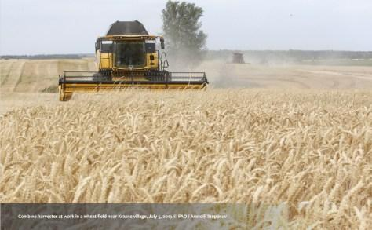
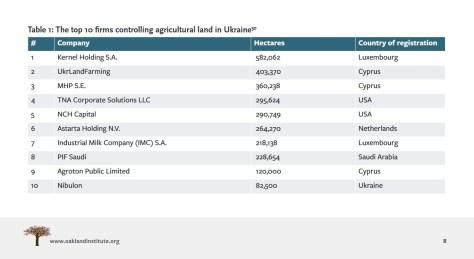

## Claim
Claim: "BlackRock has asked that Ukrainian soldiers not be buried on the land it owns in Ukraine."

## Actions
```
web_search("BlackRock Ukraine land burial policy")
```

## Evidence
### Evidence from `web_search`
The claim that BlackRock has asked that Ukrainian soldiers not be buried on land it owns in Ukraine is false. The claim originated from a Bulgarian politician and was shared by Russian and Chinese media, according to an article from Asia Fact Check Lab ([https://www.rfa.org/english/news/afcl/afcl-blackrock-ukraine-land-08262024030948.html](https://www.rfa.org/english/news/afcl/afcl-blackrock-ukraine-land-08262024030948.html)). Myth Detector also states that the claim is false and originated from a satirical Telegram channel ([https://mythdetector.com/en/ukrainian-lands-and-banned-the-burial-of-military-personnel/](https://mythdetector.com/en/ukrainian-lands-and-banned-the-burial-of-military-personnel/)).

The Oakland Institute published a report on the takeover of Ukraine's agricultural land, but it does not mention BlackRock's policy on the burial of Ukrainian soldiers ([https://tlio.org.uk/war-and-theft-the-hostile-takeover-of-ukraines-agricultural-land-private-equitys-21st-century-war-for-global-enclosure-and-slavery/](https://tlio.org.uk/war-and-theft-the-hostile-takeover-of-ukraines-agricultural-land-private-equitys-21st-century-war-for-global-enclosure-and-slavery/)). The Asia Fact Check Lab article includes an image  of the claim shared by Sputnik. Myth Detector's article includes an image  related to the claim. The Oakland Institute report includes images , , , .


## Elaboration
The claim is false. The evidence indicates that the claim originated from a Bulgarian politician and was disseminated by Russian and Chinese media. Fact-checking organizations, such as Asia Fact Check Lab ([https://www.rfa.org/english/news/afcl/afcl-blackrock-ukraine-land-08262024030948.html](https://www.rfa.org/english/news/afcl/afcl-blackrock-ukraine-land-08262024030948.html)) and Myth Detector ([https://mythdetector.com/en/ukrainian-lands-and-banned-the-burial-of-military-personnel/](https://mythdetector.com/en/ukrainian-lands-and-banned-the-burial-of-military-personnel/)), have debunked the claim.


## Final Judgement
The claim that BlackRock has requested that Ukrainian soldiers not be buried on land it owns in Ukraine is false. Multiple fact-checking sources have debunked the claim, tracing its origin to a Bulgarian politician and its spread through Russian and Chinese media.

`false`

### Verdict: FALSE

### Justification
The claim is false. Fact-checks from Asia Fact Check Lab ([https://www.rfa.org/english/news/afcl/afcl-blackrock-ukraine-land-08262024030948.html](https://www.rfa.org/english/news/afcl/afcl-blackrock-ukraine-land-08262024030948.html)) and Myth Detector ([https://mythdetector.com/en/ukrainian-lands-and-banned-the-burial-of-military-personnel/](https://mythdetector.com/en/ukrainian-lands-and-banned-the-burial-of-military-personnel/)) show that the claim originated from a Bulgarian politician and was spread by Russian and Chinese media.
