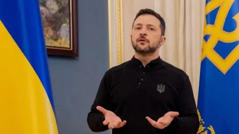

## Claim
Claim: "Russian President Vladimir Putin has declared war on the United States."

## Actions
```
web_search("Vladimir Putin declares war on United States")
```

## Evidence
### Evidence from `web_search`
Fact Crescendo states that there has been no official declaration of war by Russia against the USA, and the claim is unfounded (). The BBC article discusses the war in Ukraine, mentioning Putin's goals and his false allegations (, , , , ). The Journal of Democracy article discusses Putin's fears and mentions his more hostile policies toward the United States, including an image of a demonstration with flags from different countries, including the United States, in support of Ukraine ().

The sources are: [https://srilanka.factcrescendo.com/english/did-russia-declare-war-against-the-usa/](https://srilanka.factcrescendo.com/english/did-russia-declare-war-against-the-usa/), [https://www.bbc.com/news/articles/cj0q964851po](https://www.bbc.com/news/articles/cj0q964851po), and [https://www.journalofdemocracy.org/articles/what-putin-fears-most/](https://www.journalofdemocracy.org/articles/what-putin-fears-most/).


## Elaboration
The evidence indicates that the claim is false. Fact Crescendo explicitly states that there has been no official declaration of war by Russia against the USA. While the BBC and Journal of Democracy articles discuss Putin's actions and policies, including his hostility towards the United States, they do not mention a declaration of war.


## Final Judgement
The evidence from Fact Crescendo directly refutes the claim, stating that there has been no declaration of war. The other sources discuss related topics but do not support the claim. Therefore, the claim is demonstrably false. `false`


### Verdict: FALSE

### Justification
The claim that Vladimir Putin declared war on the United States is false. According to [Fact Crescendo](https://srilanka.factcrescendo.com/english/did-russia-declare-war-against-the-usa/), there has been no official declaration of war. While other sources discuss Putin's actions and policies, they do not support the claim.
