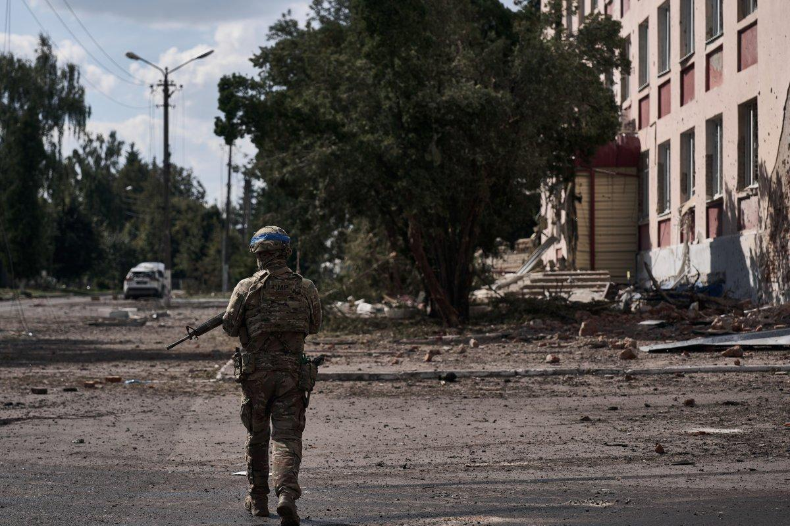
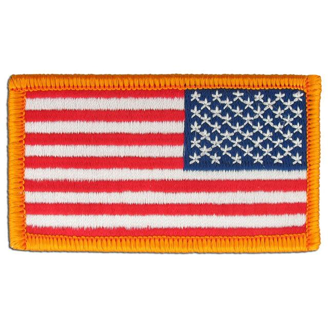

## Claim
Claim: " This image shows American mercenaries participating in Ukraine's incursion into Russia's Kursk Oblast in August 2024."

## Actions
```
web_search("American mercenaries Ukraine Kursk Oblast August 2024")
image_search("American flag patch military uniform")
```

## Evidence
### Evidence from `web_search`
Newsweek reports that Russia protested the alleged presence of American soldiers in the Kursk region, claiming they are involved in Ukraine's incursion into Russian territory. The U.S. has denied involvement. This article was published on August 20, 2024. ([https://www.newsweek.com/russia-protests-american-soldiers-kursk-1942273](https://www.newsweek.com/russia-protests-american-soldiers-kursk-1942273))

Anadolu Agency, published on August 20, 2024, reports that Russia protested the participation of US private military companies (PMCs) fighting alongside Ukraine in the Kursk region. ([https://www.aa.com.tr/en/russia-ukraine-war/russia-formally-protests-us-mercenaries-joining-ukrainian-soldiers-in-kursk-region-/3308755](https://www.aa.com.tr/en/russia-ukraine-war/russia-formally-protests-us-mercenaries-joining-ukrainian-soldiers-in-kursk-region-/3308755)) A website about Ukrainian photographers contains news stories from January 2025. ([https://www.ukrainianphotographers.com/en/news-articles/foreign-mercenaries-in-the-kursk-region](https://www.ukrainianphotographers.com/en/news-articles/foreign-mercenaries-in-the-kursk-region))
, , , 


### Evidence from `image_search`
The search results include images of U.S. flag patches. One source, from [starsnstripesco.com](https://starsnstripesco.com/products/copy-of-u-s-army-regulation-flag-patch-ocp?srsltid=AfmBOopc222egXRzsueUJYYrLIG9z4Cye0uR3e_ovnLIjk-SWrjTYPdb), shows a U.S. flag patch .

Another source, from [propper.com](https://www.propper.com/usa-flag-reverse-patch.html?srsltid=AfmBOoodi2eBnTHkrQ-8Wre7x0lPv7ZlQETVFpxqk6fXFP9rsmwdAin8), shows a military uniform with an American flag patch . A third source, from [asatechmed.com](https://www.asatechmed.com/products/6-pc-assorted-usa-tactical-american-flag-patch-100-embroidered-thin-blue-line-united-states-military-morale-patches-set-for-molle-hats-backpacks-tactical-vest-uniforms?srsltid=AfmBOop5F0TNGVoiOShv4sY6Y4jSUPZvCpKRJRhlYDJQVx96wIeTvf_y), also shows an American flag patch on a military uniform .


## Elaboration
The evidence confirms that Russia protested the alleged presence of American soldiers in the Kursk region in August 2024, with the U.S. denying involvement. The image search results show examples of U.S. flag patches, which are visible in the image provided in the claim.

The claim is partially supported by the evidence. The presence of American flag patches on the uniforms in the image aligns with the claim of American involvement. However, the evidence does not definitively confirm that the individuals in the image are mercenaries or that they were involved in an incursion into the Kursk Oblast.

Additional information is needed to verify the claim fully, such as the identity of the individuals in the image and their specific activities in the Kursk region.


## Actions
```
reverse_search()
```

## Evidence
### Evidence from `reverse_search`
The image in the claim () appears in articles from September 2022, not August 2024, about the Ukrainian army's victory in Balakleya. The articles, published on websites like Apostrophe.ua and charter97.org, describe the image as showing Ukrainian soldiers with a dead Russian soldier. The image was taken by Ukrainian journalist Denis Kazansky.


## Elaboration
The reverse image search reveals that the image predates August 2024 and was taken in September 2022, not August 2024. The image depicts Ukrainian soldiers, not American mercenaries, and the location is Balakleya, not Kursk Oblast.

The claim is therefore false.


## Final Judgement
The image is from September 2022 and shows Ukrainian soldiers in Balakleya, not American mercenaries in Kursk Oblast in August 2024. The claim is therefore not factually accurate. `false`

### Verdict: FALSE

### Justification
The claim is false. The image, which shows soldiers with American flag patches, was taken in September 2022 and depicts Ukrainian soldiers in Balakleya, not American mercenaries in the Kursk Oblast in August 2024, as indicated by a reverse image search ([https://apostrophe.ua/news/society/accidents/2022-09-11/v-seti-poyavilos-foto-s-ubityim-rossiyskim-voennym-v-balaklee-kak-na-nego-reagirovali-v-ukraine/280977](https://apostrophe.ua/news/society/accidents/2022-09-11/v-seti-poyavilos-foto-s-ubityim-rossiyskim-voennym-v-balaklee-kak-na-nego-reagirovali-v-ukraine/280977)).
