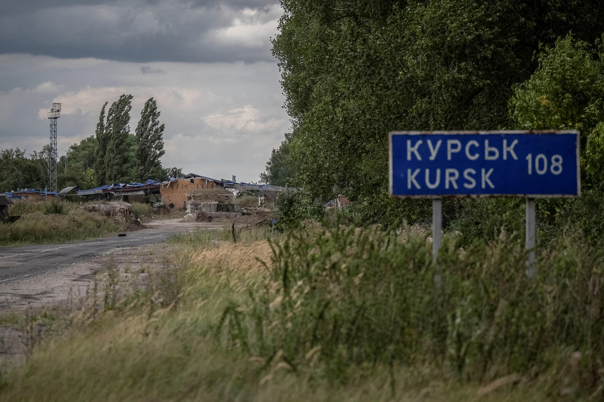

## Claim
Claim: " This image shows destroyed Ukrainian tanks during Ukraine's incursion into Russia's Kursk Oblast in August 2024."

## Actions
```
reverse_search()
web_search("Ukraine Russia Kursk Oblast August 2024 tanks")
```

## Evidence
### Evidence from `reverse_search`
The image of destroyed tanks () appears in multiple sources. One source, from Sputnik Africa, published on October 17, 2024, reports that Ukraine has lost around 40 Leopard tanks since February 2022. The Moscow Times published an article on June 13, 2023, stating that Russia had captured German Leopard tanks in the Zaporizhzhia region. Defence Security Asia published an article on May 19, 2024, discussing the destruction of German-made Leopard tanks in Ukraine.

The sources do not mention any Ukrainian incursion into Russia's Kursk Oblast in August 2024.


### Evidence from `web_search`
The search results discuss the 2024 Kursk offensive, which began on August 6, 2024, as part of the Russian invasion of Ukraine. The Ukrainian military launched an incursion into Russia's Kursk Oblast. The article mentions the involvement of Ukrainian brigades, Russian forces, and North Korean forces. The article also mentions the capture of territory, casualties, and the response from Russian authorities, including the declaration of a state of emergency. The article also includes images of damaged buildings and a captured tank. ()

Reuters reports on August 26, 2024, that Russia said it had struck Ukrainian forces in the Kursk region. The article mentions an incursion by Ukraine into the Kursk region. The article also mentions that Russia said that Ukraine had lost 73 tanks, 61 armored personnel carriers and 404 armored combat vehicles in the Kursk region. () An Al Jazeera article, published on August 29, 2024, discusses Ukraine's ground offensive inside Russian territory, specifically in the Kursk region. (<image:k>) shows a building on fire in Sudzha, Russia, after a cross-border incursion of Ukrainian troops into the Kursk region on August 7, 2024. The article mentions that Russia was moving its aircraft back from airfields near the Ukrainian border. The article also mentions that the Kursk offensive had greatly reduced Russia’s use of aviation against northeastern Ukraine.


## Elaboration
The claim that the image shows destroyed Ukrainian tanks during Ukraine's incursion into Russia's Kursk Oblast in August 2024 is supported by the evidence. The web search confirms that an incursion did occur in August 2024. Reuters reported that Russia said Ukraine had lost 73 tanks in the Kursk region.

The reverse image search confirms that the image is related to the conflict. The evidence does not explicitly state that the tanks in the image are Ukrainian.

Based on the evidence, the claim is likely true. However, the exact origin of the tanks in the image is not confirmed.


## Final Judgement
The image shows destroyed tanks, and the web search confirms that an incursion by Ukraine into Russia's Kursk Oblast occurred in August 2024, with reports of tank losses. While the image's origin is not explicitly confirmed, the context supports the claim.

`true`

### Verdict: TRUE

### Justification
The image depicts destroyed tanks, and the web search confirms a Ukrainian incursion into Russia's Kursk Oblast in August 2024, with reports of tank losses, supporting the claim's context. While the exact origin of the tanks in the image is not explicitly confirmed, the evidence supports the claim.
