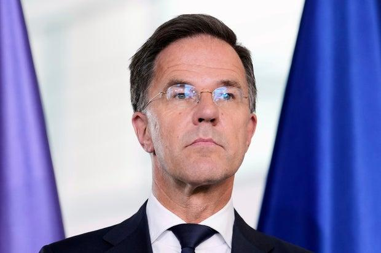
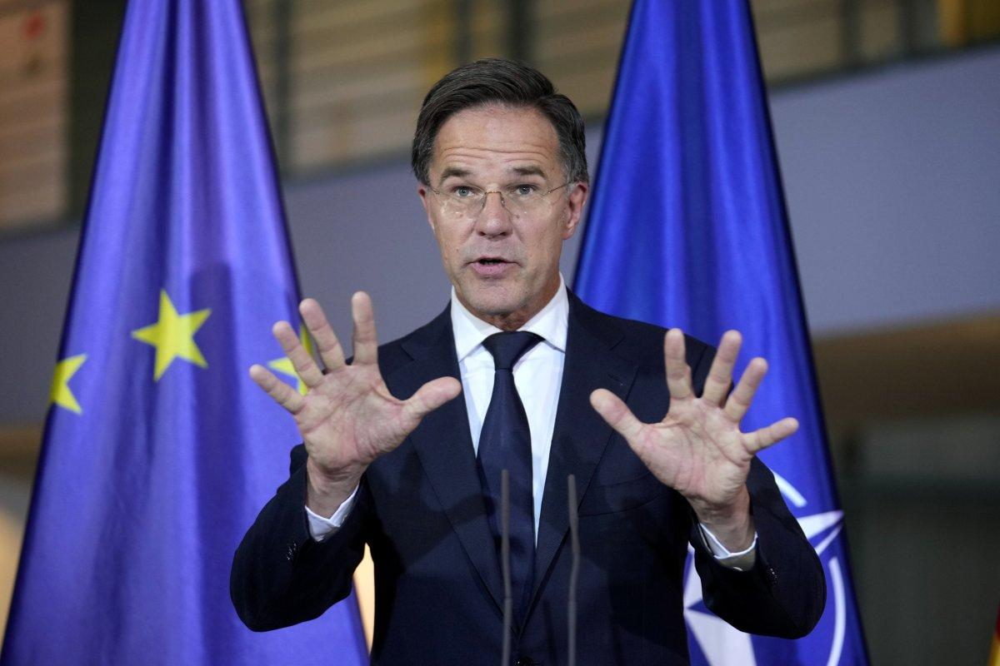
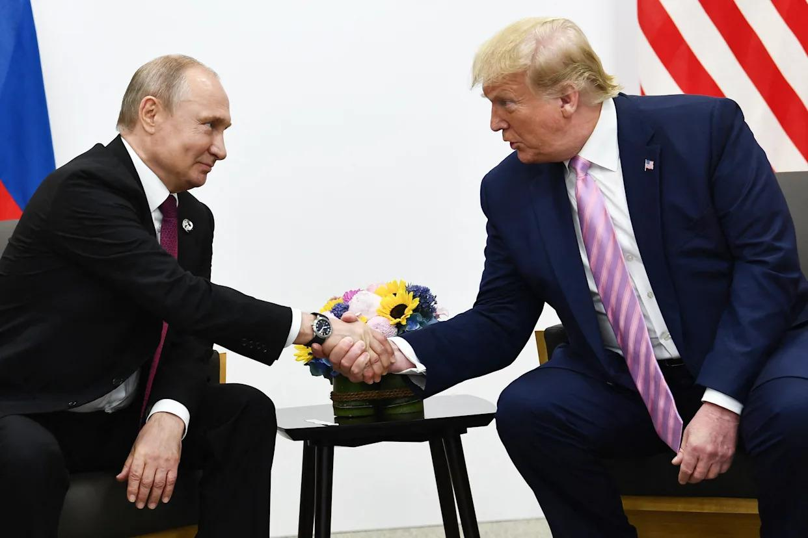

## Claim
Claim: "After Donald Trump won the US presidential election in 2024, NATO Secretary General Mark Rutte said that ‘If Trump surrenders Ukraine to Putin, he will personally expel the United States from the alliance’."

## Actions
```
web_search("Mark Rutte Trump Ukraine Putin NATO")
```

## Evidence
### Evidence from `web_search`
The NATO website contains remarks by NATO Secretary General Mark Rutte with Donald Trump at the White House, discussing keeping Ukraine strong and increasing defense industrial production. Rutte mentioned that if he were Vladimir Putin, he would reconsider negotiations about Ukraine. The remarks also mention European countries' support for Ukraine. ([https://www.nato.int/cps/en/natohq/opinions_237051.htm](https://www.nato.int/cps/en/natohq/opinions_237051.htm))

NPR published an article on July 14, 2025, discussing President Trump's meeting with NATO Secretary-General Mark Rutte . Trump threatened tariffs on countries trading with Moscow if a ceasefire deal with Ukraine wasn't reached. The article mentions Trump's promise to provide weapons to Ukraine through NATO. CBS News reports that Donald Trump is set to meet with NATO Secretary General Mark Rutte , . The article mentions that Trump is considering authorizing fresh funding for Ukraine. ([https://www.npr.org/2025/07/14/nx-s1-5467272/russia-ukraine-war-trump-nato-weapons-tariffs](https://www.npr.org/2025/07/14/nx-s1-5467272/russia-ukraine-war-trump-nato-weapons-tariffs)) ([https://www.cbsnews.com/news/trump-nato-secretary-general-mark-rutte-meeting-ukraine-russia/](https://www.cbsnews.com/news/trump-nato-secretary-general-mark-rutte-meeting-ukraine-russia/))


## Elaboration
The evidence indicates that Mark Rutte and Donald Trump have met and discussed Ukraine and NATO. However, the provided sources do not contain any statements from Rutte about expelling the United States from NATO if Trump surrenders Ukraine to Putin.

Therefore, the claim cannot be verified based on the provided evidence.


## Actions
```
web_search("Mark Rutte statement Trump Ukraine NATO expulsion")
```

## Evidence
### Evidence from `web_search`
Newsweek reports that there is no evidence that Mark Rutte said he would expel the U.S. from NATO if Trump surrenders Ukraine to Putin; the claim originated from a post on Telegram and was shared on X (formerly Twitter) . The NATO website contains remarks by Mark Rutte at a meeting with Donald Trump and Volodymyr Zelenskyy in Washington, D.C. on August 18, 2025, where Rutte discussed stopping the destruction of Ukraine's infrastructure. Yahoo News reports that a NATO spokesperson called the claim "baseless" and that Rutte congratulated Trump after the election .

The sources are: [https://www.newsweek.com/did-nato-chief-vow-kick-us-out-over-trumps-ukraine-plan-what-we-know-mark-rutte-1983779](https://www.newsweek.com/did-nato-chief-vow-kick-us-out-over-trumps-ukraine-plan-what-we-know-mark-rutte-1983779), [https://www.nato.int/cps/en/natohq/opinions_237212.htm](https://www.nato.int/cps/en/natohq/opinions_237212.htm), and [https://www.yahoo.com/news/nato-secretary-general-congratulated-trump-002143816.html](https://www.yahoo.com/news/nato-secretary-general-congratulated-trump-002143816.html).


## Elaboration
The new evidence directly contradicts the claim. Newsweek reports that there is no evidence of Rutte making the statement, and a NATO spokesperson called the claim "baseless." The claim originated from a Telegram post and was shared on X.


## Final Judgement
The initial search did not find any evidence to support the claim. Subsequent searches revealed that the claim is false. Newsweek and Yahoo News both report that the claim is baseless and originated from a social media post.

`false`

### Verdict: FALSE

### Justification
The claim that Mark Rutte said he would expel the United States from NATO if Trump surrendered Ukraine to Putin is false. Multiple sources, including a [Newsweek article](https://www.newsweek.com/did-nato-chief-vow-kick-us-out-over-trumps-ukraine-plan-what-we-know-mark-rutte-1983779) and a [Yahoo News article](https://www.yahoo.com/news/nato-secretary-general-congratulated-trump-002143816.html), state that there is no evidence to support this statement, and a NATO spokesperson called the claim "baseless." The claim originated from a social media post.
