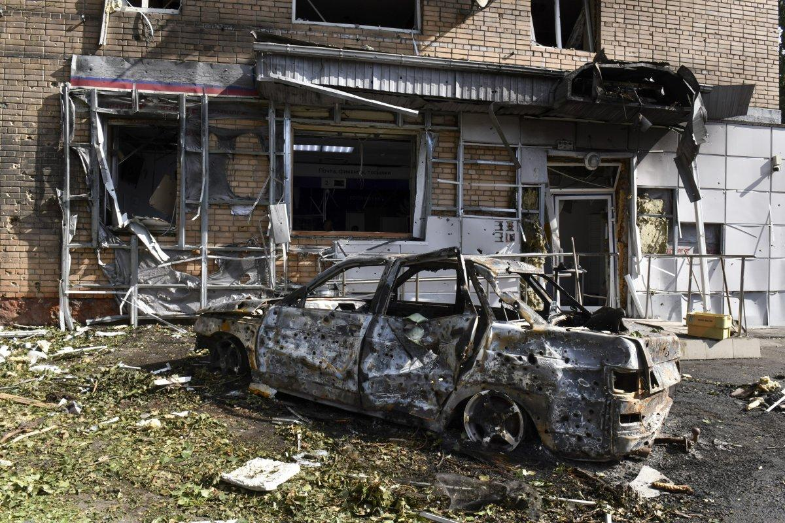
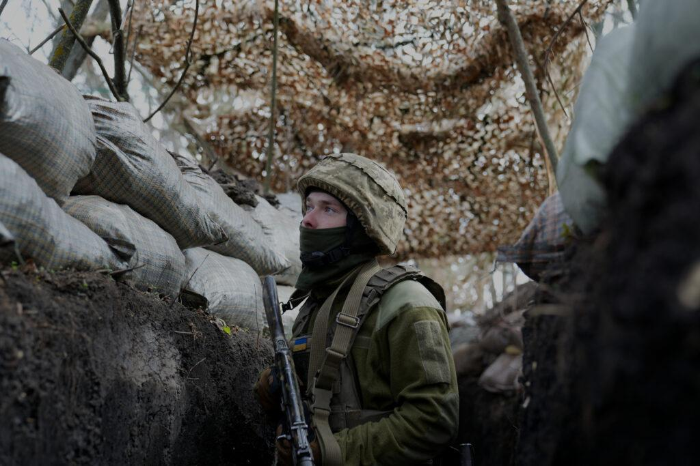
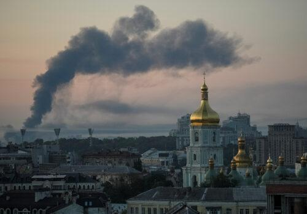
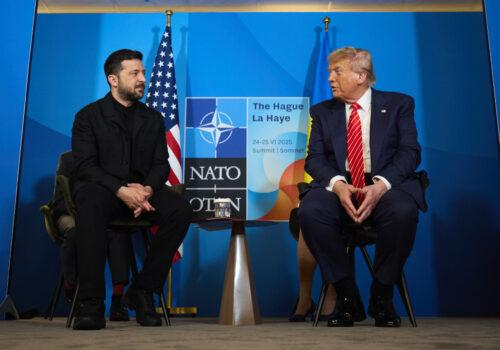
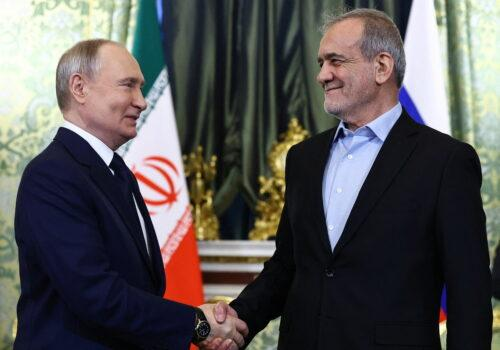
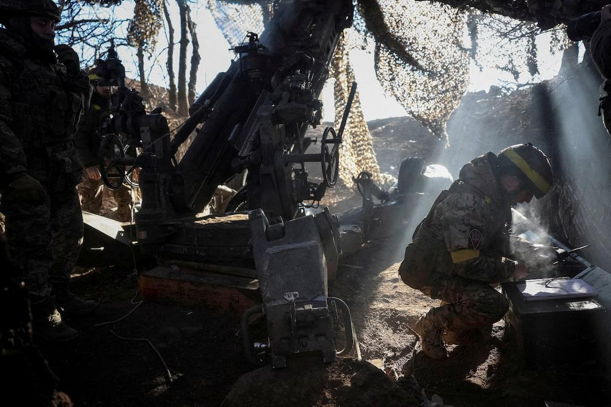
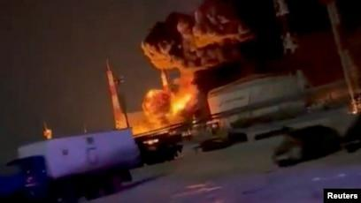
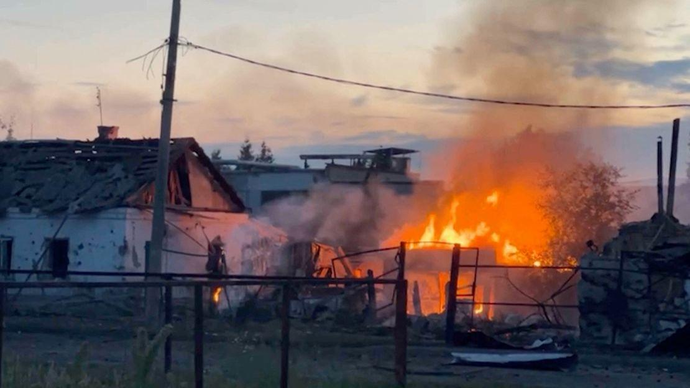
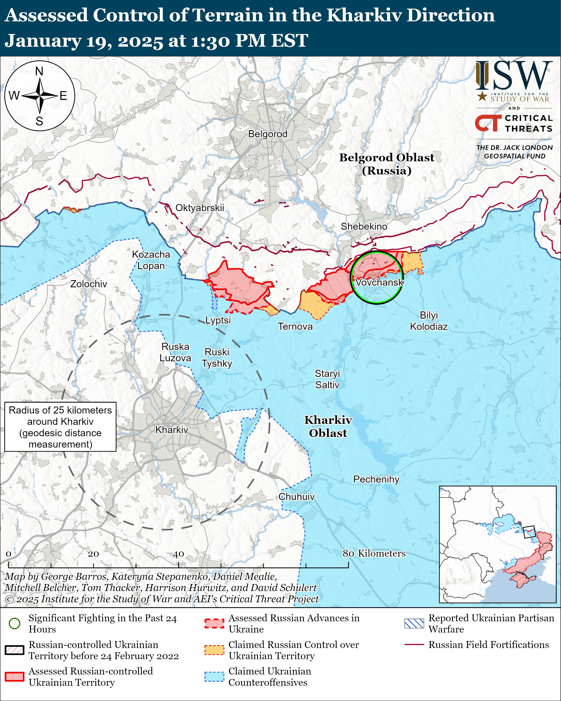

## Claim
Claim: " This image shows a chemical attack by the Armed Forces of Ukraine during the Kursk offensive in August 2024."

## Actions
```
reverse_search()
```

## Evidence
No new evidence found.

## Elaboration
There is no evidence to support the claim. The reverse image search did not yield any results. Therefore, the claim cannot be verified.


## Actions
```
web_search("Kursk offensive August 2024 chemical attack")
web_search("Armed Forces of Ukraine chemical attack")
image_search("Kursk offensive chemical explosion")
```

## Evidence
### Evidence from `web_search`
The Wikipedia article on the Kursk campaign ([https://en.wikipedia.org/wiki/Kursk_campaign](https://en.wikipedia.org/wiki/Kursk_campaign)) discusses the incursion by the Armed Forces of Ukraine into Russia's Kursk Oblast, which began on August 6, 2024, but does not mention any chemical attacks. Newsweek ([https://www.newsweek.com/russia-says-ukraine-using-chemical-weapons-kursk-1937987](https://www.newsweek.com/russia-says-ukraine-using-chemical-weapons-kursk-1937987)) reports that the acting governor of the Kursk Oblast accused Ukraine of using chemical weapons, while the U.S. Department of State accused Russia of using chloropicrin. The article includes images of Vladimir Putin () and damaged buildings and vehicles ().


### Evidence from `web_search`
The Atlantic Council published an article on July 8, 2025, stating that Ukraine has called on the international chemical weapons watchdog to launch a probe into Russia’s alleged use of toxic munitions against Ukrainian forces. The article mentions that the UK has sanctioned Russian individuals and an organization for involvement in the transfer and use of chemical weapons in Ukraine. The article also mentions that Dutch and German intelligence agencies claim to have evidence that Russia is increasingly using chemical weapons in Ukraine. (, , , )

Reuters published an article on July 4, 2025, stating that Dutch and German intelligence agencies have gathered evidence of widespread Russian use of banned chemical weapons in Ukraine. The article mentions the use of chloropicrin and the involvement of the Dutch Military Intelligence Agency (MIVD). () Arms Control Today, April 2025, reports that the OPCW found more evidence of chemical weapons use in Ukraine. The OPCW investigated three incidents in October 2024 in the Dnipropetrovsk region. The OPCW confirmed the presence of the CS agent in November after its first technical assistance visit to Ukraine in July. ()


### Evidence from `image_search`
The Voice of America published an article about the Kursk offensive, including an image of an explosion (). ABC News also published an article about the Kursk offensive (). CNN published an article about the Ukraine war ().

All sources discuss the Kursk offensive or the Ukraine war, but none mention a chemical attack by the Armed Forces of Ukraine.


## Elaboration
The evidence suggests that both sides have accused each other of using chemical weapons. However, there is no evidence to support the claim that the image depicts a chemical attack by the Armed Forces of Ukraine during the Kursk offensive in August 2024. The search results mention the Kursk offensive and chemical weapons use, but they do not connect the two in the context of the image.


## Actions
```
web_search("chemical weapons Ukraine Kursk offensive")
image_search("chemical explosion Kursk offensive")
```

## Evidence
### Evidence from `web_search`
Al Jazeera reported that Dutch and German intelligence agencies said Russia has intensified its use of chemical weapons, including chloropicrin, against Ukrainian soldiers, and includes an image of a Ukrainian soldier in a trench (). The Institute for the Study of War (ISW) stated that the Ukrainian General Staff reported that Russian forces used ammunition equipped with chemical agents banned by the Chemical Weapons Convention (CWC) 434 times in Ukraine in December 2024, contributing to a total of 5,389 documented cases since February 2023 (, ). Neither source mentions a chemical attack by the Armed Forces of Ukraine during the Kursk offensive.


## Elaboration
The evidence consistently points to accusations of chemical weapons use, primarily against Ukrainian forces, with Russia being the main actor accused. The claim, however, asserts the opposite. There is no evidence to support the claim that the image depicts a chemical attack by the Armed Forces of Ukraine during the Kursk offensive.


## Final Judgement
The evidence indicates that Russia has been accused of using chemical weapons in Ukraine, but there is no evidence to support the claim that the image shows a chemical attack by the Armed Forces of Ukraine during the Kursk offensive. Therefore, the claim is demonstrably false. `false`

### Verdict: FALSE

### Justification
The claim is demonstrably false. While there are reports of chemical weapons use in the context of the Ukraine war, the evidence indicates that Russia is the primary actor accused of using such weapons, not Ukraine. Furthermore, there is no evidence linking the image to a chemical attack by the Armed Forces of Ukraine during the Kursk offensive.
