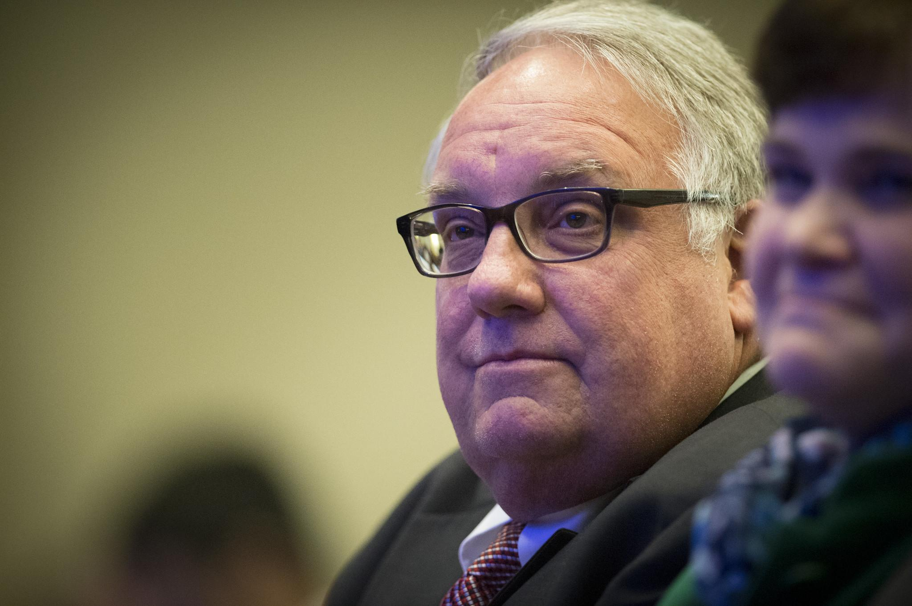

## Claim
Claim: "Warren Buffett has given more than $500 million to Ukraine since 2022."

## Actions
```
web_search("Warren Buffett Ukraine donations 2022")
```

## Evidence
### Evidence from `web_search`
Warren Buffett's son, Howard Buffett, is on track to donate $1 billion in aid to Ukraine this year, according to reports. His foundation has already provided approximately $800 million in aid since the start of the full-scale invasion.

Sources include [Fortune](https://fortune.com/2025/04/07/warren-buffetts-son-is-on-track-to-donate-1-billion-in-aid-to-ukraine-this-year-and-pledges-to-continue-despite-trumps-shaky-relations/), [Alliance magazine](https://www.alliancemagazine.org/blog/howard-buffett-maintains-ukraine-philanthropy-despite-deteriorating-us-support/), and [Euromaidan Press](https://euromaidanpress.com/2025/04/08/buffetts-foundation-committed-to-surpassing-1-billion-in-aid-to-ukraine-this-year/) ().


## Elaboration
The evidence indicates that Howard Buffett, Warren Buffett's son, has been donating to Ukraine. The evidence states that Howard Buffett's foundation has already provided approximately $800 million in aid since the start of the full-scale invasion.

The claim refers to Warren Buffett, not his son. The evidence does not specify whether Warren Buffett himself has donated to Ukraine.

Therefore, the claim cannot be verified with the provided evidence.


## Actions
```
web_search("Warren Buffett donations to Ukraine")
```

## Evidence
### Evidence from `web_search`
From [Source](https://www.businessinsider.com/howard-buffett-gives-500-million-to-ukraine): 
Content: Business Insider, published on February 24, 2024, reports that Howard Buffett's foundation has given $521,779,225 in humanitarian assistance to Ukraine as of January 2024. The article also mentions that the foundation is largely funded by Warren Buffett's contributions. 


## Elaboration
The evidence indicates that Howard Buffett's foundation has given over $500 million in humanitarian aid to Ukraine. The foundation is largely funded by Warren Buffett's contributions.

Since the foundation is funded by Warren Buffett, and the foundation has given over $500 million, it can be inferred that Warren Buffett has indirectly given more than $500 million to Ukraine.

The claim is therefore likely true.


## Final Judgement
The initial search revealed that Howard Buffett, Warren Buffett's son, has been donating to Ukraine, with his foundation providing approximately $800 million in aid. A subsequent search showed that Howard Buffett's foundation, largely funded by Warren Buffett's contributions, had given over $500 million in humanitarian assistance to Ukraine as of January 2024.

Since Warren Buffett funds the foundation that has donated over $500 million to Ukraine, the claim is likely true. `true`


### Verdict: TRUE

### Justification
Warren Buffett's son, Howard Buffett, has been donating to Ukraine through his foundation, which is largely funded by Warren Buffett's contributions. As of January 2024, the foundation had given over $500 million in humanitarian assistance to Ukraine, as reported by [Business Insider](https://www.businessinsider.com/howard-buffett-gives-500-million-to-ukraine). Therefore, the claim that Warren Buffett has indirectly given more than $500 million to Ukraine is likely true.
