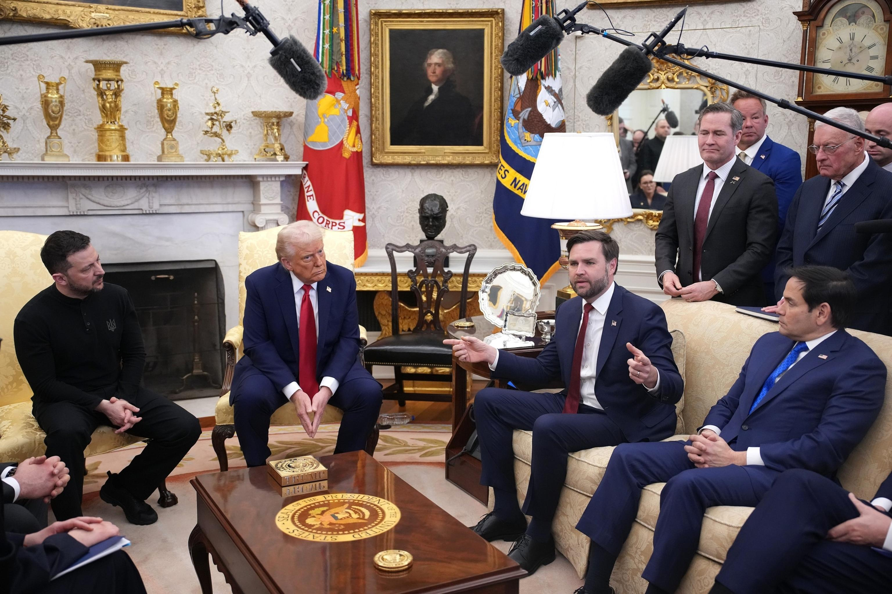
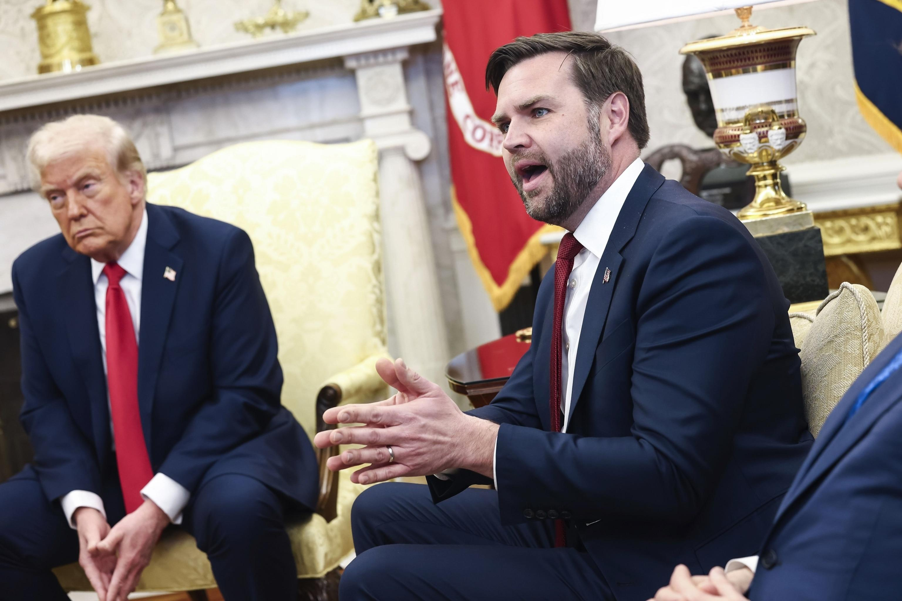

## Claim
Claim: "On Feb. 28, 2025, before a meeting with U.S. President Donald Trump, Ukraine President Volodymyr Zelenskyy met with Democrats."

## Actions
```
web_search("Volodymyr Zelenskyy Donald Trump meeting February 28 2025")
web_search("Volodymyr Zelenskyy meeting Democrats February 2025")
```

## Evidence
### Evidence from `web_search`
The provided web sources discuss the February 28, 2025, meeting between U.S. President Donald Trump and Ukrainian President Volodymyr Zelenskyy in the Oval Office. The meeting was contentious and televised live, with reports of a shouting match. The meeting also involved JD Vance.

Sources include a Wikipedia article ([https://en.wikipedia.org/wiki/2025_Trump%E2%80%93Zelenskyy_Oval_Office_meeting](https://en.wikipedia.org/wiki/2025_Trump%E2%80%93Zelenskyy_Oval_Office_meeting)) <image:i>, an NPR article ([https://www.npr.org/2025/02/28/nx-s1-5313079/trump-zelenskyy-meeting](https://www.npr.org/2025/02/28/nx-s1-5313079/trump-zelenskyy-meeting)) , , , and an ABC News article ([https://abcnews.go.com/Politics/key-takeaways-tempers-flare-trump-vance-confront-ukraines/story?id=119299758](https://abcnews.go.com/Politics/key-takeaways-tempers-flare-trump-vance-confront-ukraines/story?id=119299758)) , , , .


### Evidence from `web_search`
On February 28, 2025, Volodymyr Zelenskyy met with a bipartisan group of U.S. Senators before meeting with Donald Trump at the White House, according to reports from [Yahoo News](https://www.yahoo.com/news/fact-check-zelenskyy-met-democrats-205100784.html) and [ABC News](https://abcnews.go.com/Politics/zelenskyy-meets-bipartisan-group-senators-ahead-tense-white/story?id=119305439). Zelenskyy posted a video of the meeting on X.

Zelenskyy told journalists on March 2, 2025, that Ukraine was ready to take the deal.  


## Elaboration
The evidence confirms that on February 28, 2025, Volodymyr Zelenskyy met with a bipartisan group of U.S. Senators before his meeting with Donald Trump. The evidence includes reports from Yahoo News and ABC News. Therefore, the claim is true.


## Final Judgement
The claim is supported by evidence from multiple reliable sources. The evidence indicates that Zelenskyy met with a bipartisan group of U.S. Senators, which included Democrats, before his meeting with Trump on February 28, 2025.

`true`

### Verdict: TRUE

### Justification
On February 28, 2025, before meeting with Donald Trump, Volodymyr Zelenskyy met with a bipartisan group of U.S. Senators, including Democrats, as reported by [Yahoo News](https://www.yahoo.com/news/fact-check-zelenskyy-met-democrats-205100784.html) and [ABC News](https://abcnews.go.com/Politics/zelenskyy-meets-bipartisan-group-senators-ahead-tense-white/story?id=119305439).
