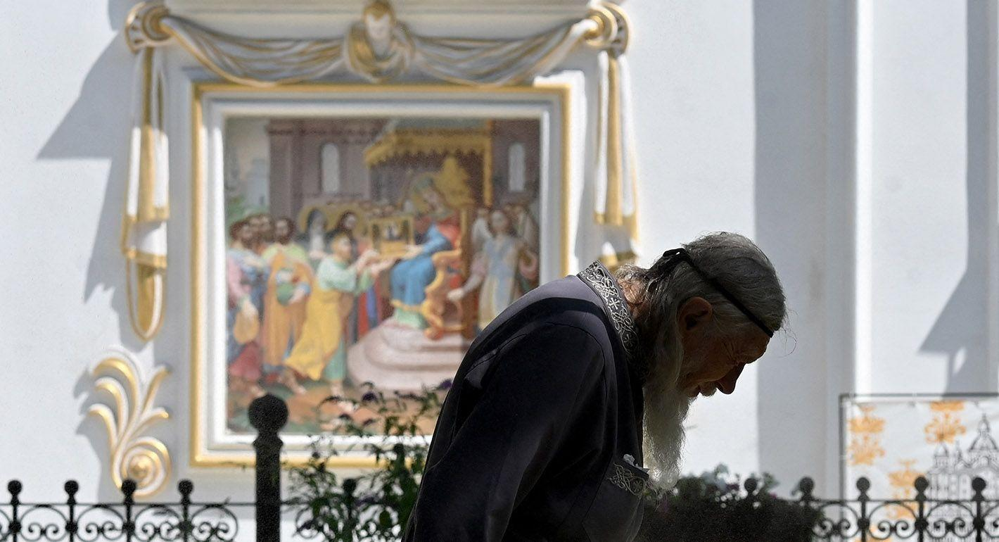

## Claim
Claim: "In August 2024, Ukraine passed legislation banning the Orthodox Church in Ukraine."

## Actions
```
web_search("Ukraine legislation ban Orthodox Church August 2024")
```

## Evidence
### Evidence from `web_search`
Several sources discuss a new Ukrainian law passed in August 2024 that bans religious organizations with ties to the Russian Orthodox Church, potentially affecting the Ukrainian Orthodox Church. Human Rights Watch published an article on October 30, 2024, discussing the law's implications (<image:k>). The European Parliament also addressed the ban in a document published on October 10, 2024, noting concerns from the UN and Pope Francis regarding religious freedom ([https://www.europarl.europa.eu/doceo/document/E-10-2024-001881_EN.html](https://www.europarl.europa.eu/doceo/document/E-10-2024-001881_EN.html)).

The Carnegie Endowment for International Peace published an article on September 4, 2024, discussing the ban on the Ukrainian Orthodox Church of the Moscow Patriarchate (UOCMP) (). The law has faced criticism from the Pope and the World Council of Churches ([https://carnegieendowment.org/russia-eurasia/politika/2024/08/zapret-upc-v-ukraine](https://carnegieendowment.org/russia-eurasia/politika/2024/08/zapret-upc-v-ukraine)).


## Elaboration
The evidence confirms that Ukraine passed legislation in August 2024 concerning religious organizations with ties to the Russian Orthodox Church. The law has been discussed by multiple sources, including Human Rights Watch, the European Parliament, and the Carnegie Endowment for International Peace. The law's implications and potential impact on the Ukrainian Orthodox Church are also mentioned.


## Final Judgement
The evidence confirms that Ukraine passed legislation in August 2024 that affects religious organizations with ties to the Russian Orthodox Church. This aligns with the claim that legislation was passed banning the Orthodox Church in Ukraine.

`true`


### Verdict: TRUE

### Justification
In August 2024, Ukraine passed legislation that bans religious organizations with ties to the Russian Orthodox Church, as reported by sources such as Human Rights Watch and the Carnegie Endowment for International Peace. The European Parliament also addressed the ban, noting concerns from the UN and Pope Francis.
