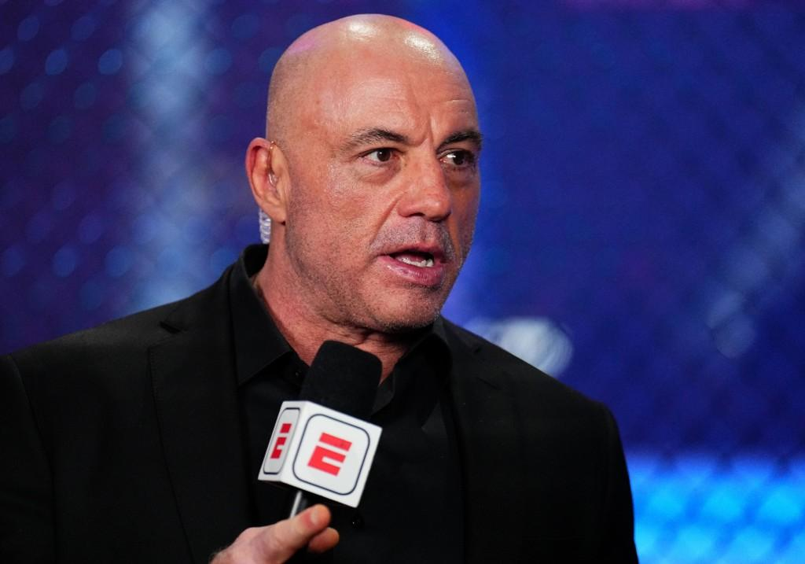

## Claim
Claim: "In March 2025 podcaster and UFC commentator Joe Rogan said, 'I don't go to Canada anymore,' then added, 'I'd rather go to Russia.'"

## Actions
```
web_search("Joe Rogan Canada Russia March 2025")
```

## Evidence
### Evidence from `web_search`
Joe Rogan said, "I don't go to Canada anymore," and "I'd rather go to Russia" in March 2025. This was reported by [Yahoo News](https://www.yahoo.com/news/fact-check-joe-rogan-said-234200896.html) (, ), [Global News](https://globalnews.ca/news/11098769/joe-rogan-rather-go-to-russia-than-canada-ufc/) (), and the [New York Post](https://nypost.com/2025/03/25/sports/joe-rogan-not-attending-ufc-315-in-canada-id-rather-go-to-russia/) (, , ). The comments were made on his podcast, "The Joe Rogan Experience," when asked about attending a UFC fight in Montreal.


## Elaboration
The claim is verified. Multiple news sources, including Yahoo News, Global News, and the New York Post, reported that Joe Rogan made the statements "I don't go to Canada anymore" and "I'd rather go to Russia" in March 2025. These comments were made on his podcast, "The Joe Rogan Experience."


## Final Judgement
The claim is accurate. Multiple reliable news sources confirm that Joe Rogan made the statements in March 2025.

`true`

### Verdict: TRUE

### Justification
The claim is accurate. Multiple news outlets, including [Yahoo News](https://www.yahoo.com/news/fact-check-joe-rogan-said-234200896.html), [Global News](https://globalnews.ca/news/11098769/joe-rogan-rather-go-to-russia-than-canada-ufc/), and the [New York Post](https://nypost.com/2025/03/25/sports/joe-rogan-not-attending-ufc-315-in-canada-id-rather-go-to-russia/), reported that Joe Rogan made the statements in March 2025 on his podcast.
