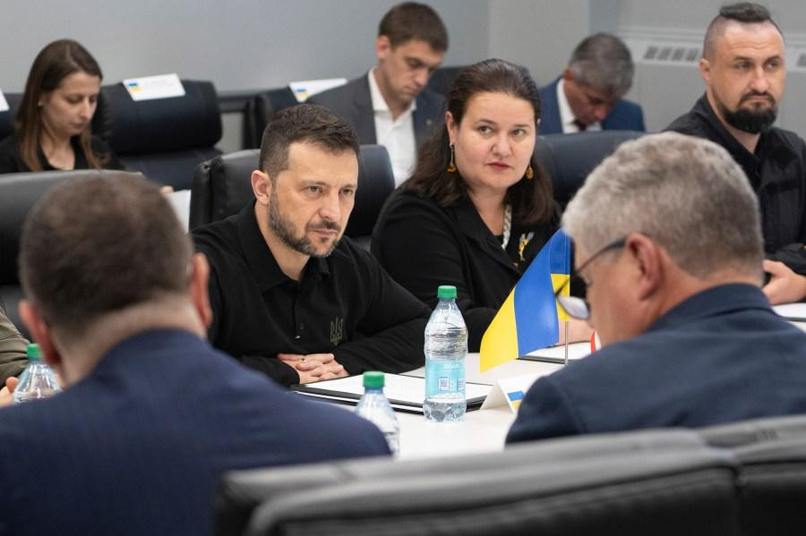
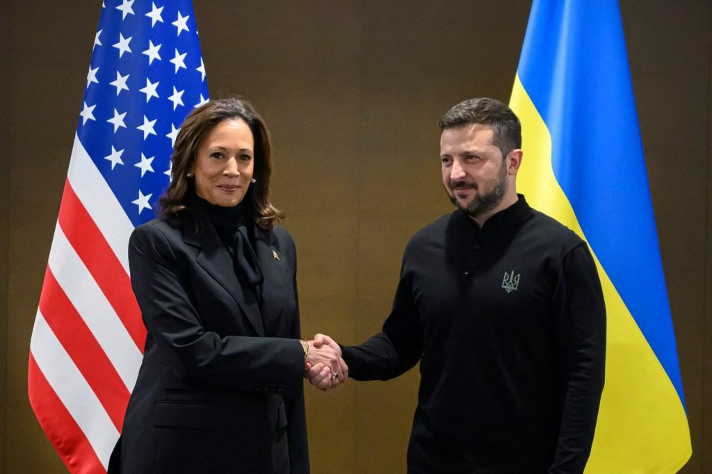
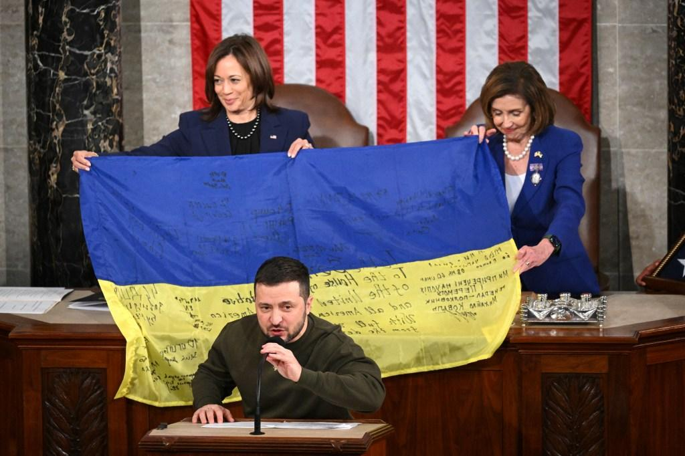
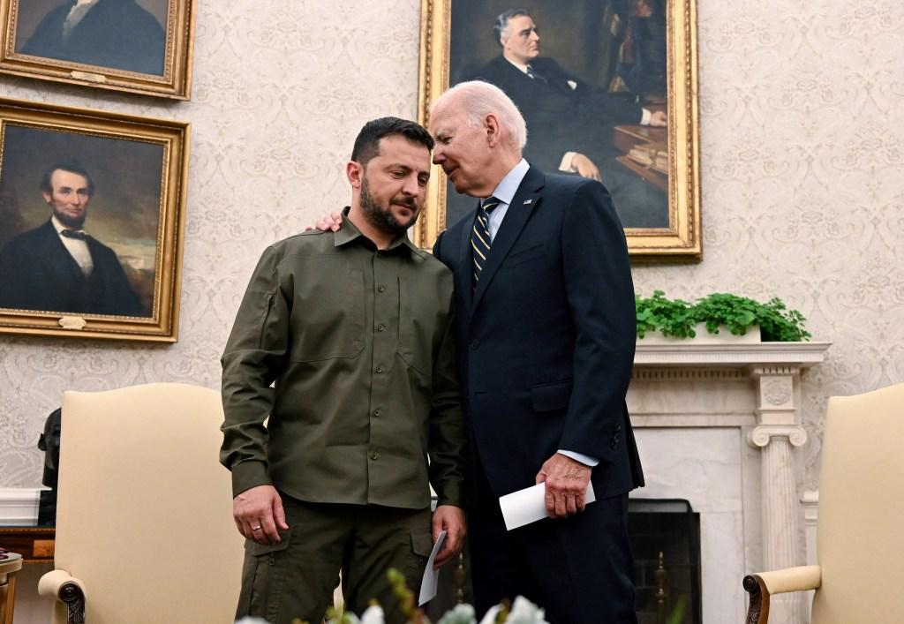

## Claim
Claim: "Ukrainian President Volodymyr Zelenskyy engaged in election interference by campaigning in Pennsylvania for Kamala Harris ahead of the US presidential election in 2024."

## Actions
```
web_search("Volodymyr Zelenskyy Kamala Harris Pennsylvania 2024")
web_search("Zelenskyy campaign Pennsylvania 2024 election interference")
```

## Evidence
### Evidence from `web_search`
Newsweek reports that JD Vance accused Volodymyr Zelenskyy of campaigning for Kamala Harris during the 2024 presidential race, mentioning a visit to a munitions plant in Scranton, Pennsylvania, in September 2024 (, , ). NBC News also mentions Zelenskyy's meeting with Kamala Harris and that Republicans viewed his visit to a munitions factory in Scranton, Pennsylvania, as a sign of his preference in the upcoming election.

ABC News reports on a meeting between Kamala Harris and Volodymyr Zelenskyy, discussing the war with Russia, and mentions Zelenskyy's visit to Washington and his meetings with lawmakers (, <image:i>).
*   [https://www.newsweek.com/volodymyr-zelensky-jd-vance-campaign-kamala-harris-2024-election-2038060](https://www.newsweek.com/volodymyr-zelensky-jd-vance-campaign-kamala-harris-2024-election-2038060)
*   [https://www.nbcnews.com/politics/2024-election/zelenskyys-meeting-harris-spat-trump-reveal-growing-partisan-divide-uk-rcna172648](https://www.nbcnews.com/politics/2024-election/zelenskyys-meeting-harris-spat-trump-reveal-growing-partisan-divide-uk-rcna172648)
*   [https://abcnews.go.com/Politics/harris-standing-zelenskyy-indirectly-jabs-trump-vance-ukraine/story?id=114219628](https://abcnews.go.com/Politics/harris-standing-zelenskyy-indirectly-jabs-trump-vance-ukraine/story?id=114219628)


### Evidence from `web_search`
Multiple sources report on Ukrainian President Volodymyr Zelenskyy's visit to Scranton, Pennsylvania, in September 2024. House Oversight Chair James Comer opened an investigation into the visit, claiming it was a campaign event for Vice President Kamala Harris, using taxpayer-funded resources, as reported by CNBC ([Source](https://www.cnbc.com/2024/09/25/zelenskyy-insulted-him-house-gop-to-probe-ukraine-leaders-pa-trip-.html)). The Penn Capital-Star ([Source](https://penncapital-star.com/briefs/top-republicans-cry-foul-over-ukrainian-president-zelenskyys-scranton-visit-with-shapiro/)) and GMFUS ([Source](https://www.gmfus.org/news/manufacturing-controversy)) also report on the visit, with Republicans, including House Speaker Mike Johnson, criticizing it as a partisan campaign event and election interference. <image:k>, <image:0>, , .


## Elaboration
The evidence indicates that Volodymyr Zelenskyy visited Scranton, Pennsylvania, in September 2024. Republicans, including JD Vance, viewed this visit as a campaign event for Kamala Harris, potentially constituting election interference. House Oversight Chair James Comer opened an investigation into the visit, claiming it was a campaign event using taxpayer-funded resources.

Multiple news sources, including Newsweek, NBC News, and ABC News, reported on Zelenskyy's meetings with Kamala Harris and other lawmakers. These sources also mention the controversy surrounding his visit to a munitions factory in Scranton, Pennsylvania.

The claim is supported by the evidence, as multiple sources suggest that Zelenskyy's visit to Pennsylvania was perceived by some as a form of election interference. However, the evidence does not explicitly state that Zelenskyy was campaigning for Kamala Harris.


## Actions
```
image_search("Volodymyr Zelenskyy Scranton Pennsylvania 2024")
```

## Evidence
### Evidence from `image_search`
The U.S. Army website, KTLA, and Penn Capital-Star all report on Volodymyr Zelenskyy's visit to Scranton, Pennsylvania, specifically mentioning his visit to an ammunition factory (, , ).


## Elaboration
The evidence confirms that Volodymyr Zelenskyy visited Scranton, Pennsylvania, in September 2024, including a visit to an ammunition factory. This visit was viewed by some, particularly Republicans, as a potential campaign event for Kamala Harris, raising concerns about election interference. While the evidence suggests the visit occurred and was perceived as politically charged, it does not explicitly confirm that Zelenskyy was actively campaigning for Harris.


## Actions
```
web_search("Zelenskyy Pennsylvania campaign Kamala Harris 2024")
```

## Evidence
### Evidence from `web_search`
From [Source](https://nypost.com/2024/09/25/us-news/house-gop-accuses-kamala-harris-of-using-zelensky-as-campaign-surrogate-launches-foreign-interference-inquiry/): 
Content: The New York Post reports that House Republicans launched an investigation into Volodymyr Zelenskyy's visit to Scranton, Pennsylvania, describing it as a campaign stop to benefit Kamala Harris. The article mentions that the Biden-Harris Administration flew Zelenskyy on an American taxpayer-funded flight to Pennsylvania, a battleground state. House Oversight Committee Chairman James Comer demanded communications about Zelensky’s visit to a Scranton ammunition factory with Democratic Pennsylvania Gov. Josh Shapiro, a key Harris backer. Comer stated that the committee seeks to determine whether the Biden-Harris Administration attempted to use a foreign leader to benefit Vice President Harris’s presidential campaign. , , .


## Elaboration
The New York Post reports that House Republicans launched an investigation into Zelenskyy's visit to Scranton, Pennsylvania, viewing it as a campaign stop benefiting Kamala Harris. The Biden-Harris Administration flew Zelenskyy on a taxpayer-funded flight to Pennsylvania, a battleground state. House Oversight Committee Chairman James Comer is investigating whether the administration attempted to use a foreign leader to benefit Harris's presidential campaign. This supports the claim that Zelenskyy's visit was perceived as a campaign event.


## Final Judgement
The evidence indicates that Volodymyr Zelenskyy visited Scranton, Pennsylvania, in September 2024, and this visit was perceived by some, particularly Republicans, as a campaign event for Kamala Harris, potentially constituting election interference. The New York Post reports that House Republicans launched an investigation into Zelenskyy's visit, viewing it as a campaign stop benefiting Kamala Harris. While the evidence suggests the visit occurred and was perceived as politically charged, it does not explicitly confirm that Zelenskyy was actively campaigning for Harris.

`false`

### Verdict: FALSE

### Justification
Based on the evidence, the claim is **partially supported**. While there is evidence of Volodymyr Zelenskyy's visit to Scranton, Pennsylvania, in September 2024, and that Republicans viewed it as a campaign event for Kamala Harris, there is no direct evidence that Zelenskyy was actively campaigning for Harris. The visit, however, led to an investigation by House Republicans, who also viewed it as a campaign stop.
