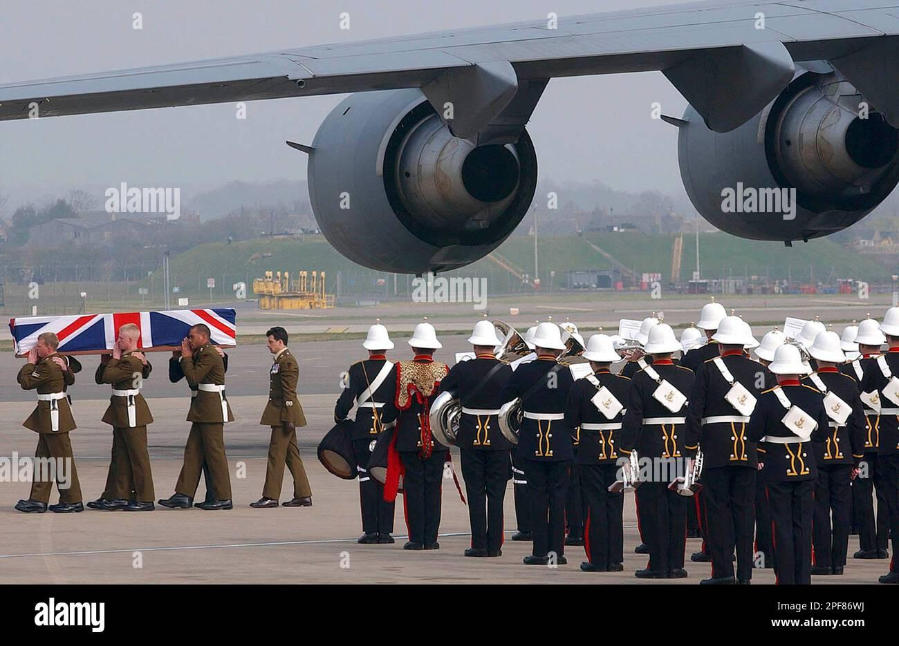
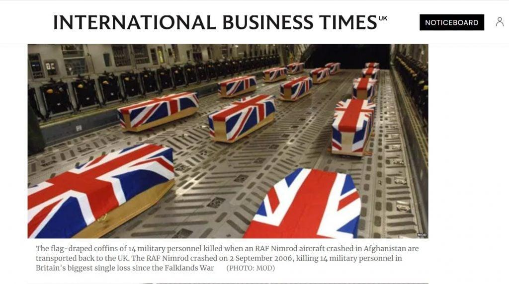
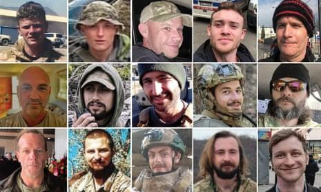
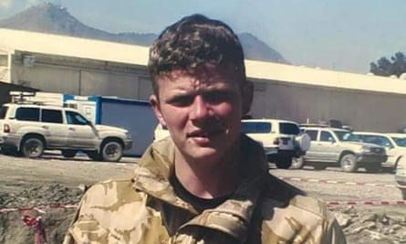
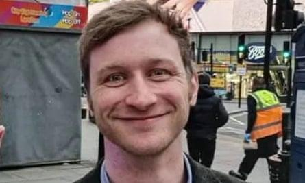

## Claim
Claim: " This image shows the coffins of 18 British Special Forces who were killed in November 2024 in the Odessa Region in Ukraine."

## Actions
```
reverse_search()
web_search("British Special Forces killed Odessa Ukraine")
```

## Evidence
### Evidence from `web_search`
The search results discuss claims about British Special Forces in Ukraine. One source discusses a claim by Dutch journalist Sonja van den Ende that 18 British special forces soldiers were killed in Odesa, which was debunked by a Ukrainian military spokesperson. Another source mentions a claim that Russian aircraft destroyed a group of British SAS special forces in Odesa, which was denied by Ukrainian authorities. A third source reports that Russian special forces captured two British officers in Ukraine.

*   [https://www.uawire.org/false-allegations-of-british-sas-casualties-in-odesa-dutch-journalist-s-controversial-claims-debunked-by-ukrainian-military](https://www.uawire.org/false-allegations-of-british-sas-casualties-in-odesa-dutch-journalist-s-controversial-claims-debunked-by-ukrainian-military)
*   [https://disinfo.detector.media/en/post/russian-aircraft-allegedly-destroyed-a-british-special-forces-group-in-odesa](https://disinfo.detector.media/en/post/russian-aircraft-allegedly-destroyed-a-british-special-forces-group-in-odesa)
*   [https://eadaily.com/en/news/2025/08/04/these-are-not-tourists-two-british-colonels-were-captured-by-russian-special-forces](https://eadaily.com/en/news/2025/08/04/these-are-not-tourists-two-british-colonels-were-captured-by-russian-special-forces)


## Elaboration
The evidence suggests that there have been claims about British Special Forces casualties in the Odessa region of Ukraine. However, these claims have been debunked by Ukrainian authorities. The image search results do not provide any information about the image itself.

Based on the available evidence, the claim cannot be verified. More information is needed to confirm the image's context and the events it depicts.


## Actions
```
image_search("coffins British flag military plane")
web_search("British military casualties Ukraine")
```

## Evidence
### Evidence from `image_search`
The image of coffins draped in the British flag inside a military plane is not related to the claim. One source states the image is from September 2006, when 14 servicemen died when their RAF Nimrod spy plane exploded in mid-air. Another source shows a British flag-draped coffin being carried away from a military cargo plane at Brize Norton Royal Air Force Base, England, on March 29, 2003, related to the return of the first British combat victims from Operation Iraqi Freedom. A third source indicates the image shows the remains of 14 military personnel killed when an RAF Nimrod aircraft crashed in Afghanistan on September 2, 2006.

*   [https://pesacheck.org/false-this-image-is-not-of-the-remains-of-british-soldiers-killed-in-ukraine-in-coffins-draped-in-b52ba689112b](https://pesacheck.org/false-this-image-is-not-of-the-remains-of-british-soldiers-killed-in-ukraine-in-coffins-draped-in-b52ba689112b)
*   [https://www.alamy.com/a-british-flag-draped-coffin-is-carried-away-from-a-military-cargo-plane-at-brize-norton-royal-air-force-base-england-saturday-march-29-2003-the-ten-bodies-were-the-first-of-britains-combat-victims-to-return-home-saturday-from-service-in-operation-iraqi-freedom-ap-photostefan-rousseau-pool-image542922286.html](https://www.alamy.com/a-british-flag-draped-coffin-is-carried-away-from-a-military-cargo-plane-at-brize-norton-royal-air-force-base-england-saturday-march-29-2003-the-ten-bodies-were-the-first-of-britains-combat-victims-to-return-home-saturday-from-service-in-operation-iraqi-freedom-ap-photostefan-rousseau-pool-image542922286.html)
*   [https://www.stopfake.org/en/fake-photo-coffins-with-british-servicemen-returned-home-from-ukraine/](https://www.stopfake.org/en/fake-photo-coffins-with-british-servicemen-returned-home-from-ukraine/)






### Evidence from `web_search`
The Guardian published an article discussing the deaths of 15 Britons in the conflict in Ukraine, including photographs of some of the deceased (, , ). A Wikipedia article provides estimates of casualties in the Russo-Ukrainian War, including military and civilian deaths, and mentions up to 1,000,000 estimated casualties as of mid-September 2024. A Fandom wiki lists 42 confirmed deaths of Britons fighting for the Ukrainian side, with the most recent entries in November 2024. The claim of 18 British Special Forces killed in November 2024 in the Odessa Region is not mentioned in the search result.

*   [https://www.theguardian.com/world/2025/jan/10/the-britons-killed-fighting-for-ukraine-against-russia](https://www.theguardian.com/world/2025/jan/10/the-britons-killed-fighting-for-ukraine-against-russia)
*   [https://en.wikipedia.org/wiki/Casualties_of_the_Russo-Ukrainian_War](https://en.wikipedia.org/wiki/Casualties_of_the_Russo-Ukrainian_War)
*   [https://foreign-volunteers-killed-in-ukraine.fandom.com/wiki/List_of_Britons_killed_fighting_for_the_Ukrainian_side](https://foreign-volunteers-killed-in-ukraine.fandom.com/wiki/List_of_Britons_killed_fighting_for_the_Ukrainian_side)


## Elaboration
The image search results show that the image in the claim is not related to the events described. The image depicts coffins of British servicemen from different incidents, not the one described in the claim. The web search results mention the deaths of Britons in Ukraine, but do not mention the claim of 18 British Special Forces killed in the Odessa region in November 2024.

Based on the evidence, the claim is false.


## Final Judgement
The image in the claim is not related to the events described. The image depicts coffins of British servicemen from different incidents. The web search results mention the deaths of Britons in Ukraine, but do not mention the claim of 18 British Special Forces killed in the Odessa region in November 2024.

`false`

### Verdict: FALSE

### Justification
The claim is false. The image depicts coffins of British servicemen from different incidents, not the one described in the claim. The image has been used in the context of the RAF Nimrod crash in 2006 and the return of British combat victims from Operation Iraqi Freedom in 2003. The web search results do not support the claim of 18 British Special Forces killed in the Odessa region in November 2024.
