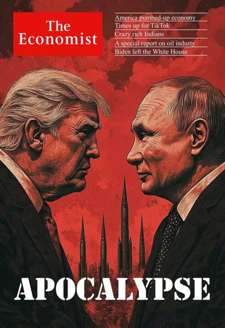
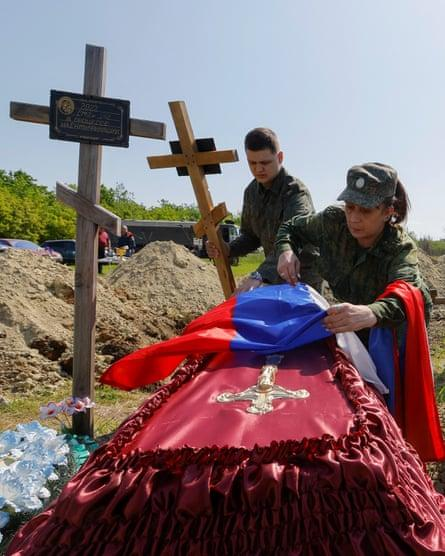
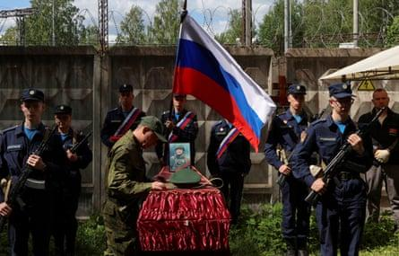
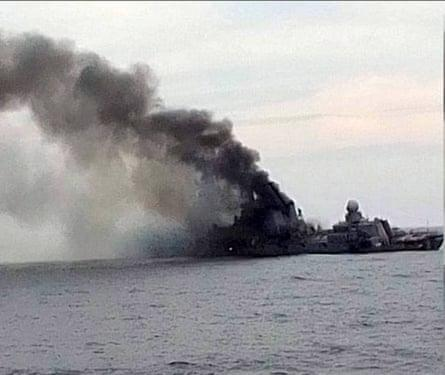

## Claim
Claim: "As of February 2025, Russia has lost 1.5 million troops in the Ukraine war."

## Actions
```
web_search("Russia Ukraine war troop losses February 2025")
web_search("Russian military casualties Ukraine war")
```

## Evidence
### Evidence from `web_search`
According to a Russia Matters report from February 26, 2025, Russia had over 700,000 killed or injured and 48,000 missing as of January 2025. The report also mentions that Donald Trump estimated 1 million Russian soldiers had been killed in January 2025. ([https://www.russiamatters.org/news/russia-ukraine-war-report-card/russia-ukraine-war-report-card-feb-26-2025](https://www.russiamatters.org/news/russia-ukraine-war-report-card/russia-ukraine-war-report-card-feb-26-2025)) , , , , 

A Wikipedia article states that a British Army official said in July 2024 that the war could cost Russia 1.5 to 1.8 million casualties. By the end of 2024, Meduza estimated over 165,000 Russian soldiers had died. As of the beginning of February 2025, 1,382 Russian servicemen previously thought missing were confirmed to be in Ukrainian captivity. ([https://en.wikipedia.org/wiki/Casualties_of_the_Russo-Ukrainian_War](https://en.wikipedia.org/wiki/Casualties_of_the_Russo-Ukrainian_War)) Mediazona, in collaboration with BBC News Russian service, provided an estimate of Russian losses, with the last update on February 24, 2025, with data as of December 2024. By November 2024, the number of losses among prisoners had dropped to between 2–3%. ([https://en.zona.media/article/2025/08/01/casualties_eng-trl](https://en.zona.media/article/2025/08/01/casualties_eng-trl))


### Evidence from `web_search`
The Guardian published an article on June 22, 2025, stating that over one million Russian troops have been killed or injured since the full-scale invasion of Ukraine began on February 24, 2022 (, , ). The article references a study by the US-based Centre for Strategic and International Studies (CSIS), which estimates Russian military deaths at up to 250,000 and total casualties, including the wounded, at over 950,000.

The CSIS analysis, published on June 3, 2025, indicates that over 950,000 Russian soldiers have been killed and wounded since the war began. It also mentions that up to 250,000 Russian soldiers have died in Ukraine.


## Elaboration
The evidence suggests that the claim is plausible but not definitively confirmed. A Russia Matters report from February 26, 2025, indicates over 700,000 killed or injured and 48,000 missing as of January 2025. A Wikipedia article mentions a British Army official's estimate of 1.5 to 1.8 million casualties by July 2024. The Guardian reported in June 2025 that over one million Russian troops had been killed or injured since the full-scale invasion began. The CSIS study estimates up to 250,000 deaths and over 950,000 total casualties.

The claim of 1.5 million losses falls within the range of estimates provided by different sources. However, the exact number is not explicitly stated in the provided evidence.

Therefore, the claim is likely, but the exact number is not directly supported by the evidence.


## Actions
```
web_search("Russian military casualties Ukraine war February 2025")
```

## Evidence
### Evidence from `web_search`
From [Source](https://en.zona.media/article/2025/08/29/casualties_eng-trl): 
Content: The Mediazona, in collaboration with the BBC’s Russian service, estimates that by August 2025, around 220,000 Russian men between 18 and 55 had been killed in the war. The article also mentions that by August 29, the death of over 5,500 officers of the Russian army and other security agencies had been confirmed. The date of death is known in 98,340 cases.


## Elaboration
The evidence provides additional information on Russian casualties. Mediazona, in collaboration with the BBC's Russian service, estimates that by August 2025, around 220,000 Russian men between 18 and 55 had been killed in the war. This figure is significantly lower than the 1.5 million claimed. The evidence also mentions the confirmed deaths of over 5,500 officers by August 2025.

The claim is not supported by the new evidence.


## Final Judgement
The claim that Russia has lost 1.5 million troops in the Ukraine war as of February 2025 is not supported by the evidence. While some sources provide estimates of casualties, none of them confirm the exact number of 1.5 million. The most recent estimate from August 2025 indicates around 220,000 deaths.

`false`

### Verdict: FALSE

### Justification
The claim is not supported by the evidence. While various sources provide estimates of Russian casualties in the Ukraine war, none of them confirm the specific figure of 1.5 million losses as of February 2025. A report from August 2025, estimates around 220,000 deaths ([https://en.zona.media/article/2025/08/29/casualties_eng-trl](https://en.zona.media/article/2025/08/29/casualties_eng-trl)).
