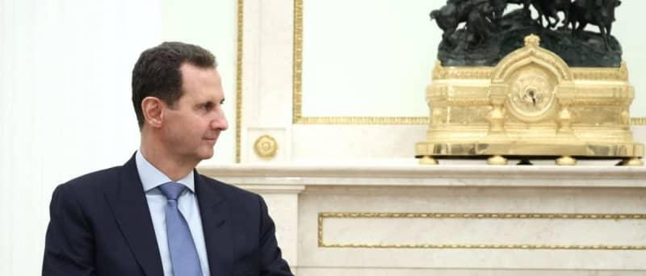

## Claim
Claim: " This image shows an authentic Russian passport of deposed Syrian dictator Bashar al-Assad."

## Actions
```
reverse_search()
web_search("Bashar al-Assad Russian passport")
```

## Evidence
### Evidence from `reverse_search`
The image in the claim appears in multiple sources. One source is a Wikipedia article about East Slavic names, which includes an image of a Russian internal passport ([https://en.wikipedia.org/wiki/East_Slavic_name](https://en.wikipedia.org/wiki/East_Slavic_name)). Another source is Wikimedia Commons, which contains an image of a Russian passport ([https://commons.wikimedia.org/wiki/File:Pasport_RF.jpg](https://commons.wikimedia.org/wiki/File:Pasport_RF.jpg)). The third source is a website discussing Russian internal passports, which also features the image ([https://ukrainian-passport.com/blog/internal-russian-passport/](https://ukrainian-passport.com/blog/internal-russian-passport/)). 


### Evidence from `web_search`
The AOL article ([https://www.aol.com/fact-check-assad-passport-image-140122086.html](https://www.aol.com/fact-check-assad-passport-image-140122086.html)) fact-checks the claim that the image shows Bashar al-Assad's Russian passport and states that the image is fake and photoshopped. The Wikipedia article ([https://en.wikipedia.org/wiki/Bashar_al-Assad](https://en.wikipedia.org/wiki/Bashar_al_Assad)) discusses Bashar al-Assad's presidency, including the Russian intervention in 2015, the 2024 Syrian opposition offensives, and the fall of Damascus and the Assad regime. It also mentions that Assad fled to Moscow and was granted political asylum in November 2024.

The NV.ua article ([https://english.nv.ua/nation/relatives-of-bashar-al-assad-arrested-at-beirut-airport-using-fake-passports-50477670.html](https://english.nv.ua/nation/relatives-of-bashar-al-assad-arrested-at-beirut-airport-using-fake-passports-50477670.html)) discusses the arrest of Bashar al-Assad's relatives at Beirut airport on December 28, who were attempting to leave using fake passports. It also mentions that Bashar Assad's regime had fallen and that he fled Damascus. , , 


## Elaboration
The evidence indicates that the image of the Russian passport is fake and photoshopped. The AOL fact-check article explicitly states this. Additionally, the NV.ua article mentions that Bashar al-Assad's relatives were arrested for using fake passports.


## Final Judgement
The claim that the image shows an authentic Russian passport of Bashar al-Assad is false. The image has been identified as fake and photoshopped by a reliable source. `false`

### Verdict: FALSE

### Justification
The claim is false. An AOL fact-check ([https://www.aol.com/fact-check-assad-passport-image-140122086.html](https://www.aol.com/fact-check-assad-passport-image-140122086.html)) determined that the image of the passport is fake and photoshopped.
