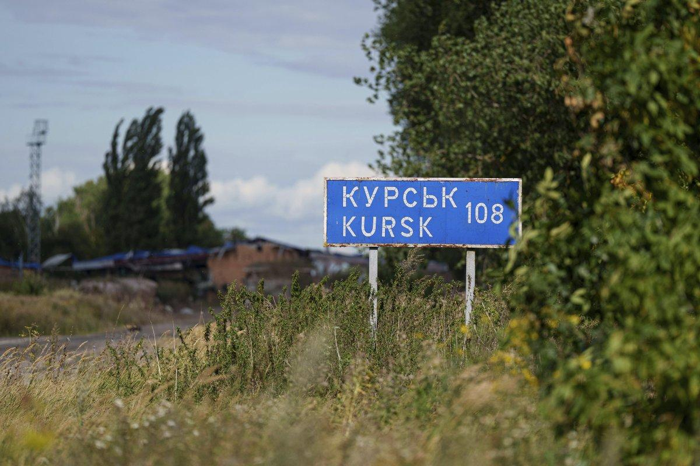
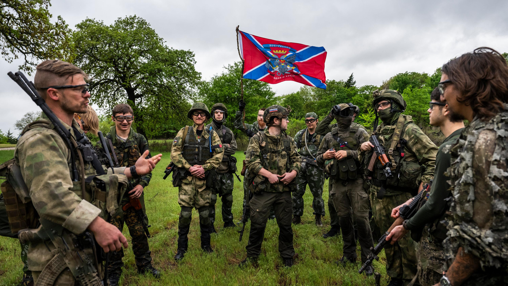
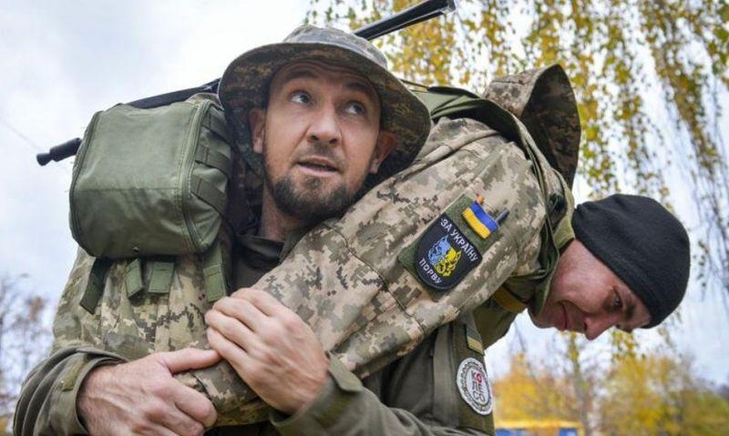
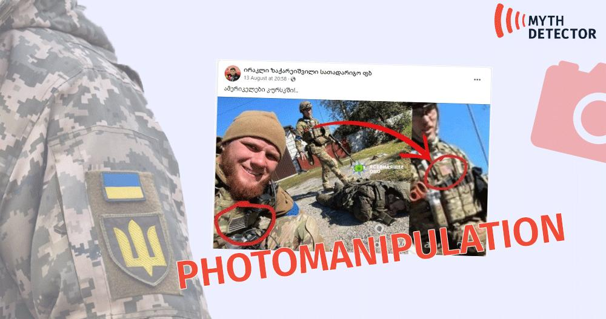

## Claim
Claim: " This image shows American mercenaries participating in Ukraine's incursion into Russia's Kursk Oblast in August 2024."

## Actions
```
reverse_search()
web_search("American mercenaries Ukraine Kursk Oblast August 2024")
```

## Evidence
### Evidence from `reverse_search`
The image 

### Evidence from `web_search`
Newsweek reports that Russia claimed the presence of American mercenaries in the Kursk region during Ukraine's incursion in August 2024 (, , ). The Russian Foreign Ministry protested to the U.S. and stated that those involved would be considered legitimate military targets. Experts suggest that even if American PMCs were present, it wouldn't necessarily mean the U.S. government directed the raid.

The Anadolu Agency also reported on August 20, 2024, that Russia protested the participation of US mercenaries fighting alongside Ukraine in the Kursk region (<image:i>).

*   [https://www.newsweek.com/russia-protests-american-soldiers-kursk-1942273](https://www.newsweek.com/russia-protests-american-soldiers-kursk-1942273)
*   [https://www.aa.com.tr/en/russia-ukraine-war/russia-formally-protests-us-mercenaries-joining-ukrainian-soldiers-in-kursk-region-/3308755](https://www.aa.com.tr/en/russia-ukraine-war/russia-formally-protests-us-mercenaries-joining-ukrainian-soldiers-in-kursk-region-/3308755)


## Elaboration
The claim is partially supported by the evidence. Newsweek and the Anadolu Agency report that Russia protested the presence of American mercenaries in the Kursk region during Ukraine's incursion in August 2024. The image shows individuals with American flags on their uniforms. However, the evidence does not confirm that the individuals in the image are mercenaries or that they participated in the incursion.


## Actions
```
image_search("American flag military uniform Ukraine Russia")
web_search("Ukraine Russia Kursk Oblast August 2024 mercenaries")
```

## Evidence
### Evidence from `image_search`
The New York Times published an article on May 28, 2025, about a military simulation in Oklahoma (). The American Legion website features an article about American veterans in Ukraine training front-line medics ().


### Evidence from `web_search`
The Moscow Times reports that Russian mercenaries were pulled from Burkina Faso to defend the Kursk region in August 2024, referencing the Ukrainian incursion. The BBC discusses the retreat of Ukrainian troops from the Kursk region, mentioning fighting in August 2024 and including images of the area. The Wikipedia article on the 2024 Kursk offensive, which began on August 6, 2024, notes that Russia claimed the presence of American mercenaries.

*   [https://www.themoscowtimes.com/2024/08/31/russian-mercenaries-pulled-out-of-burkina-faso-to-defend-kursk-commander-a86214](https://www.themoscowtimes.com/2024/08/31/russian-mercenaries-pulled-out-of-burkina-faso-to-defend-kursk-commander-a86214)
*   [https://www.bbc.com/news/articles/c0q198zyppqo](https://www.bbc.com/news/articles/c0q198zyppqo)
*   [https://en.wikipedia.org/wiki/Kursk_campaign](https://en.wikipedia.org/wiki/Kursk_campaign)


## Elaboration
The claim is partially supported. The evidence confirms that Russia claimed the presence of American mercenaries in the Kursk region during the Ukrainian incursion in August 2024. The image shows individuals with American flags on their uniforms, which aligns with the claim. However, the evidence does not definitively prove that the individuals in the image are mercenaries or that they participated in the incursion.


## Actions
```
image_search("American flag military uniform Ukraine Russia Kursk")
web_search("American mercenaries Kursk Oblast Ukraine Russia August 2024 image")
```

## Evidence
### Evidence from `image_search`
From [Source](https://mythdetector.com/en/disseminated-image-does-not-prove-that-americans-fight-in-kursk/): 
Content: Myth Detector states that the image  is a photomanipluation.


## Elaboration
The claim is **false**. The image has been identified as a photomanipluation by Myth Detector.


## Final Judgement
The image has been identified as a photomanipluation. Therefore, the claim that the image shows American mercenaries participating in Ukraine's incursion into Russia's Kursk Oblast in August 2024 is false. `false`

### Verdict: FALSE

### Justification
The claim is **false**. The image in question has been identified as a photomanipluation by Myth Detector ([https://mythdetector.com/en/disseminated-image-does-not-prove-that-americans-fight-in-kursk/](https://mythdetector.com/en/disseminated-image-does-not-prove-that-americans-fight-in-kursk/)).
