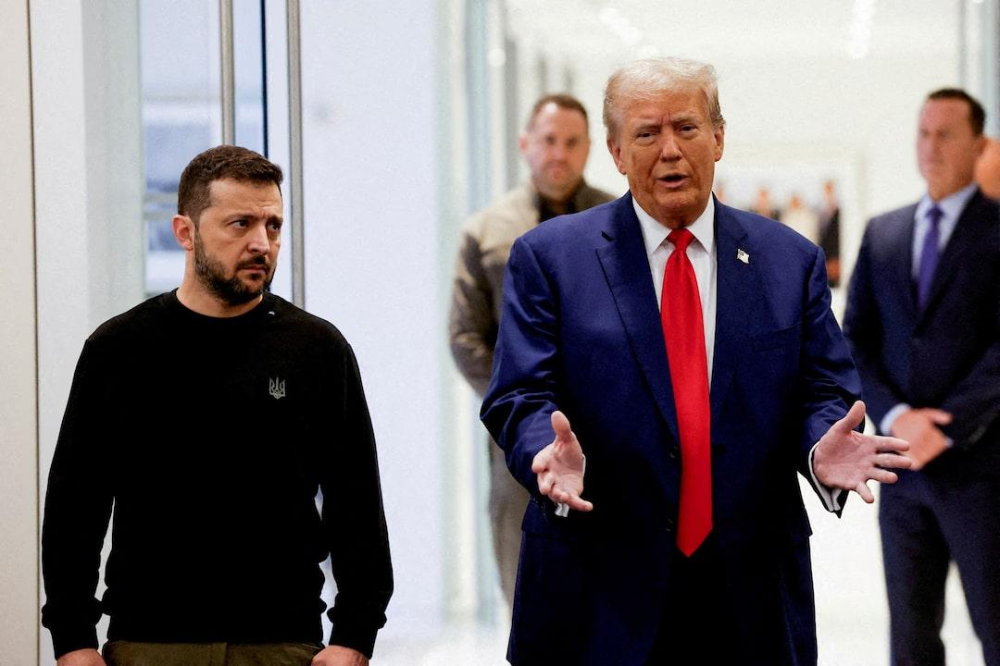
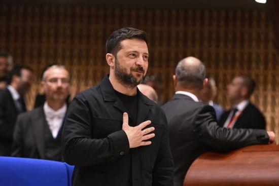
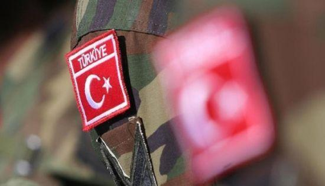
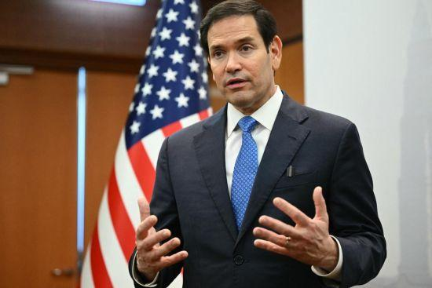

## Claim
Claim: "In February 2025 Ukrainian President Volodymyr Zelenskyy blocked access to US President Donald Trump's social media platform Truth Social across Ukraine."

## Actions
```
web_search("Volodymyr Zelenskyy Donald Trump Truth Social Ukraine February 2025")
```

## Evidence
### Evidence from `web_search`
PBS News published an article on March 3, 2025, stating that Donald Trump criticized Volodymyr Zelenskyy on Truth Social for suggesting the end of the Russia-Ukraine war is "very, very far away" (). NPR published an article on February 28, 2025, discussing a contentious meeting between Donald Trump and Volodymyr Zelenskyy in the Oval Office (, , ). Trump criticized Zelenskyy's gratitude for U.S. support and later posted on Truth Social that he had "determined that President Zelenskyy is not ready for peace."

Reuters published an article on February 19, 2025, reporting on the strained relationship between Donald Trump and Volodymyr Zelenskyy. Trump called Zelenskyy a "dictator" and suggested he was prolonging the war. Zelenskyy accused Trump of spreading Russian disinformation ().


## Elaboration
The evidence does not contain any information about Zelenskyy blocking access to Truth Social in Ukraine. The evidence shows that Trump and Zelenskyy had a contentious relationship, with Trump criticizing Zelenskyy on Truth Social.


## Actions
```
web_search("Truth Social Ukraine ban February 2025")
```

## Evidence
### Evidence from `web_search`
Anadolu Agency ([https://www.aa.com.tr/en/russia-ukraine-war/trump-s-truth-social-not-blocked-in-ukraine-says-kyiv/3488237](https://www.aa.com.tr/en/russia-ukraine-war/trump-s-truth-social-not-blocked-in-ukraine-says-kyiv/3488237)) reported that the Ukrainian Foreign Ministry denied reports that Truth Social was blocked in Ukraine, stating that the platform's limited regional availability was the reason for its unavailability. UATV ([https://uatv.ua/en/ukrainian-foreign-ministry-denies-alleged-blocking-of-access-to-truth-social-in-ukraine/](https://uatv.ua/en/ukrainian-foreign-ministry-denies-alleged-blocking-of-access-to-truth-social-in-ukraine/)) also reported the denial, mentioning that Russian propaganda spread a false story about the alleged ban (, , , , ). Al Jazeera ([https://www.aljazeera.com/news/2025/2/20/fact-check-did-ukraine-start-its-war-with-russia-as-trump-claims](https://www.aljazeera.com/news/2025/2/20/fact-check-did-ukraine-start-its-war-with-russia-as-trump-claims)) discussed the strained relationship between Trump and Zelenskyy, including Trump's criticism of Zelenskyy on Truth Social, but did not mention any blocking of the platform ().


## Elaboration
The claim is false. The Ukrainian Foreign Ministry denied reports that Truth Social was blocked in Ukraine.


## Final Judgement
The search results indicate that the Ukrainian Foreign Ministry denied reports of blocking Truth Social in Ukraine. The ministry stated that the platform's limited regional availability was the reason for its unavailability.

`false`

### Verdict: FALSE

### Justification
The claim is false. The Ukrainian Foreign Ministry denied reports that President Zelenskyy blocked access to Truth Social in Ukraine, stating that the platform's limited regional availability was the reason for its unavailability, as reported by the Anadolu Agency ([https://www.aa.com.tr/en/russia-ukraine-war/trump-s-truth-social-not-blocked-in-ukraine-says-kyiv/3488237](https://www.aa.com.tr/en/russia-ukraine-war/trump-s-truth-social-not-blocked-in-ukraine-says-kyiv/3488237)) and UATV ([https://uatv.ua/en/ukrainian-foreign-ministry-denies-alleged-blocking-of-access-to-truth-social-in-ukraine/](https://uatv.ua/en/ukrainian-foreign-ministry-denies-alleged-blocking-of-access-to-truth-social-in-ukraine/)).
