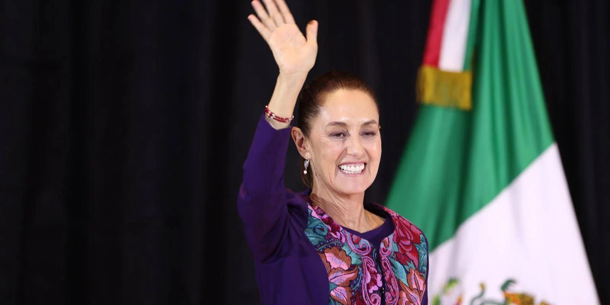

## Claim
Claim: "Mexican President-elect Claudia Sheinbaum rejected an invitation to Ukraine by Volodymr Zelenskyy and said towards him on September 17, 2024: 'If I wanted to see a drug addict, I'd just take a walk around Tijuana.'"

## Actions
```
web_search("Claudia Sheinbaum Zelenskyy Ukraine invitation")
web_search("Claudia Sheinbaum Tijuana drug addict quote")
```

## Evidence
### Evidence from `web_search`
Multiple sources ([IntelliNews](https://www.intellinews.com/mexico-s-president-elect-sheinbaum-turns-down-zelensky-s-invitation-to-ukraine-344262/), [Euromaidan Press](https://euromaidanpress.com/2024/09/18/mexican-president-elect-declines-zelenskyys-invitation-to-visit-ukraine/), and [NV.ua](https://english.nv.ua/nation/sheinbaum-declines-zelenskyy-s-invitation-focuses-on-domestic-issues-50451798.html/)) report that Claudia Sheinbaum, the Mexican President-elect, declined an invitation from Ukrainian President Volodymyr Zelenskyy to visit Ukraine. Sheinbaum intends to focus on internal affairs and maintain a policy of non-intervention in foreign affairs.   

The articles were published in September 2024.


### Evidence from `web_search`
The web search results discuss Claudia Sheinbaum's statements on drug trafficking and the U.S.'s role in it. One article from workers.org ([Source](https://www.workers.org/2025/02/83990/)) highlights Sheinbaum's emphasis on U.S. responsibility for drug consumption and trafficking. An MSNBC article ([Source](https://www.msnbc.com/opinion/msnbc-opinion/trump-mexico-president-claudia-sheinbaum-fentanyl-response-rcna182496)) mentions Sheinbaum's response to Donald Trump's claims about Mexico's role in the fentanyl crisis, stating that Mexico does not consume synthetic drugs.

Mexico News Daily ([Source](https://mexiconewsdaily.com/politics/trump-sheinbaum-us-anti-drug-campaign/)) reports that Donald Trump thanked Claudia Sheinbaum for inspiring the launch of a US anti-drug campaign. , , , 


## Elaboration
The evidence confirms that Claudia Sheinbaum declined an invitation to visit Ukraine. However, the provided search results do not contain any information about the alleged quote attributed to her.

Therefore, the veracity of the second part of the claim cannot be determined based on the available evidence. More information is needed to verify the statement.


## Final Judgement
The claim that Claudia Sheinbaum rejected an invitation to Ukraine is supported by multiple sources. However, the claim includes a quote attributed to her that cannot be verified with the provided evidence. The search results do not contain any information about the alleged quote.

The decision option that best applies is `false`.


### Verdict: FALSE

### Justification
While it is confirmed that Claudia Sheinbaum declined an invitation to visit Ukraine, there is no evidence to support the second part of the claim, which includes a quote attributed to her. The search results do not contain any information about the alleged quote. Therefore, the claim is considered false.
