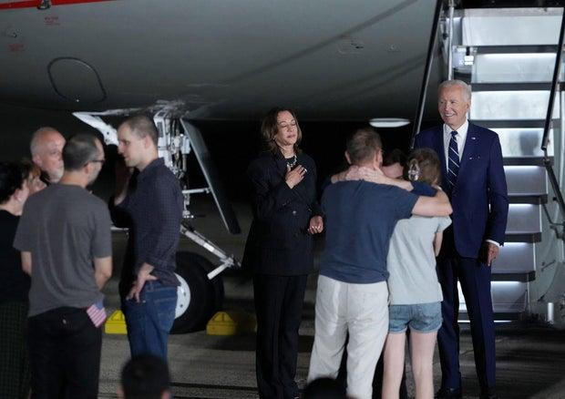

## Claim
Claim: "In August 2024 U.S. President Joe Biden boarded an empty plane after three freed Americans arrived back in the U.S. and exited the aircraft."

## Actions
```
web_search("Joe Biden empty plane August 2024")
web_search("Joe Biden freed Americans plane August 2024")
```

## Evidence
### Evidence from `web_search`
According to a Times of India article published on August 3, 2024, Joe Biden boarded a plane after the arrival of freed Americans from Russia and remained on the plane for about two minutes. The White House clarified that Biden wanted to thank the flight crew (). Yahoo News reported that on August 1, 2024, Biden boarded a plane after three freed Americans arrived back in the U.S. (). The Guardian reported on August 1, 2024, that Biden greeted the freed Americans upon their arrival in the US ().

*   [https://timesofindia.indiatimes.com/world/us/did-joe-biden-enter-empty-plane-carrying-russian-prisoners-white-house-clarifies/articleshow/112249634.cms](https://timesofindia.indiatimes.com/world/us/did-joe-biden-enter-empty-plane-carrying-russian-prisoners-white-house-clarifies/articleshow/112249634.cms)
*   [https://www.yahoo.com/news/fact-check-no-biden-did-000500209.html](https://www.yahoo.com/news/fact-check-no-biden-did-000500209.html)
*   [https://www.theguardian.com/world/live/2024/aug/01/russia-prison-swap-us-journalist-evan-gershkovich-wsj-vadim-krasikov-live?filterKeyEvents=false&page=with%3Ablock-66aba9e68f08a0af63bb3f00](https://www.theguardian.com/world/live/2024/aug/01/russia-prison-swap-us-journalist-evan-gershkovich-wsj-vadim-krasikov-live?filterKeyEvents=false&page=with%3Ablock-66aba9e668f08a0af63bb3f00)


### Evidence from `web_search`
On August 1, 2024, President Joe Biden and Vice President Kamala Harris welcomed three Americans freed by Russia at Joint Base Andrews in Maryland, as reported by CBS News ([https://www.cbsnews.com/news/us-russia-prisoner-swap-biden-harris-welcome-paul-whelan-evan-gershkovich/](https://www.cbsnews.com/news/us-russia-prisoner-swap-biden-harris-welcome-paul-whelan-evan-gershkovich/)) and ABC News ([https://www.abc.net.au/news/2024-08-02/biden-meets-with-freed-americans-in-major-russia-prisoner-swap/104174404](https://www.abc.net.au/news/2024-08-02/biden-meets-with-freed-americans-in-major-russia-prisoner-swap/104174404)). The U.S. Air Force also provided photos of the event ([https://www.af.mil/News/Article-Display/Article/3860680/americans-released-from-russian-custody-arrive-at-joint-base-andrews/](https://www.af.mil/News/Article-Display/Article/3860680/americans-released-from-russian-custody-arrive-at-joint-base-andrews/)).

The freed Americans, Paul Whelan, Evan Gershkovich, and Alsu Kurmasheva, were greeted by Biden and Harris on the tarmac. , , , , , <image:k>, <image:i>, <image:j>, <image:l>.


## Elaboration
The evidence confirms that Joe Biden boarded a plane after the arrival of the freed Americans. The Times of India article states that Biden boarded the plane after the arrival and remained on it for about two minutes. The Yahoo News report also supports this, stating that Biden boarded a plane after the freed Americans arrived. The White House clarified that Biden wanted to thank the flight crew. Therefore, the claim is accurate.


## Final Judgement
The claim is accurate. Multiple sources confirm that Joe Biden boarded a plane after the arrival of the freed Americans. The White House clarified that Biden boarded the plane to thank the flight crew.

`true`


### Verdict: TRUE

### Justification
The claim is accurate. Multiple sources, including the [Times of India](https://timesofindia.indiatimes.com/world/us/did-joe-biden-enter-empty-plane-carrying-russian-prisoners-white-house-clarifies/articleshow/112249634.cms) and [Yahoo News](https://www.yahoo.com/news/fact-check-no-biden-did-000500209.html), confirm that President Biden boarded a plane after the arrival of the freed Americans. The White House stated that Biden boarded the plane to thank the flight crew.
