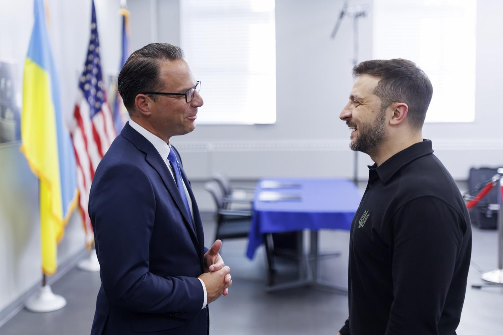
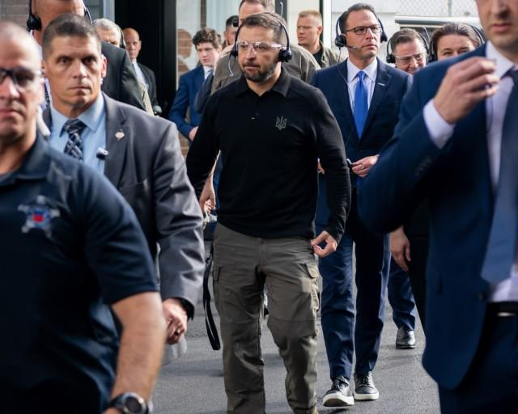
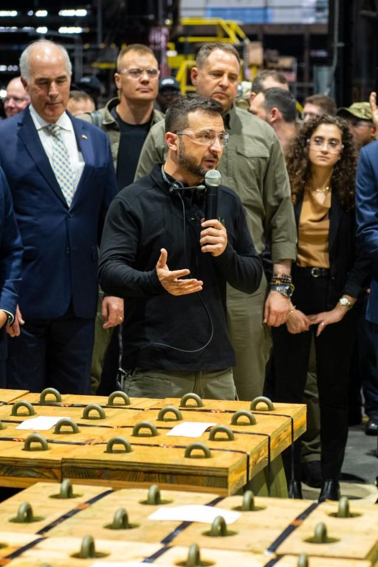
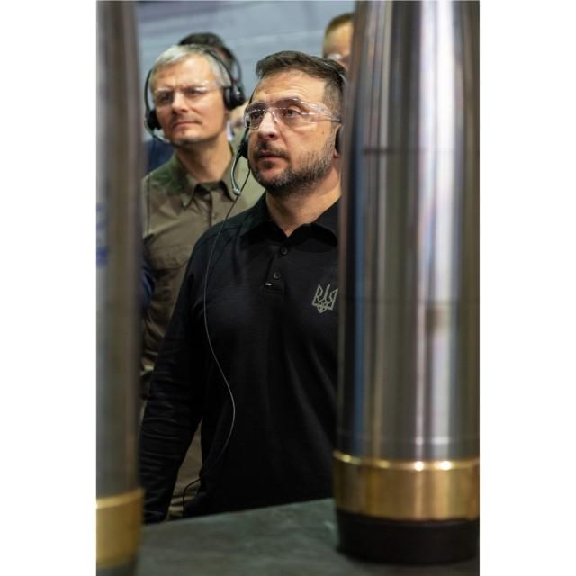
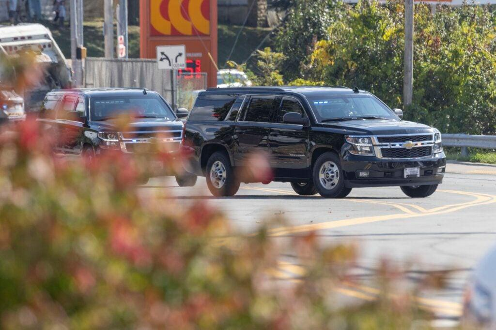

## Claim
Claim: "Ukrainian President Volodymyr Zelenskyy engaged in election interference by campaigning in Pennsylvania for Kamala Harris ahead of the US presidential election in 2024."

## Actions
```
web_search("Volodymyr Zelenskyy Kamala Harris Pennsylvania 2024")
web_search("Zelenskyy campaign Pennsylvania 2024 election interference")
```

## Evidence
### Evidence from `web_search`
Newsweek reports that JD Vance accused Volodymyr Zelenskyy of campaigning for Kamala Harris during the 2024 presidential race, mentioning a visit to a munitions plant in Scranton, Pennsylvania, in September 2024 (, , ). NBC News notes a partisan divide regarding Ukraine, mentioning a meeting between Zelenskyy and Harris, and that Republicans viewed Zelenskyy's visit to a munitions factory in Scranton, Pennsylvania, as a sign of his preference in the upcoming election. ABC News reports on a meeting between Zelenskyy and Harris, and mentions Zelenskyy meeting with lawmakers at the Capitol and President Joe Biden on September 26, 2024 (, <image:i>).

The articles are available at the following URLs: [Newsweek](https://www.newsweek.com/volodymyr-zelensky-jd-vance-campaign-kamala-harris-2024-election-2038060), [NBC News](https://www.nbcnews.com/politics/2024-election/zelenskyys-meeting-harris-spat-trump-reveal-growing-partisan-divide-uk-rcna172648), and [ABC News](https://abcnews.go.com/Politics/harris-standing-zelenskyy-indirectly-jabs-trump-vance-ukraine/story?id=114219628).


### Evidence from `web_search`
Multiple sources report on Ukrainian President Volodymyr Zelenskyy's visit to an ammunition factory in Scranton, Pennsylvania, on September 22, 2024. House Oversight Chair James Comer opened an investigation, claiming the visit was a campaign event for Vice President Kamala Harris, using taxpayer-funded resources (<image:k>). Some Republicans labeled the visit as "election interference" (, ).

The visit involved meetings with Pennsylvania Democrats. One article argues that Zelenskyy's visit does not meet the definition of foreign interference. The articles are from CNBC ([Source](https://www.cnbc.com/2024/09/25/zelenskyy-insulted-him-house-gop-to-probe-ukraine-leaders-pa-trip-.html)), GMFUS ([Source](https://www.gmfus.org/news/manufacturing-controversy)), and Penn Capital-Star ([Source](https://penncapital-star.com/briefs/top-republicans-cry-foul-over-ukrainian-president-zelenskyys-scranton-visit-with-shapiro/)).


## Elaboration
The evidence indicates that Volodymyr Zelenskyy visited Scranton, Pennsylvania, in September 2024, which coincided with the US presidential election. Republicans, including JD Vance and House Oversight Chair James Comer, have accused Zelenskyy of election interference, viewing his visit as a campaign event for Kamala Harris.

The visit included a meeting at a munitions plant and meetings with Pennsylvania Democrats. Some sources suggest that the visit does not meet the definition of foreign interference.

To fully verify the claim, it would be helpful to know the specific details of Zelenskyy's statements and actions during his visit to determine if they constituted campaigning for Kamala Harris.


## Actions
```
web_search("Volodymyr Zelenskyy Scranton Pennsylvania 2024 campaign speech")
```

## Evidence
### Evidence from `web_search`
Volodymyr Zelenskyy visited the Scranton Army Ammunition Plant in Pennsylvania in September 2024 to thank workers and ask for more munitions (<image:k>). He also praised the U.S. Department of Defense for its assistance to Ukraine (, , , ). The visit included a tour of the plant. The articles are available at the following URLs: [AP News](https://apnews.com/article/zelenskyy-ukraine-pennsylvania-ammunition-plant-c0e1fe5ebfa11ecfe92e842860e6440c) and [U.S. Army](https://www.army.mil/article/279907/ukrainian_president_zelenskyy_praises_scranton_dod_for_role_supporting_ukraine).


## Elaboration
The evidence indicates that Zelenskyy's visit to Scranton, Pennsylvania, in September 2024, involved thanking workers, requesting more munitions, and praising the U.S. Department of Defense. There is no evidence in the search results of Zelenskyy explicitly campaigning for Kamala Harris. Therefore, the claim cannot be fully verified.


## Actions
```
web_search("Volodymyr Zelenskyy Scranton Pennsylvania 2024 Kamala Harris")
```

## Evidence
### Evidence from `web_search`
From [Source](https://whyy.org/articles/ukraine-president-volodymyr-zelenskyy-visits-scranton-pennsylvania-ammunition-factory/): 
Content: WHYY reports that Volodymyr Zelenskyy visited the Scranton Army Ammunition Plant in Pennsylvania to thank workers and seek support for Ukraine. The article mentions that Zelenskyy met with President Joe Biden and Vice President Kamala Harris in Washington. . The article does not contain any information about Zelenskyy campaigning for Kamala Harris.


## Elaboration
Based on the evidence, Volodymyr Zelenskyy visited Scranton, Pennsylvania, in September 2024, where he toured an ammunition plant and thanked workers. He also met with President Biden and Vice President Harris in Washington. While some Republicans viewed the visit as potential election interference, the evidence does not show Zelenskyy explicitly campaigning for Kamala Harris in Pennsylvania. Therefore, the claim is not supported by the evidence.


## Final Judgement
The claim that Volodymyr Zelenskyy campaigned for Kamala Harris in Pennsylvania ahead of the 2024 US presidential election is not supported by the available evidence. While Zelenskyy did visit Scranton, Pennsylvania, and met with Harris, the evidence indicates that the purpose of his visit was to thank workers, seek support for Ukraine, and tour an ammunition plant. There is no evidence of him explicitly campaigning for Harris.

`false`


### Verdict: FALSE

### Justification
The claim is not supported. While Volodymyr Zelenskyy visited Scranton, Pennsylvania, and met with Kamala Harris, the visit's purpose was to thank workers and seek support for Ukraine, not to campaign for Harris, according to available sources like [WHYY](https://whyy.org/articles/ukraine-president-volodymyr-zelenskyy-visits-scranton-pennsylvania-ammunition-factory/).
