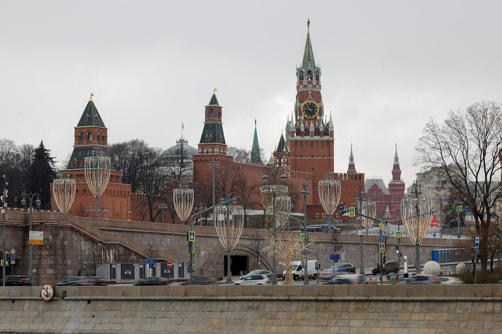

## Claim
Claim: "After a call with Russia's President Vladimir Putin on February 12, 2025, US President Donald Trump announced that he had reached an agreement to end the war in Ukraine."

## Actions
```
web_search("Donald Trump Vladimir Putin call February 12 2025 Ukraine war")
```

## Evidence
### Evidence from `web_search`
On February 12, 2025, after a phone call with Vladimir Putin, Donald Trump announced that negotiations to end the war in Ukraine would start "immediately" according to a CNN article ([https://www.cnn.com/2025/02/12/politics/putin-trump-phone-call](https://www.cnn.com/2025/02/12/politics/putin-trump-phone-call)). Reuters reported that Trump said both Putin and Volodymyr Zelenskiy expressed a desire for peace, and Trump ordered U.S. officials to begin talks ([https://www.reuters.com/world/trump-says-he-discussed-ending-ukraine-war-with-russias-putin-2025-02-12/](https://www.reuters.com/world/trump-says-he-discussed-ending-ukraine-war-with-russias-putin-2025-02-12/)).

The Wikipedia entry ([https://en.wikipedia.org/wiki/February_2025_Putin%E2%80%93Trump_phone_call](https://en.wikipedia.org/wiki/February_2025_Putin%E2%80%93Trump_phone_call)) mentions that the call was followed by a meeting at NATO headquarters in Brussels, and Trump shared details of his conversation with Putin and agreed to begin peace talks. The foreign ministers of several countries supported Ukraine and the EU's participation in the negotiation process. , , 


## Elaboration
After the phone call on February 12, 2025, Donald Trump announced that negotiations to end the war in Ukraine would start "immediately" ([https://www.cnn.com/2025/02/12/politics/putin-trump-phone-call](https://www.cnn.com/2025/02/12/politics/putin-trump-phone-call)). Reuters reported that Trump said both Putin and Volodymyr Zelenskiy expressed a desire for peace, and Trump ordered U.S. officials to begin talks ([https://www.reuters.com/world/trump-says-he-discussed-ending-ukraine-war-with-russias-putin-2025-02-12/](https://www.reuters.com/world/trump-says-he-discussed-ending-ukraine-war-with-russias-putin-2025-02-12/)).

The evidence indicates that Trump announced the start of negotiations, not that an agreement was reached.


## Final Judgement
The claim is partially accurate. While Trump did announce the start of negotiations after the call, the claim states that an agreement was reached, which is not supported by the evidence.

`false`

### Verdict: FALSE

### Justification
Following a phone call with Vladimir Putin on February 12, 2025, Donald Trump announced the initiation of negotiations to end the war in Ukraine, as reported by CNN ([https://www.cnn.com/2025/02/12/politics/putin-trump-phone-call](https://www.cnn.com/2025/02/12/politics/putin-trump-phone-call)) and Reuters ([https://www.reuters.com/world/trump-says-he-discussed-ending-ukraine-war-with-russias-putin-2025-02-12/](https://www.reuters.com/world/trump-says-he-discussed-ending-ukraine-war-with-russias-putin-2025-02-12/)). However, the evidence does not support the claim that an agreement was reached.
