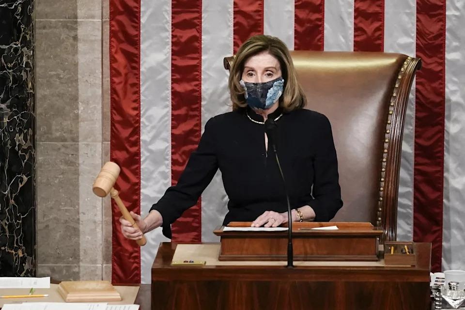
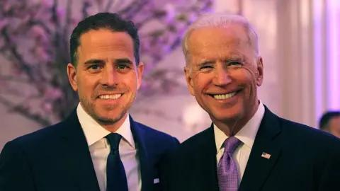

## Claim
Claim: " This image shows an authentic list realeased by Ukraine showing US politicians taking bribes from Ukraine. The highest bribe was 92 Million US-$ for Joe Biden."

## Actions
```
web_search("Joe Biden Mitch McConnell Nancy Pelosi wealth")
web_search("US politicians Ukraine bribes")
```

## Evidence
### Evidence from `web_search`
The Yahoo Finance article from February 13, 2025, discusses Elon Musk's questioning of the wealth of members of Congress, including Joe Biden, Nancy Pelosi, and Mitch McConnell, and their net worths. The article also mentions that members of Congress can buy and sell stocks, options, and cryptocurrency as long as they disclose the transactions. ([https://finance.yahoo.com/news/elon-musk-questions-congress-members-190016734.html](https://finance.yahoo.com/news/elon-musk-questions-congress-members-190016734.html)) 

The Yahoo News article discusses the wealth of Nancy Pelosi, mentioning her real estate investments, business partnerships, and stock holdings. ([https://www.yahoo.com/news/fact-check-no-house-speaker-172533305.html](https://www.yahoo.com/news/fact-check-no-house-speaker-172533305.html)) , , ,  The Conversation published an article on July 21, 2023, discussing the age of US politicians, including Joe Biden, Mitch McConnell, and Nancy Pelosi. ([https://theconversation.com/why-are-us-politicians-so-old-and-why-do-they-want-to-stay-in-office-217024](https://theconversation.com/why-are-us-politicians-so-old-and-why-do-they-want-to-stay-in-office-217024)) 


### Evidence from `web_search`
Euronews ([https://www.euronews.com/my-europe/2025/01/15/old-false-claims-resurface-about-ukrainian-kickbacks-to-us-politicians](https://www.euronews.com/my-europe/2025/01/15/old-false-claims-resurface-about-ukrainian-kickbacks-to-us-politicians)) debunks a social media claim that lists US politicians, including Joe Biden, who allegedly received bribes from Ukraine, stating there is no evidence to support these claims. The image has been circulating since at least 2023. 

The BBC News ([https://www.bbc.com/news/world-us-canada-66272217](https://www.bbc.com/news/world-us-canada-66272217)) discusses an FBI document alleging that Joe Biden and his son accepted bribes from a Ukrainian firm, but there is no evidence that Joe Biden received any payments from Ukraine. , ,  Wikipedia ([https://en.wikipedia.org/wiki/Biden%E2%80%93Ukraine_conspiracy_theory](https://en.wikipedia.org/wiki/Biden%E2%80%93Ukraine_conspiracy_theory)) discusses the Biden–Ukraine conspiracy theory, which alleges that Joe Biden took a bribe to pressure Ukraine, but a joint investigation found no evidence of wrongdoing by Joe Biden. 


## Elaboration
The claim is false. Multiple sources debunk the claim that the image shows an authentic list of US politicians taking bribes from Ukraine. There is no evidence to support these claims.


## Final Judgement
The claim is demonstrably false. There is no evidence to support the claim that the image shows an authentic list of US politicians taking bribes from Ukraine. The claim has been debunked by multiple sources. `false`

### Verdict: FALSE

### Justification
The claim is false. Multiple sources, including Euronews ([https://www.euronews.com/my-europe/2025/01/15/old-false-claims-resurface-about-ukrainian-kickbacks-to-us-politicians](https://www.euronews.com/my-europe/2025/01/15/old-false-claims-resurface-about-ukrainian-kickbacks-to-us-politicians)), debunk the assertion that the image is an authentic list of US politicians taking bribes from Ukraine, stating there is no evidence to support the claim. Additionally, the BBC News ([https://www.bbc.com/news/world-us-canada-66272217](https://www.bbc.com/news/world-us-canada-66272217)) and Wikipedia ([https://en.wikipedia.org/wiki/Biden%E2%80%93Ukraine_conspiracy_theory](https://en.wikipedia.org/wiki/Biden%E2%80%93Ukraine_conspiracy_theory)) confirm that there is no evidence of wrongdoing by Joe Biden.
