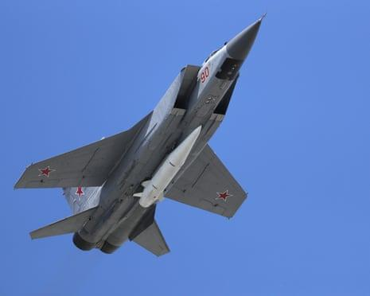
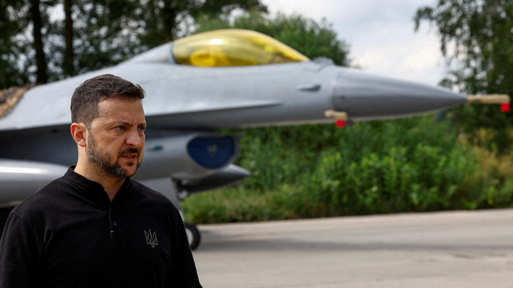
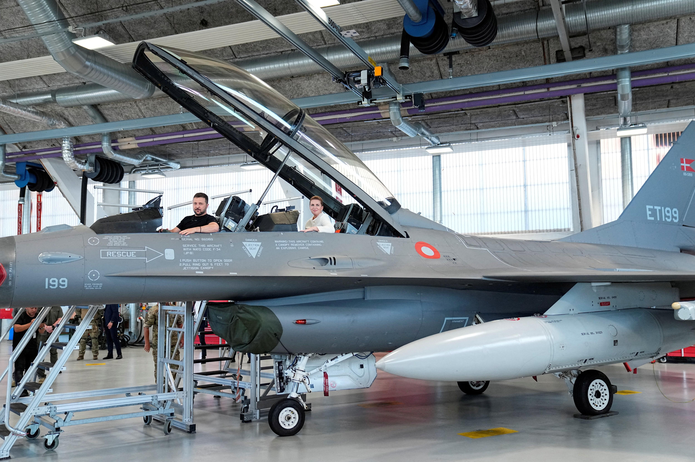

## Claim
Claim: " This image shows a Ukrainian F-16 fighter jet which was shot down by Russia as part of the large-scale Russian invasion in Ukraine."

## Actions
```
reverse_search()
```

## Evidence
### Evidence from `reverse_search`
The image 

## Elaboration
The image appears to be a meme. The background shows a damaged aircraft with Ukrainian markings. The foreground features two "soyjak" characters, a type of internet meme, which suggests the image is satirical.

The evidence does not provide information about the type of aircraft or the cause of the damage. Therefore, the claim that the image shows a Ukrainian F-16 fighter jet shot down by Russia cannot be verified.


## Actions
```
web_search("Ukrainian aircraft damage Russia")
web_search("damaged aircraft Ukraine war")
```

## Evidence
### Evidence from `web_search`
CNN reported that in June 2025, Ukrainian forces damaged or destroyed dozens of Russian aircraft using drones. The Guardian reported that Ukraine claimed to have damaged Russian fighter jets in a night-time raid on an airfield in Russia on June 9, 2025. The Wikipedia article provides a list of aviation shootdowns and accidents during the Russo-Ukrainian War, including the loss of an ex-Danish Air Force F-16 on August 26, 2023.

Sources: [CNN](https://www.cnn.com/2025/08/29/world/ukraine-blows-up-russian-bridges-own-mines-cheap-drones-intl), [Wikipedia](https://en.wikipedia.org/wiki/List_of_aviation_shootdowns_and_accidents_during_the_Russo-Ukrainian_War), [The Guardian](https://www.theguardian.com/world/2025/jun/09/ukraine-claims-to-have-damaged-russian-fighter-jets-in-night-time-raid). 


### Evidence from `web_search`
From [Source](https://www.nbcnews.com/world/ukraine/ukraine-russia-drone-bombers-attack-satellite-images-rcna210943): 
Content: NBC News published an article on June 4, 2025, by Jason Abbruzzese and Matt Nighswander, discussing satellite images showing the destruction of Russian planes by Ukrainian drones. The article mentions Ukrainian drone strikes on Russian airfields, including the Belaya air base, and shows images of damaged Tu-95 and Tu-22 bombers .


## Elaboration
The evidence confirms that there have been instances of aircraft damage and destruction during the Russo-Ukrainian War. Specifically, Ukrainian forces have damaged or destroyed Russian aircraft using drones, and there is a record of an F-16 being lost. However, the evidence does not confirm the claim that the image shows a Ukrainian F-16 fighter jet shot down by Russia. The image's nature as a meme and the lack of specific details about the aircraft in the image make it impossible to verify the claim.


## Actions
```
image_search("Ukrainian F-16 damaged Russia")
```

## Evidence
### Evidence from `image_search`
The BBC News website published an article featuring Volodymyr Zelenskyy with an F-16 fighter jet (). NPR published an article about the F-16 warplane (). Reuters discussed the arrival of F-16s in Ukraine ().


## Elaboration
The evidence confirms that Ukraine has received F-16 fighter jets. However, the image search results do not provide any information about a specific F-16 being shot down or damaged. Therefore, the claim remains unverified.


## Final Judgement
The image appears to be a meme depicting a damaged aircraft with Ukrainian markings. While there is evidence of aircraft damage during the Russo-Ukrainian War, and Ukraine has received F-16s, the specific claim that the image shows a Ukrainian F-16 shot down by Russia cannot be verified due to the image's nature and lack of specific details.

`false`

### Verdict: FALSE

### Justification
The claim is unverified. The image is a meme, and while there is evidence of aircraft damage during the Russo-Ukrainian War, the specific claim that the image shows a Ukrainian F-16 shot down by Russia cannot be verified due to the image's nature and lack of specific details. The evidence includes reports of Ukrainian forces damaging Russian aircraft using drones ([CNN](https://www.cnn.com/2025/08/29/world/ukraine-blows-up-russian-bridges-own-mines-cheap-drones-intl), [The Guardian](https://www.theguardian.com/world/2025/jun/09/ukraine-claims-to-have-damaged-russian-fighter-jets-in-night-time-raid)) and the loss of an F-16 ([Wikipedia](https://en.wikipedia.org/wiki/List_of_aviation_shootdowns_and_accidents_during_the_Russo-Ukrainian_War)).
