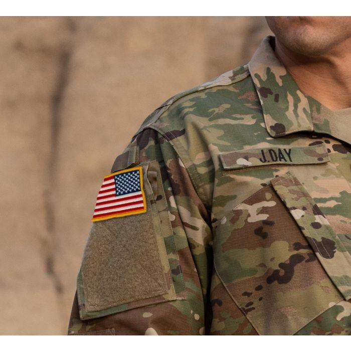

## Claim
Claim: " This image shows American mercenaries participating in Ukraine's incursion into Russia's Kursk Oblast in August 2024."

## Actions
```
web_search("American mercenaries Ukraine Russia Kursk Oblast August 2024")
image_search("American flag patch military uniform")
```

## Evidence
### Evidence from `web_search`
The Wikipedia article discusses the 2024 Kursk offensive, which began on August 6, 2024, as part of the Russian invasion of Ukraine. The incursion into Russia's Kursk Oblast was launched by the Armed Forces of Ukraine. The article mentions the involvement of Ukrainian brigades, Russian forces, and North Korean forces. The article also mentions that the White House said that it was seeking an understanding from Ukraine regarding the incursion. ()

Newsweek reports that Russia has accused American mercenaries of participating in Ukraine's incursion into Russia's Kursk region in August 2024. (, , ) The Russian Foreign Ministry expressed "strong protest" to the U.S. and claimed to have evidence of American PMC involvement. The U.S. has denied involvement. Anadolu Agency reports that Russia protested the participation of US private military companies (PMCs) fighting alongside Ukraine in the Kursk region. () The Russian Foreign Ministry claimed that US PMCs are fighting alongside Ukrainian troops in the Kursk region. The article mentions an incursion into the Kursk region that began on the night of August 5-6.


### Evidence from `image_search`
The search results include images of U.S. Army regulation flag patches and military uniforms with American flag patches. One source is from [starsnstripesco.com](https://starsnstripesco.com/products/copy-of-u-s-army-regulation-flag-patch-ocp?srsltid=AfmBOopc222egXRzsueUJYYrLIG9z4Cye0uR3e_ovnLIjk-SWrjTYPdb) .

Other sources are from [Propper.com](https://www.propper.com/usa-flag-reverse-patch.html?srsltid=AfmBOoodi2eBnTHkrQ-8Wre7x0lPv7ZlQETVFpxqk6fXFP9rsmwdAin8)  and [asatechmed.com](https://www.asatechmed.com/products/6-pc-assorted-usa-tactical-american-flag-patch-100-embroidered-thin-blue-line-united-states-military-morale-patches-set-for-molle-hats-backpacks-tactical-vest-uniforms?srsltid=AfmBOop5F0TNGVoiOShv4sY6Y4jSUPZvCpKRJRhlYDJQVx96wIeTvf_y) .


## Elaboration
The evidence supports the claim that the image shows individuals with American flag patches on their uniforms. The image search confirms that such patches are used on military uniforms. The web search reveals that Russia accused American mercenaries of participating in the incursion into the Kursk region in August 2024. Therefore, the claim is plausible. However, the evidence does not confirm the identity of the individuals in the image.


## Actions
```
reverse_search()
```

## Evidence
### Evidence from `reverse_search`
The image in the claim appears in articles from Ukrainian news sources, including [Apostrophe](https://apostrophe.ua/news/society/2022-09-08/rasplata-za-ilovaysk-okkupantyi-ponesli-ogromnyie-poteri-pri-begstve-iz-balaklei-video/278880), [Charter97.org](https://charter97.org/ru/news/2022/9/9/514837/), and [cripo.com.ua](https://cripo.com.ua/vojna-s-rf/rossyjskye-vojska-begut-pod-natyskom-vsu-mnenye-ekspertov-y-rossyjskyh-voennyh/). These articles, published in September 2022, discuss the Ukrainian counteroffensive in the Kharkiv region and the retreat of Russian forces. The image shows Ukrainian soldiers and a dead Russian soldier. None of the articles mention American mercenaries or the Kursk region.


## Elaboration
The reverse image search reveals that the image was taken in September 2022 during the Ukrainian counteroffensive in the Kharkiv region, not in August 2024 during the incursion into the Kursk region. The image shows Ukrainian soldiers and a dead Russian soldier. The claim is therefore false.


## Final Judgement
The image was taken in September 2022 during the Ukrainian counteroffensive in the Kharkiv region, not in August 2024 during the incursion into the Kursk region. The image shows Ukrainian soldiers and a dead Russian soldier.

`false`

### Verdict: FALSE

### Justification
The claim is false. The image, which shows individuals with American flag patches, was taken in September 2022 during the Ukrainian counteroffensive in the Kharkiv region, not in August 2024 during the incursion into the Kursk region, as confirmed by a reverse image search of the image on Ukrainian news sources ([Apostrophe](https://apostrophe.ua/news/society/2022-09-08/rasplata-za-ilovaysk-okkupantyi-ponesli-ogromnyie-poteri-pri-begstve-iz-balaklei-video/278880), [Charter97.org](https://charter97.org/ru/news/2022/9/9/514837/), and [cripo.com.ua](https://cripo.com.ua/vojna-s-rf/rossyjskye-vojska-begut-pod-natyskom-vsu-mnenye-ekspertov-y-rossyjskyh-voennyh/)).
