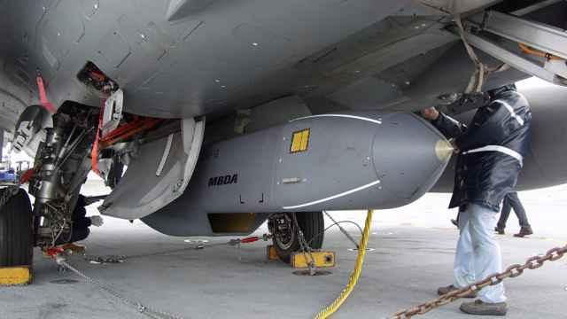
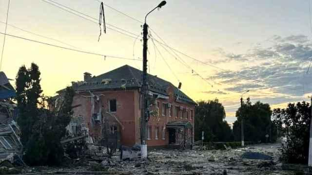

## Claim
Claim: " This image shows Ukrainian President Volodymyr Zelensky arriving in August 2024 in the Sudzha of Kursk region, Russia, which had just been occupied by Ukrainian troops in the Kursk Offensive, and meeting with representatives of the people there."

## Actions
```
reverse_search()
web_search("Volodymyr Zelensky Kursk Offensive")
```

## Evidence
### Evidence from `reverse_search`
The image in the claim () appears in multiple sources. According to the BBC, the image shows Volodymyr Zelensky visiting troops on the front line in the Kharkiv region, and the article was published on May 29, 2022. ([https://www.bbc.com/news/live/world-europe-61612803](https://www.bbc.com/news/live/world-europe-61612803)).

Telegrafi.com also features the image, stating that Zelensky visited the front line where he met Ukrainian troops in the Kharkiv region. ([https://telegrafi.com/en/zelensky-on-a-rare-trip-outside-kiev-visited-the-front-line-where-he-met-ukrainian-troops/](https://telegrafi.com/en/zelensky-on-a-rare-trip-outside-kiev-visited-the-front-line-where-he-met-ukrainian-troops/)).


### Evidence from `web_search`
The BBC News article ([https://www.bbc.com/news/articles/c9vn1x23x88o](https://www.bbc.com/news/articles/c9vn1x23x88o)) discusses the ongoing incursion into Russia's Kursk region by Ukraine, with Volodymyr Zelensky stating the operation is holding down 50,000 Russian troops. The Moscow Times ([https://www.themoscowtimes.com/2025/04/27/zelensky-says-ukraine-still-fighting-in-russias-kursk-a88884](https://www.themoscowtimes.com/2025/04/27/zelensky-says-ukraine-still-fighting-in-russias-kursk-a88884)) reports on the ongoing conflict, mentioning a shock offensive launched by Kyiv in August 2024 and Zelensky's statement that Ukraine's army was still fighting in Kursk.

ABC News ([https://abcnews.go.com/International/ukraine-bringing-war-back-russia-zelenskyy-after-new/story?id=117408954](https://abcnews.go.com/International/ukraine-bringing-war-back-russia-zelenskyy-after-new/story?id=117408954)) reports that Zelensky stated Ukraine is bringing the war "back to Russia" and that Russia has lost over 38,000 troops in the area since August, with fighting reported near Sudzha, which Ukraine captured in August. , , , , , , 


## Elaboration
The claim is partially inaccurate. The image (

## Final Judgement
The image shows Volodymyr Zelensky visiting troops in the Kharkiv region in May 2022, not in the Kursk region in August 2024. While there are reports of Ukrainian incursions into the Kursk region, the image's context is misrepresented.

`false`

### Verdict: FALSE

### Justification
The image in the claim shows Volodymyr Zelensky visiting troops in the Kharkiv region in May 2022, as reported by the BBC ([https://www.bbc.com/news/live/world-europe-61612803](https://www.bbc.com/news/live/world-europe-61612803)) and Telegrafi.com ([https://telegrafi.com/en/zelensky-on-a-rare-trip-outside-kiev-visited-the-front-line-where-he-met-ukrainian-troops/](https://telegrafi.com/en/zelensky-on-a-rare-trip-outside-kiev-visited-the-front-line-where-he-met-ukrainian-troops/)). The claim incorrectly places the image in the Kursk region in August 2024.
