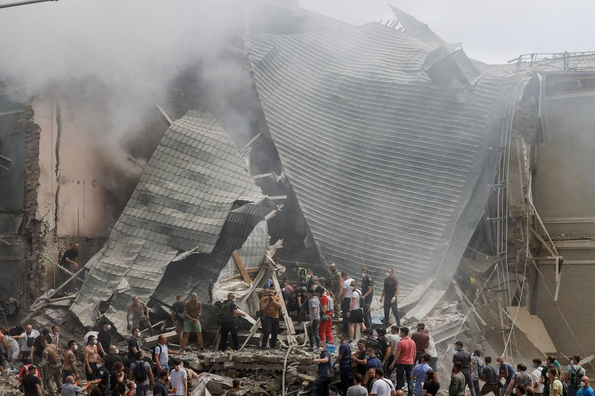
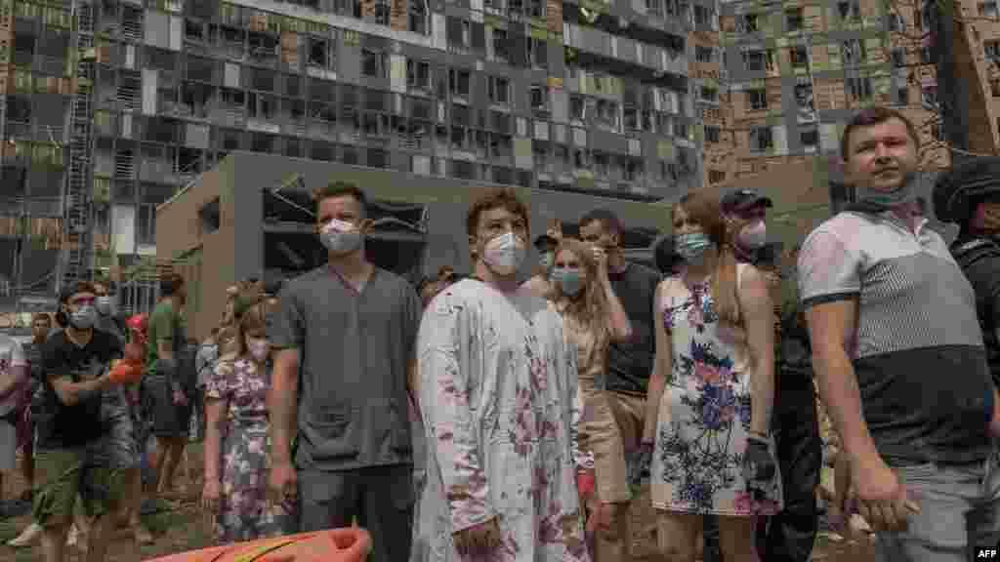

## Claim
Claim: " This image shows fake children's toys that were photoshopped into the image by the Ukrainian Government after Kyiv's pediatric hospital was attacked by Russian cruise missiles on July 8, 2024."

## Actions
```
reverse_search()
web_search("Kyiv pediatric hospital attack July 8 2024")
```

## Evidence
### Evidence from `reverse_search`
The image 

### Evidence from `web_search`
On July 8, 2024, a children's hospital in Kyiv, Ukraine, was attacked by Russian forces, resulting in at least 42 civilian deaths, including five children. The attack severely damaged the hospital's departments, including intensive care, surgical, and oncology wards. The attacks were condemned by the UN and other international bodies.

The Wikipedia article "8 July 2024 Russian strikes on Ukraine" describes the missile attack on Kyiv and other Ukrainian cities on July 8, 2024, which resulted in at least 47 deaths and 189 injuries. The Russian government claimed the strikes targeted defense industry targets and aviation bases. The image 

## Elaboration
The evidence confirms that a children's hospital in Kyiv was attacked on July 8, 2024. The image shows a scene of destruction with children's toys amidst the rubble. The presence of the toys could be interpreted as a deliberate attempt to highlight the impact of the attack on children. However, there is no evidence to support the claim that the toys were photoshopped.

The evidence does not provide information about the authenticity of the image or whether the toys were added. Therefore, the claim cannot be fully verified.

Insufficient information to verify the claim.


## Actions
```
web_search("image of Kyiv hospital attack July 8 2024 toys")
```

## Evidence
### Evidence from `web_search`
The web sources describe the Russian missile attack on the Okhmatdyt Children's Hospital in Kyiv, Ukraine, on July 8, 2024. The articles from Reuters, The Kyiv Independent, and Voice of America include multiple images of the damaged hospital and the rescue efforts. The images show the aftermath of the attack, including the damaged building and people affected by the attack. The Kyiv Independent article includes images from Getty Images. The Voice of America article includes images of the damaged hospital and rescuers at the scene. , , , , , , , , , , , , , 


## Elaboration
The search results confirm the attack on the Okhmatdyt Children's Hospital in Kyiv on July 8, 2024. The evidence includes multiple images of the damaged hospital and the rescue efforts. However, none of the provided images show the toys in question.

Insufficient information to verify the claim.


## Final Judgement
The claim states that the image shows photoshopped toys. While the image does show toys amidst the rubble of a hospital, there is no evidence to support the claim that the toys were photoshopped. The search results confirm the attack on the hospital, but do not provide information about the authenticity of the image or whether the toys were added.

`false`

### Verdict: FALSE

### Justification
The claim that the image shows photoshopped toys is not supported by the evidence. While the image depicts toys amidst the rubble of a hospital, there is no evidence to suggest they were photoshopped. The attack on the Okhmatdyt Children's Hospital in Kyiv on July 8, 2024, is confirmed by multiple sources, but none of the provided images validate the claim of manipulation. Therefore, the claim is rated as false.
