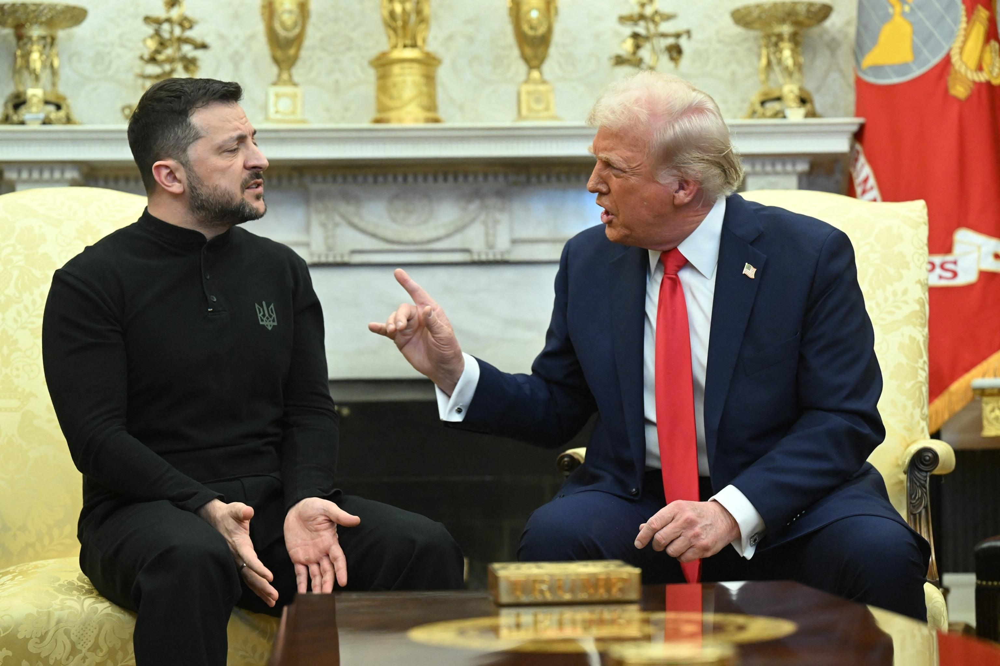
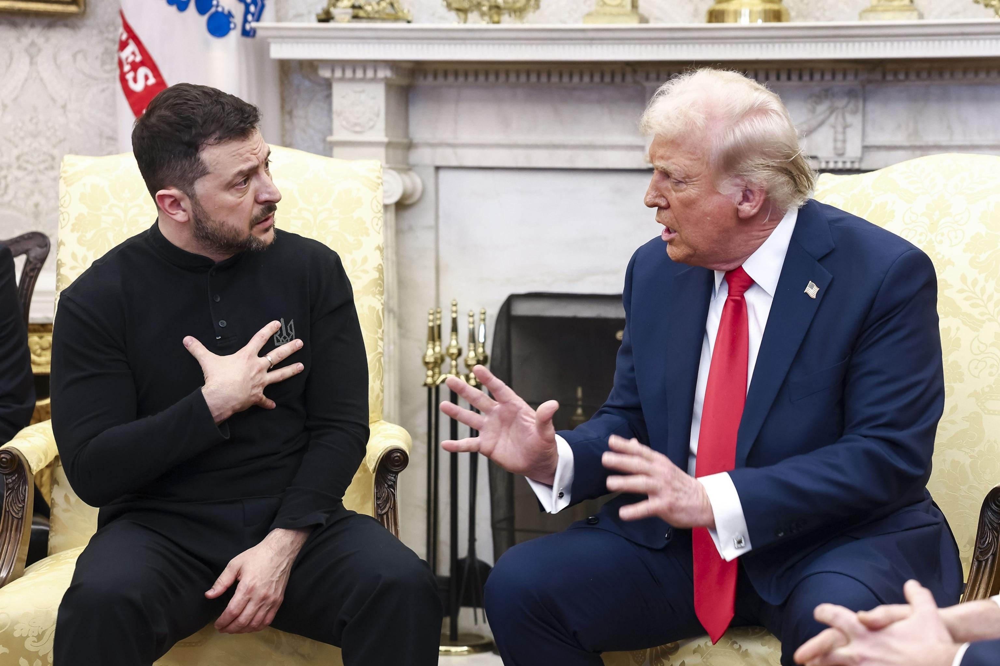

## Claim
Claim: "On Feb. 28, 2025, before a meeting with U.S. President Donald Trump, Ukraine President Volodymyr Zelenskyy met with Democrats."

## Actions
```
web_search("Volodymyr Zelenskyy Donald Trump meeting February 28 2025")
web_search("Volodymyr Zelenskyy meeting with Democrats February 28 2025")
```

## Evidence
### Evidence from `web_search`
On February 28, 2025, Volodymyr Zelenskyy met with Donald Trump in the Oval Office at the White House, according to multiple sources. The meeting was contentious, with reports of a shouting match and Zelenskyy leaving early. The Trump administration initially considered canceling Zelenskyy's trip. <image:i>, , , , , , , 

The sources include a Wikipedia article ([https://en.wikipedia.org/wiki/2025_Trump%E2%80%93Zelenskyy_Oval_Office_meeting](https://en.wikipedia.org/wiki/2025_Trump%E2%80%93Zelenskyy_Oval_Office_meeting)), an NPR article ([https://www.npr.org/2025/02/28/nx-s1-5313079/trump-zelenskyy-meeting](https://www.npr.org/2025/02/28/nx-s1-5313079/trump-zelenskyy-meeting)), and an ABC News article ([https://abcnews.go.com/Politics/key-takeaways-tempers-flare-trump-vance-confront-ukraines/story?id=119299758](https://abcnews.go.com/Politics/key-takeaways-tempers-flare-trump-vance-confront-ukraines/story?id=119299758)).


### Evidence from `web_search`
From [Source](https://abcnews.go.com/Politics/zelenskyy-meets-bipartisan-group-senators-ahead-tense-white/story?id=119305439): 
Content: ABC News reports that on February 28, 2025, Zelenskyy met with a bipartisan group of senators before meeting with Donald Trump. The article mentions that Chris Coons, Amy Klobuchar, and Lindsey Graham were present at the meeting. 


## Elaboration
The evidence confirms that on February 28, 2025, Zelenskyy met with Donald Trump. Additionally, the evidence from ABC News indicates that Zelenskyy met with a bipartisan group of senators before his meeting with Trump. The article specifically names Chris Coons and Amy Klobuchar, who are Democrats, as being present at the meeting.

Therefore, the claim is verified.


## Final Judgement
The evidence confirms that Zelenskyy met with Donald Trump on February 28, 2025, and also met with a bipartisan group of senators, including Democrats, before the meeting with Trump.

`true`

### Verdict: TRUE

### Justification
On February 28, 2025, Volodymyr Zelenskyy met with Donald Trump, as confirmed by multiple sources. Furthermore, Zelenskyy met with a bipartisan group of senators, including Democrats, before his meeting with Trump, as reported by [ABC News](https://abcnews.go.com/Politics/zelenskyy-meets-bipartisan-group-senators-ahead-tense-white/story?id=119305439).
