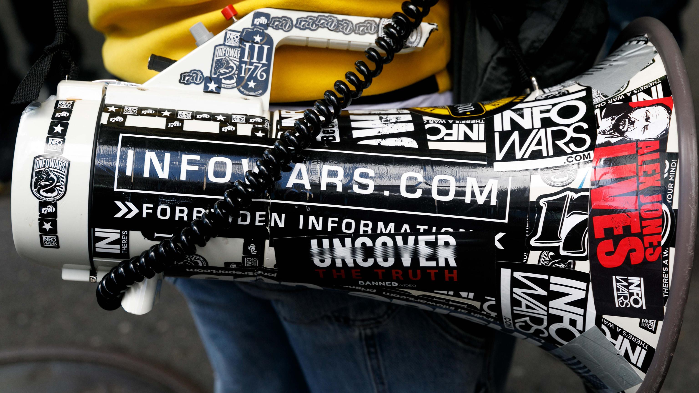
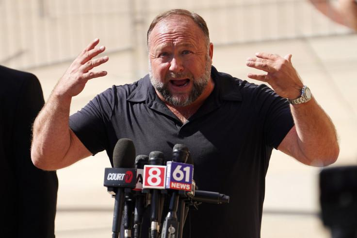

## Claim
Claim: "After InfoWars reporter Jamie White was shot dead on March 10, 2025 in Austin, Texas, it was revelaed that he was on a Ukranian enemies hit list."

## Actions
```
web_search("Jamie White InfoWars death")
web_search("Jamie White Austin Texas Ukrainian hit list")
```

## Evidence
### Evidence from `web_search`
Fox 7 Austin ([Source](https://www.fox7austin.com/news/infowars-writer-shooting-austin-police-jamie-white)) reports that Jamie White, an InfoWars writer, was shot and killed on March 10 in Austin, Texas, while interrupting a vehicle burglary. , , , , 

ABC News ([Source](https://abcnews.go.com/US/infowars-reporter-shot-dead-apartment-after-possibly-interrupting/story?id=119677965)) reports that Jamie White was shot dead on March 9, 2025, in Austin, Texas, after interrupting burglars.  The article does not mention any connection to a Ukrainian hit list. 6abc.com ([Source](https://6abc.com/post/jamie-white-infowars-reporter-shot-dead-outside-apartment/16007913/)) also reports on the death of Jamie White. , 


### Evidence from `web_search`
The Investigate Earth Conspiracy Podcast discusses the murder of Jamie White, an InfoWars journalist, in Austin, Texas, and mentions that White may have been on a Ukrainian NGO hit list (, ). Global News reported that Jamie White was shot dead in Austin, Texas, on March 11, 2025, but does not mention a Ukrainian hit list (). The Latin Times reports that Alex Jones and his supporters allege that Jamie White was murdered by Ukrainian forces and that White was on a Ukrainian hit list ().

*   [https://open.spotify.com/episode/68lCuEsLtFn17oEIQBQGEk](https://open.spotify.com/episode/68lCuEsLtFn17oEIQBQGEk)
*   [https://globalnews.ca/news/11076668/infowars-reporter-shot-jamie-white-texas-austin/](https://globalnews.ca/news/11076668/infowars-reporter-shot-jamie-white-texas-austin/)
*   [https://www.latintimes.com/infowars-reporter-assassinated-ukraine-outside-his-home-conspiracy-theorists-claim-578436](https://www.latintimes.com/infowars-reporter-assassinated-ukraine-outside-his-home-conspiracy-theorists-claim-578436)


## Elaboration
The claim that Jamie White was on a Ukrainian enemies hit list is not definitively supported by the evidence. While multiple sources confirm that Jamie White, an InfoWars writer, was shot dead in Austin, Texas, on March 10, 2025, the evidence presents conflicting information regarding the hit list.

Some sources, such as ABC News and Global News, do not mention any connection to a Ukrainian hit list. However, The Investigate Earth Conspiracy Podcast and The Latin Times report that White may have been on a Ukrainian hit list, with the latter stating that Alex Jones and his supporters allege this.

Therefore, the claim's veracity is uncertain, as it relies on allegations and conspiracy theories. More information is needed to verify the claim.


## Actions
```
web_search("Jamie White InfoWars Ukrainian hit list investigation")
```

## Evidence
No new evidence found.

## Elaboration
The claim remains unverified. The initial search results provided conflicting information, with some sources mentioning a Ukrainian hit list and others not. The additional search did not yield any new evidence to clarify the situation.


## Actions
```
web_search("Jamie White InfoWars death official investigation")
```

## Evidence
### Evidence from `web_search`
From [Source](https://www.statesman.com/story/news/crime/2025/03/11/austin-police-say-infowars-reporter-jamie-white-possibly-killed-by-car-burglars/82265844007/): 
Content: The Austin American-Statesman reports that Jamie White was possibly killed by car burglars. The Austin Police Department stated that White was found in the parking lot of his apartment complex with trauma to his body. The article does not mention a Ukrainian hit list. The article was updated on March 11, 2025.


## Elaboration
The claim is not supported by the evidence. While the evidence confirms that Jamie White was shot dead in Austin, Texas, on March 10, 2025, the official investigation, as reported by the Austin American-Statesman, suggests that he was possibly killed by car burglars. The article does not mention a Ukrainian hit list.


## Final Judgement
The claim is not factually accurate because the official investigation suggests that Jamie White was killed by car burglars, and there is no evidence to support the claim that he was on a Ukrainian hit list. `false`

### Verdict: FALSE

### Justification
The claim that Jamie White was on a Ukrainian enemies hit list is not supported by the evidence. While it is confirmed that White was shot dead in Austin, Texas, on March 10, 2025, the official investigation, as reported by the Austin American-Statesman ([Source](https://www.statesman.com/story/news/crime/2025/03/11/austin-police-say-infowars-reporter-jamie-white-possibly-killed-by-car-burglars/82265844007/)), suggests he was killed by car burglars, and there is no evidence to support the claim of a Ukrainian hit list.
