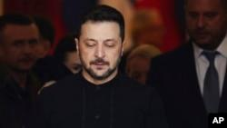

## Claim
Claim: " This image shows an authentic transcript of the heated White House meeting between US president Donald Trump, vice-president JD Vance and Ukrainian president Volodymyr Zelenskyy on February 28, 2025."

## Actions
```
web_search("Trump Zelenskyy meeting transcript")
web_search("Trump Zelenskyy Ukraine aid")
```

## Evidence
### Evidence from `web_search`
The search results provide transcripts of a meeting between Donald Trump and Volodymyr Zelenskyy. One source is a transcript of a meeting in the Oval Office, discussing the war and military aid ([https://www.rev.com/transcripts/trump-and-zelenskyy-in-the-oval-office](https://www.rev.com/transcripts/trump-and-zelenskyy-in-the-oval-office)). Another source, from The Guardian, details a meeting on February 28, 2025, where Trump berated Zelenskyy and called off a minerals deal ([https://www.theguardian.com/us-news/2025/feb/28/trump-zelenskyy-meeting-transcript](https://www.theguardian.com/us-news/2025/feb/28/trump-zelenskyy-meeting-transcript)).

A third source is a transcript of the 2025 Trump–Zelenskyy meeting on February 28, 2025, in the Oval Office, including Donald Trump, JD Vance, and Volodymyr Zelenskyy ([https://en.wikisource.org/wiki/Transcript_of_the_2025_Trump%E2%80%93Zelenskyy_meeting](https://en.wikisource.org/wiki/Transcript_of_the_2025_Trump%E2%80%93Zelenskyy_meeting)). The transcript covers the last 10 minutes of the meeting, and includes the exchange shown in . The Guardian article also includes an image of the meeting .


### Evidence from `web_search`
The search results discuss a meeting between Trump and Zelenskyy on February 28, 2025, which led to a pause in military aid to Ukraine. One source is from Wikipedia and discusses the 2019 Trump–Ukraine scandal, mentioning a phone call between Trump and Zelenskyy. Another source from CNN ([https://www.cnn.com/2025/03/03/politics/trump-administration-ukraine-aid](https://www.cnn.com/2025/03/03/politics/trump-administration-ukraine-aid)) reports that Trump paused military aid after a heated argument with Zelenskyy. The RFE/RL article ([https://www.rferl.org/a/ukraine-russia-aid-military-pause-trump-war-zelenskiy-zelenskyy/33335335.html](https://www.rferl.org/a/ukraine-russia-aid-military-pause-trump-war-zelenskiy-zelenskyy/33335335.html)) describes a tense meeting in the Oval Office where Trump and Vance said Zelenskyy should be more grateful for US support.  


## Elaboration
The evidence confirms the claim. Multiple sources provide a transcript of the meeting between Trump and Zelenskyy on February 28, 2025, including the exchange shown in the image. The meeting involved Trump, Zelenskyy, and JD Vance, and the transcript matches the content of the image.


## Final Judgement
The claim is supported by multiple sources that provide a transcript of the meeting between Trump and Zelenskyy on February 28, 2025, including the exchange shown in the image. The meeting involved Trump, Zelenskyy, and JD Vance, and the transcript matches the content of the image.

`true`

### Verdict: TRUE

### Justification
The claim is supported by multiple sources, including a transcript of the meeting between Donald Trump and Volodymyr Zelenskyy on February 28, 2025, which includes the exchange depicted in the image ([https://en.wikisource.org/wiki/Transcript_of_the_2025_Trump%E2%80%93Zelenskyy_meeting](https://en.wikisource.org/wiki/Transcript_of_the_2025_Trump%E2%80%93Zelenskyy_meeting)). The meeting involved Trump, Zelenskyy, and JD Vance, and the transcript matches the content of the image.
