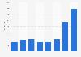
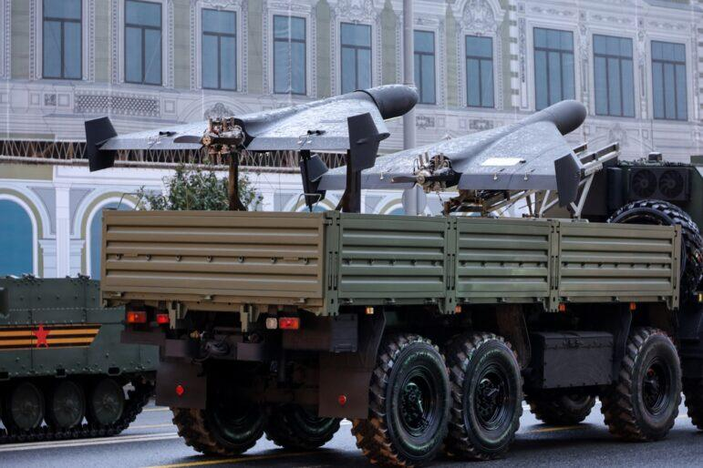

## Claim
Claim: "Ukraine is selling half of the armaments it receives from the United States"

## Actions
```
web_search("Ukraine US arms sales corruption")
web_search("US aid to Ukraine arms tracking")
```

## Evidence
### Evidence from `web_search`
Al Jazeera ([https://www.aljazeera.com/news/2025/8/2/ukraine-says-defence-sector-corruption-scheme-uncovered](https://www.aljazeera.com/news/2025/8/2/ukraine-says-defence-sector-corruption-scheme-uncovered)) reports that Ukrainian authorities detained officials over a corruption scheme in the defense sector involving military drones and signal jamming systems, with inflated prices and kickbacks. Politico ([https://www.politico.eu/article/ukraine-uncovers-major-corruption-scheme-defense-procurment-days-after-restoring-anticorruption/](https://www.politico.eu/article/ukraine-uncovers-major-corruption-scheme-defense-procurment-days-after-restoring-anticorruption/)) also reported on a corruption scheme involving inflated prices and illegal payments in military equipment procurement.

PBS.org ([https://www.pbs.org/frontlineworld/stories/sierraleone/context.html](https://www.pbs.org/frontlineworld/stories/sierraleone/context.html)) discusses corruption and illicit weapons in Ukraine, referencing a report about the need for Ukraine to clean up its arms export industry. The article mentions Ukraine lost billions in military assets due to theft and lack of oversight.


### Evidence from `web_search`
The Kiel Institute for the World Economy provides a "Ukraine Support Tracker" database, listing military, financial, and humanitarian aid pledged to Ukraine since January 24, 2022, with data through April 2025 ([https://www.ifw-kiel.de/topics/war-against-ukraine/ukraine-support-tracker/](https://www.ifw-kiel.de/topics/war-against-ukraine/ukraine-support-tracker/)) <image:k>. A timeline of military aid packages to Ukraine from 2021 to 2025 is available, mentioning aid from various countries, including the United States, but does not mention Ukraine selling armaments ([https://www.forumarmstrade.org/ukrainearms.html](https://www.forumarmstrade.org/ukrainearms.html)).

NPR reported that the U.S. has provided around $75 billion in military assistance to Ukraine since the full-scale invasion in 2022, and other countries are also contributing to the aid ([https://www.npr.org/2025/08/05/g-s1-81084/europe-us-weapons-ukraine-russia-war](https://www.npr.org/2025/08/05/g-s1-81084/europe-us-weapons-ukraine-russia-war)) , , .


## Elaboration
The evidence indicates that Ukraine has faced corruption issues within its defense sector, including inflated prices and illegal payments in military equipment procurement ([https://www.aljazeera.com/news/2025/8/2/ukraine-says-defence-sector-corruption-scheme-uncovered](https://www.aljazeera.com/news/2025/8/2/ukraine-says-defence-sector-corruption-scheme-uncovered), [https://www.politico.eu/article/ukraine-uncovers-major-corruption-scheme-defense-procurment-days-after-restoring-anticorruption/](https://www.politico.eu/article/ukraine-uncovers-major-corruption-scheme-defense-procurment-days-after-restoring-anticorruption/)). However, there is no direct evidence to support the claim that Ukraine is selling half of the armaments it receives from the United States.

While the evidence mentions the U.S. providing significant military assistance to Ukraine ([https://www.npr.org/2025/08/05/g-s1-81084/europe-us-weapons-ukraine-russia-war](https://www.npr.org/2025/08/05/g-s1-81084/europe-us-weapons-ukraine-russia-war)), it does not mention any sales of these armaments. The provided sources highlight corruption and the need for oversight in Ukraine's arms industry, but they do not confirm the claim.

To verify the claim, information is missing regarding the actual sales of U.S.-provided armaments by Ukraine, including the quantities sold and the recipients.


## Actions
```
web_search("Ukraine arms sales to other countries")
web_search("Ukraine arms trafficking investigations")
```

## Evidence
### Evidence from `web_search`
The U.S. State Department approved a Foreign Military Sale to Ukraine for Air Delivered Munitions for $825 million ([https://www.dsca.mil/Press-Media/Major-Arms-Sales/Article-Display/Article/4289280/ukraine-air-delivered-munitions](https://www.dsca.mil/Press-Media/Major-Arms-Sales/Article-Display/Article/4289280/ukraine-air-delivered-munitions)). Statista, in cooperation with SIPRI, provides data on arms imports from Ukraine from 2018 to 2024, showing China and India as leading importers in 2024 (, , ). SIPRI reports that Ukraine became the world’s largest importer of major arms in 2020–24, with the U.S. providing 45% of the major arms supplied to Ukraine (<image:k>).


### Evidence from `web_search`
The Global Initiative Against Transnational Organized Crime discusses potential arms trafficking from Ukraine to Europe, Africa, Latin America, the Middle East, and Central Asia, highlighting the need for policy measures to reduce risks and concerns about the diversion of small arms and light weapons ([https://globalinitiative.net/analysis/future-trends-in-arms-trafficking-from-the-ukraine-conflict/](https://globalinitiative.net/analysis/future-trends-in-arms-trafficking-from-the-ukraine-conflict/)). The Ministry of Internal Affairs of Ukraine launched a Coordination Centre to Combat Illicit Arms Trafficking with international support to coordinate actions and improve the legal framework ([https://www.euam-ukraine.eu/news/moia-launches-the-coordination-centre-to-combat-illicit-arms-trafficking/](https://www.euam-ukraine.eu/news/moia-launches-the-coordination-centre-to-combat-illicit-arms-trafficking/)) , , . The Global Investigative Journalism Network published a guide on investigating war crimes and the arms trade ([https://gijn.org/resource/guide-to-investigating-war-crimes-arms-trade/](https://gijn.org/resource/guide-to-investigating-war-crimes-arms-trade/)) .


## Elaboration
The evidence suggests that Ukraine is a major importer of arms, with the U.S. being a significant supplier. There are concerns about arms trafficking from Ukraine, and the Ukrainian government has taken steps to combat illicit arms trafficking ([https://globalinitiative.net/analysis/future-trends-in-arms-trafficking-from-the-ukraine-conflict/](https://globalinitiative.net/analysis/future-trends-in-arms-trafficking-from-the-ukraine-conflict/), [https://www.euam-ukraine.eu/news/moia-launches-the-coordination-centre-to-combat-illicit-arms-trafficking/](https://www.euam-ukraine.eu/news/moia-launches-the-coordination-centre-to-combat-illicit-arms-trafficking/)). However, the evidence does not support the claim that Ukraine is selling half of the armaments it receives from the United States.

The data from Statista, in cooperation with SIPRI, shows that China and India were leading importers from Ukraine in 2024, but this does not indicate that Ukraine is selling U.S.-supplied arms ([](https://www.statista.com/statistics/1295669/arms-imports-from-ukraine/)). The U.S. has approved arms sales to Ukraine ([https://www.dsca.mil/Press-Media/Major-Arms-Sales/Article-Display/Article/4289280/ukraine-air-delivered-munitions](https://www.dsca.mil/Press-Media/Major-Arms-Sales/Article-Display/Article/4289280/ukraine-air-delivered-munitions)), but there is no evidence of the resale of these arms.

The claim remains unverified due to the lack of specific data on the sale of U.S.-supplied armaments by Ukraine.


## Actions
```
web_search("Ukraine arms sales to other countries US supplied")
```

## Evidence
No new evidence found.

## Elaboration
The claim that Ukraine is selling half of the armaments it receives from the United States is not supported by the evidence. While there are indications of corruption and arms trafficking concerns, and Ukraine is a major importer of arms, there is no specific information to confirm the claim. The evidence does not provide data on the quantities of U.S.-supplied armaments being resold by Ukraine.


## Final Judgement
The claim is not supported by the available evidence. While there are reports of corruption and arms trafficking concerns in Ukraine, and the country is a major importer of arms, there is no specific evidence to confirm that Ukraine is selling half of the armaments it receives from the United States. Therefore, the claim is considered unsubstantiated. `false`

### Verdict: FALSE

### Justification
The claim that Ukraine is selling half of the armaments it receives from the United States is not supported by the evidence. While there are reports of corruption within the Ukrainian defense sector and concerns about arms trafficking ([https://www.aljazeera.com/news/2025/8/2/ukraine-says-defence-sector-corruption-scheme-uncovered](https://www.aljazeera.com/news/2025/8/2/ukraine-says-defence-sector-corruption-scheme-uncovered), [https://globalinitiative.net/analysis/future-trends-in-arms-trafficking-from-the-ukraine-conflict/](https://globalinitiative.net/analysis/future-trends-in-arms-trafficking-from-the-ukraine-conflict/)), and Ukraine is a major importer of arms, there is no specific data to confirm the claim.
