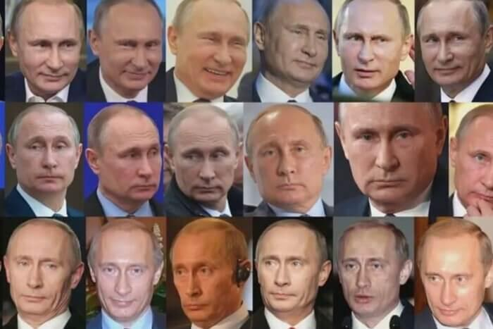
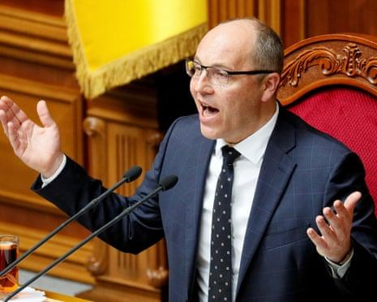
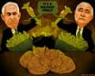
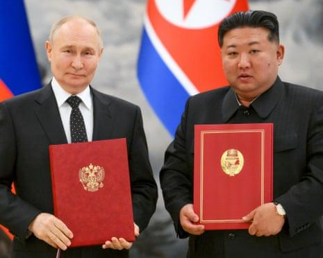

## Claim
Claim: "Russian President Vladimir Putin has died in an explosion in one of his limousines."

## Actions
```
web_search("Vladimir Putin death limousine explosion")
```

## Evidence
### Evidence from `web_search`
Newsweek reports that a limousine from Vladimir Putin's presidential fleet caught fire near the FSB headquarters in Moscow (). The cause of the fire is unknown, and it is unclear if Putin was using the car. The Hindustan Times reported on a viral video of an explosion involving an Aurus Senat limousine in Moscow, near the FSB headquarters (<image:k>). The Economic Times reports that one of Vladimir Putin's official limousines exploded in Moscow, raising security concerns (, ).

The articles mention speculation of an assassination attempt on Vladimir Putin, but it was not immediately clear who was in the car, and no injuries were reported.

*   [https://www.newsweek.com/russia-putin-limousine-fire-video-2052846](https://www.newsweek.com/russia-putin-limousine-fire-video-2052846)
*   [https://www.hindustantimes.com/world-news/275000-aurus-senat-limousine-vladimir-putin-goes-up-in-flames-limo-explodes-moscow-assassination-attempt-101743297137628.html](https://www.hindustantimes.com/world-news/275000-aurus-senat-limousine-vladimir-putin-goes-up-in-flames-limo-explodes-moscow-assassination-attempt-101743297137628.html)
*   [https://m.economictimes.com/news/international/world-news/blast-in-one-of-vladimir-putins-official-limousines-triggers-fresh-assassination-concerns/articleshow/119758547.cms](https://m.economictimes.com/news/international/world-news/blast-in-one-of-vladimir-putins-official-limousines-triggers-fresh-assassination-concerns/articleshow/119758547.cms)


## Elaboration
The evidence indicates that one of Vladimir Putin's limousines was involved in an incident near the FSB headquarters in Moscow. News reports mention a fire and an explosion. However, the evidence does not confirm that Putin was in the car or that he died.

The reports raise security concerns and mention speculation about an assassination attempt. However, there is no information about Putin's death.

Therefore, the claim cannot be verified based on the provided evidence. More information is needed to confirm Putin's death.


## Actions
```
web_search("Vladimir Putin health status")
```

## Evidence
### Evidence from `web_search`
The search results discuss speculations about Vladimir Putin's health and potential death. One source is a Wikipedia article that mentions claims of various illnesses and death, circulating for about 20 years, but states that these claims are largely speculation and cannot be accredited for authenticity. Another source, Legion Magazine, discusses rumors about Putin's health and potential death, stating there is no verifiable evidence that Putin is seriously ill or dead, and also mentions speculation about Putin's health and behavior, as well as the use of body doubles (, ). The Economic Times reports that Ukrainian President Volodymyr Zelensky stated that Vladimir Putin "will die soon" (, , ).

*   [https://en.wikipedia.org/wiki/Claims_of_Vladimir_Putin%27s_incapacity_and_death](https://en.wikipedia.org/wiki/Claims_of_Vladimir_Putin%27s_incapacity_and_death)
*   [https://legionmagazine.com/long-standing-rumours-of-putins-impending-death-have-been-greatly-exaggerated/](https://legionmagazine.com/long-standing-rumours-of-putins-impending-death-have-been-greatly-exaggerated/)
*   [https://m.economictimes.com/news/international/us/is-putin-suffering-from-a-deadly-disease-zelensky-says-he-will-die-soon-heres-the-truth/articleshow/119615602.cms](https://m.economictimes.com/news/international/us/is-putin-suffering-from-a-deadly-disease-zelensky-says-he-will-die-soon-heres-the-truth/articleshow/119615602.cms)


## Elaboration
The new evidence provides additional context to the claim. It reveals that there have been long-standing rumors and speculations about Vladimir Putin's health and potential death. However, these claims are largely unverified. The evidence includes a statement from Ukrainian President Volodymyr Zelensky, who said that Putin "will die soon."

The evidence does not confirm the claim that Putin died in an explosion. It only reinforces the existence of rumors and speculation about his health and potential death.

Therefore, the claim remains unverified.


## Actions
```
web_search("Vladimir Putin recent public appearances")
```

## Evidence
### Evidence from `web_search`
The official website of the President of Russia ([http://www.en.kremlin.ru/events/president/news](http://www.en.kremlin.ru/events/president/news)) lists Vladimir Putin's recent activities, including meetings and public appearances in August 2025, a working trip to Vladivostok on September 4-5, 2025, and a visit to China from August 31 to September 3, 2025. The BBC News website ([https://www.bbc.com/news/topics/cvenzmgywd4t](https://www.bbc.com/news/topics/cvenzmgywd4t)) has articles about Vladimir Putin, with the most recent one published 11 hours ago, and includes a headshot of Putin (). The Guardian ([https://www.theguardian.com/world/vladimir-putin](https://www.theguardian.com/world/vladimir-putin)) published articles about Putin's activities between August 22 and August 30, 2025, mentioning his visit to China () and other public appearances (, , , , ).


## Elaboration
The evidence indicates that Vladimir Putin has been making public appearances recently. The Kremlin's official website lists his activities, including meetings and trips in August and September 2025. The BBC and The Guardian also report on his recent activities, including a visit to China.

This information contradicts the claim that Putin died in an explosion.

Therefore, the claim is false.


## Final Judgement
The claim that Vladimir Putin died in an explosion is demonstrably false. Multiple sources confirm that Putin has been making public appearances recently, including meetings and trips, which contradicts the claim. `false`

### Verdict: FALSE

### Justification
The claim is demonstrably false. While there were reports of a fire and explosion involving one of Putin's limousines, there is no evidence to support the claim that he died. Furthermore, multiple sources, including the Kremlin's official website, the BBC, and The Guardian, confirm that Putin has been making public appearances recently, contradicting the claim.
