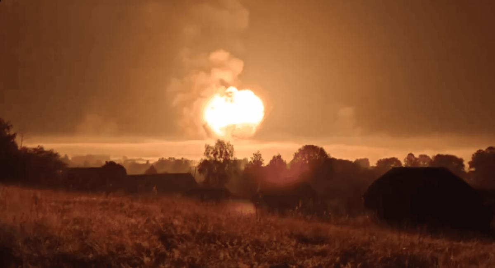

## Claim
Claim: " This image shows a Russian ammunition depot in Toropets, Tver Oblast, before and after it was hit by a, possible nuclear, strike from the North Atlantic Treaty Organization (NATO)."

## Actions
```
reverse_search()
web_search("Russian ammunition depot Toropets Tver Oblast")
web_search("Toropets Tver Oblast NATO strike")
```

## Evidence
### Evidence from `reverse_search`
The image () appears in multiple articles discussing a Ukrainian drone attack on a Russian arms depot in Toropets, Tver Oblast. The depot, renovated in 2018, stored an estimated 30,000 tonnes of military munitions, including explosives, artillery shells, and ballistic missiles. The attack caused a large explosion and fire.

The articles, published by Euronews ([https://www.euronews.com/my-europe/2024/09/18/what-was-stored-at-the-russian-arms-depot-in-tver-region-struck-by-ukraines-drones](https://www.euronews.com/my-europe/2024/09/18/what-was-stored-at-the-russian-arms-depot-in-tver-region-struck-by-ukraines-drones)), Reuters ([https://www.reuters.com/world/europe/ukraine-targets-western-russian-regions-with-drones-russian-officials-says-2024-09-18/](https://www.reuters.com/world/europe/ukraine-targets-western-russian-regions-with-drones-russian-officials-says-2024-09-18/)), and the Associated Press ([https://apnews.com/article/russia-ukraine-toropets-drones-attack-e3d05b2637d316b437e4789a35c7f59e](https://apnews.com/article/russia-ukraine-toropets-drones-attack-e3d05b2637d316b437e4789a35c7f59e)), describe the attack and its aftermath. The Reuters article also mentions that the facility was designed to withstand missile strikes and even a small nuclear attack.


### Evidence from `web_search`
The image () shows a Russian ammunition depot in Toropets, Tver Oblast, before and after a Ukrainian drone attack on September 17-18, 2024, which caused a large explosion and fire. The depot stored fuel tanks, missiles, and ammunition, including Iskander and Tochka-U missiles, guided aerial bombs, and North Korean munitions. The CIA provided intelligence about the depot to Ukraine.

The attack was reported by CNN ([https://edition.cnn.com/2024/09/18/europe/ukraine-russian-weapons-depot-drone-attack-intl](https://edition.cnn.com/2024/09/18/europe/ukraine-russian-weapons-depot-drone-attack-intl)) and is also discussed in a Wikipedia article ([https://en.wikipedia.org/wiki/Toropets_depot_explosions](https://en.wikipedia.org/wiki/Toropets_depot_explosions)).


### Evidence from `web_search`
From [Source](https://www.newsweek.com/russia-tver-ukraine-drones-1955582): 
Content: Newsweek reports on a suspected Ukrainian drone attack on a Russian ammunition depot in Toropets, Tver region. The article includes a screen grab of the fire . The depot reportedly contained North Korean KN23 ballistic missiles, missiles for Grad multiple rocket launcher systems and S-300 air defense systems, as well as Iskander ballistic missiles. The article mentions social media users' claims about the scale of the explosions, with one user stating that the main explosion looked like a nuclear bomb went off. The article was published on September 18, 2024.


## Elaboration
The claim that the image shows a Russian ammunition depot in Toropets, Tver Oblast, before and after a NATO strike is **false**. The evidence indicates that the depot was hit by a Ukrainian drone attack, not a NATO strike. The attack caused a large explosion and fire. The depot stored a large amount of ammunition, including missiles and explosives.


## Final Judgement
The image depicts a Russian ammunition depot in Toropets, Tver Oblast, before and after a Ukrainian drone attack, not a NATO strike. The attack caused a significant explosion and fire at the depot, which stored a large quantity of ammunition.

`false`


### Verdict: FALSE

### Justification
The image depicts a Russian ammunition depot in Toropets, Tver Oblast, before and after a Ukrainian drone attack, not a NATO strike. Multiple sources, including Euronews ([https://www.euronews.com/my-europe/2024/09/18/what-was-stored-at-the-russian-arms-depot-in-tver-region-struck-by-ukraines-drones](https://www.euronews.com/my-europe/2024/09/18/what-was-stored-at-the-russian-arms-depot-in-tver-region-struck-by-ukraines-drones)), Reuters ([https://www.reuters.com/world/europe/ukraine-targets-western-russian-regions-with-drones-russian-officials-says-2024-09-18/](https://www.reuters.com/world/europe/ukraine-targets-western-russian-regions-with-drones-russian-officials-says-2024-09-18/)), and the Associated Press ([https://apnews.com/article/russia-ukraine-toropets-drones-attack-e3d05b2637d316b437e4789a35c7f59e](https://apnews.com/article/russia-ukraine-toropets-drones-attack-e3d05b2637d316b437e4789a35c7f59e)), confirm the attack.
