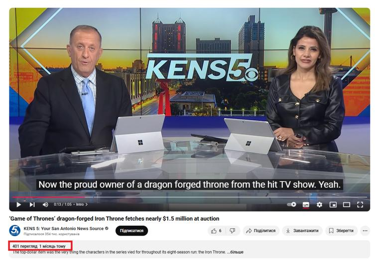

## Claim
Claim: "Ukrainian President Volodymyr Zelenskyy purchased an 88 million euro hotel in the Courchevel ski resort in France."

## Actions
```
web_search("Volodymyr Zelenskyy Courchevel hotel")
web_search("Zelenskyy hotel Courchevel 88 million euro")
```

## Evidence
### Evidence from `web_search`
The claim that Volodymyr Zelenskyy purchased an 88 million euro hotel in Courchevel, France, is false. The claim originated from anonymous Russian-language accounts, pro-war Telegram channels, social media platforms, and a questionable French-language media outlet. The claim is part of a disinformation campaign. The website link provided in the article was fraudulent. (, , , , , , )

The articles were published on December 6, 2024, and December 13, 2024. The claim was also reported by Inshorts, which refers to a Reuters fact-check.
The articles can be found here: [Myth Detector](https://mythdetector.com/en/that-volodymyr-zelenskyy/), [Ukrinform.net](https://www.ukrinform.net/rubric-factcheck/3935929-russian-propaganda-falsely-claims-zelensky-bought-french-hotel-kulebas-son-acquired-iron-throne.html), and [Inshorts](https://inshorts.com/en/news/posts-falsely-claim-zelenskyy-bought-88-mn-euro-hotel-in-france----1734106048310).


## Elaboration
The claim is false. The evidence indicates that the claim originated from disinformation campaigns and was reported by questionable sources. Fact-checks by Myth Detector, Ukrinform.net, and Inshorts (referencing a Reuters fact-check) debunked the claim.


## Final Judgement
The claim that Volodymyr Zelenskyy purchased an 88 million euro hotel in Courchevel, France, is false. The claim is part of a disinformation campaign and has been debunked by multiple fact-checking sources.

`false`

### Verdict: FALSE

### Justification
The claim is false. The assertion originated from disinformation campaigns and was debunked by fact-checkers like [Myth Detector](https://mythdetector.com/en/that-volodymyr-zelenskyy/), [Ukrinform.net](https://www.ukrinform.net/rubric-factcheck/3935929-russian-propaganda-falsely-claims-zelensky-bought-french-hotel-kulebas-son-acquired-iron-throne.html), and [Inshorts](https://inshorts.com/en/news/posts-falsely-claim-zelenskyy-bought-88-mn-euro-hotel-in-france----1734106048310).
